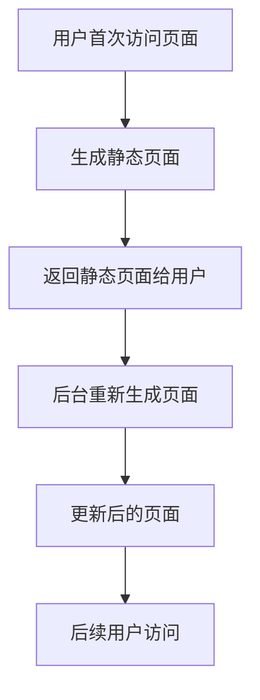

# Next.js 增量静态再生成 (ISR)

Next.js 是一个强大的 React 框架，提供了多种渲染策略来优化性能和用户体验。其中，**增量静态再生成 (Incremental Static Regeneration, ISR)** 是一种独特的策略，允许你在构建后动态更新静态页面，而无需重新构建整个站点。

## 什么是增量静态再生成 (ISR)？

增量静态再生成 (ISR) 是 Next.js 提供的一种功能，它允许你在页面首次生成后，按需或在特定时间间隔内重新生成静态页面。这意味着你可以在不重新部署整个应用的情况下，更新页面的内容。

:::note
ISR 的核心思想是：**静态生成 + 动态更新**。它结合了静态生成的高性能和动态内容的灵活性。
:::

### ISR 的工作原理

1. **首次请求**：当用户首次访问页面时，Next.js 会生成并返回一个静态页面。
2. **后台更新**：在后台，Next.js 会根据配置的时间间隔或触发条件重新生成页面。
3. **后续请求**：当页面重新生成后，后续用户将看到更新后的内容。



## 如何使用 ISR？

要在 Next.js 中使用 ISR，你需要在 `getStaticProps` 函数中配置 `revalidate` 属性。`revalidate` 定义了页面重新生成的间隔时间（以秒为单位）。

### 示例代码

以下是一个简单的示例，展示如何在 Next.js 中使用 ISR：

```javascript
export async function getStaticProps() {
  // 模拟从 API 获取数据
  const res = await fetch('https://api.example.com/data');
  const data = await res.json();

  return {
    props: {
      data,
    },
    // 每 10 秒重新生成页面
    revalidate: 10,
  };
}

function HomePage({ data }) {
  return (
    <div>
      <h1>最新数据</h1>
      <p>{data.message}</p>
    </div>
  );
}

export default HomePage;
```

### 代码解释

1. **`getStaticProps`**：这是一个 Next.js 函数，用于在构建时获取数据并生成静态页面。
2. **`revalidate: 10`**：这表示页面每 10 秒会重新生成一次。
3. **`data`**：从 API 获取的数据会传递给页面组件 `HomePage`。

:::tip
你可以根据需要调整 `revalidate` 的值。例如，对于频繁更新的内容，可以设置为较短的时间间隔；对于不常变化的内容，可以设置为较长的时间间隔。
:::

## ISR 的实际应用场景

ISR 非常适合以下场景：

1. **新闻网站**：新闻内容需要频繁更新，但不需要实时刷新。ISR 可以在后台定期更新页面，确保用户看到最新的内容。
2. **电商网站**：商品详情页的内容可能会随时间变化（如库存、价格），ISR 可以在不重新构建整个站点的情况下更新这些页面。
3. **博客平台**：博客文章可能会被编辑或更新，ISR 可以确保读者看到最新的版本。

### 案例：新闻网站

假设你正在开发一个新闻网站，首页需要展示最新的新闻头条。你可以使用 ISR 来确保首页每 30 秒更新一次：

```javascript
export async function getStaticProps() {
  const res = await fetch('https://api.news.com/latest');
  const headlines = await res.json();

  return {
    props: {
      headlines,
    },
    revalidate: 30, // 每 30 秒更新一次
  };
}
```

## 总结

Next.js 的增量静态再生成 (ISR) 是一种强大的功能，它允许你在不重新构建整个站点的情况下动态更新静态页面。通过配置 `revalidate` 属性，你可以控制页面更新的频率，从而在性能和内容新鲜度之间找到平衡。

ISR 特别适合需要频繁更新内容的场景，如新闻网站、电商平台和博客。它为开发者提供了更多的灵活性，同时保持了静态生成的高性能。

## 附加资源与练习

- **官方文档**：[Next.js ISR 文档](https://nextjs.org/docs/basic-features/data-fetching/incremental-static-regeneration)
- **练习**：尝试在你的 Next.js 项目中实现 ISR，并观察页面更新的效果。
- **扩展阅读**：了解 Next.js 的其他渲染策略，如静态生成 (SSG) 和服务器端渲染 (SSR)。

:::caution
在使用 ISR 时，请确保你的 API 或数据源能够支持频繁的请求，以避免性能问题。
:::