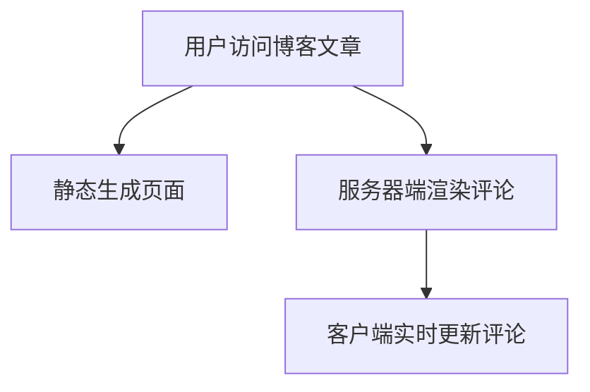

# Next.js 数据获取概述

Next.js 是一个功能强大的 React 框架，提供了多种数据获取方式，使开发者能够根据应用需求灵活选择。本文将详细介绍 Next.js 中的数据获取方法，包括静态生成（SSG）、服务器端渲染（SSR）和客户端数据获取，并通过实际案例帮助你理解这些概念。

## 什么是数据获取？

在 Web 开发中，数据获取是指从服务器、数据库或其他数据源获取数据，并将其渲染到页面上的过程。Next.js 提供了多种数据获取方式，每种方式都有其独特的优势和适用场景。

## 静态生成（SSG）

静态生成（Static Site Generation，SSG）是 Next.js 中最常用的数据获取方式之一。它允许在构建时生成静态 HTML 页面，这些页面可以在用户请求时快速加载。

### 如何使用 SSG

在 Next.js 中，你可以通过 `getStaticProps` 函数来实现静态生成。这个函数在构建时运行，并将数据作为 props 传递给页面组件。

```jsx
export async function getStaticProps() {
  const res = await fetch('https://api.example.com/data');
  const data = await res.json();

  return {
    props: {
      data,
    },
  };
}

export default function Home({ data }) {
  return (
    <div>
      <h1>Static Generation Example</h1>
      <ul>
        {data.map((item) => (
          <li key={item.id}>{item.name}</li>
        ))}
      </ul>
    </div>
  );
}
```

### 适用场景

- 博客文章
- 产品列表
- 任何不需要频繁更新的内容

:::tip
静态生成的页面加载速度非常快，因为它们在构建时已经生成了 HTML 文件。
:::

## 服务器端渲染（SSR）

服务器端渲染（Server-Side Rendering，SSR）是指在每次用户请求时，服务器动态生成 HTML 页面并将其发送给客户端。这种方式适用于需要频繁更新数据的页面。

### 如何使用 SSR

在 Next.js 中，你可以通过 `getServerSideProps` 函数来实现服务器端渲染。这个函数在每次请求时运行，并将数据作为 props 传递给页面组件。

```jsx
export async function getServerSideProps() {
  const res = await fetch('https://api.example.com/data');
  const data = await res.json();

  return {
    props: {
      data,
    },
  };
}

export default function Home({ data }) {
  return (
    <div>
      <h1>Server-Side Rendering Example</h1>
      <ul>
        {data.map((item) => (
          <li key={item.id}>{item.name}</li>
        ))}
      </ul>
    </div>
  );
}
```

### 适用场景

- 用户仪表盘
- 实时数据展示
- 需要根据用户请求动态生成内容的页面

:::caution
服务器端渲染的页面加载速度可能较慢，因为每次请求都需要服务器动态生成 HTML。
:::

## 客户端数据获取

客户端数据获取是指在页面加载后，通过 JavaScript 在客户端获取数据。这种方式适用于需要频繁更新或用户交互较多的页面。

### 如何使用客户端数据获取

你可以使用 `useEffect` 钩子或 `SWR` 库来实现客户端数据获取。

```jsx
import { useEffect, useState } from 'react';

export default function Home() {
  const [data, setData] = useState([]);

  useEffect(() => {
    fetch('https://api.example.com/data')
      .then((res) => res.json())
      .then((data) => setData(data));
  }, []);

  return (
    <div>
      <h1>Client-Side Data Fetching Example</h1>
      <ul>
        {data.map((item) => (
          <li key={item.id}>{item.name}</li>
        ))}
      </ul>
    </div>
  );
}
```

### 适用场景

- 实时聊天应用
- 用户交互较多的页面
- 需要频繁更新的数据

:::note
客户端数据获取可以减少服务器的负载，但可能会增加页面的初始加载时间。
:::

## 实际案例

假设你正在开发一个博客网站，你可以使用静态生成来生成博客文章的页面，使用服务器端渲染来生成用户评论的页面，并使用客户端数据获取来实现实时评论功能。



## 总结

Next.js 提供了多种数据获取方式，每种方式都有其独特的优势和适用场景。通过合理选择数据获取方式，你可以构建出高性能、用户体验良好的 Web 应用。

### 附加资源

- [Next.js 官方文档](https://nextjs.org/docs)
- [SWR 库](https://swr.vercel.app/)
- [React 官方文档](https://reactjs.org/docs/getting-started.html)

### 练习

1. 创建一个使用静态生成的博客页面。
2. 尝试使用服务器端渲染来动态生成用户评论页面。
3. 使用客户端数据获取实现一个实时更新的评论功能。

通过完成这些练习，你将更深入地理解 Next.js 中的数据获取方法，并能够在实际项目中灵活应用。