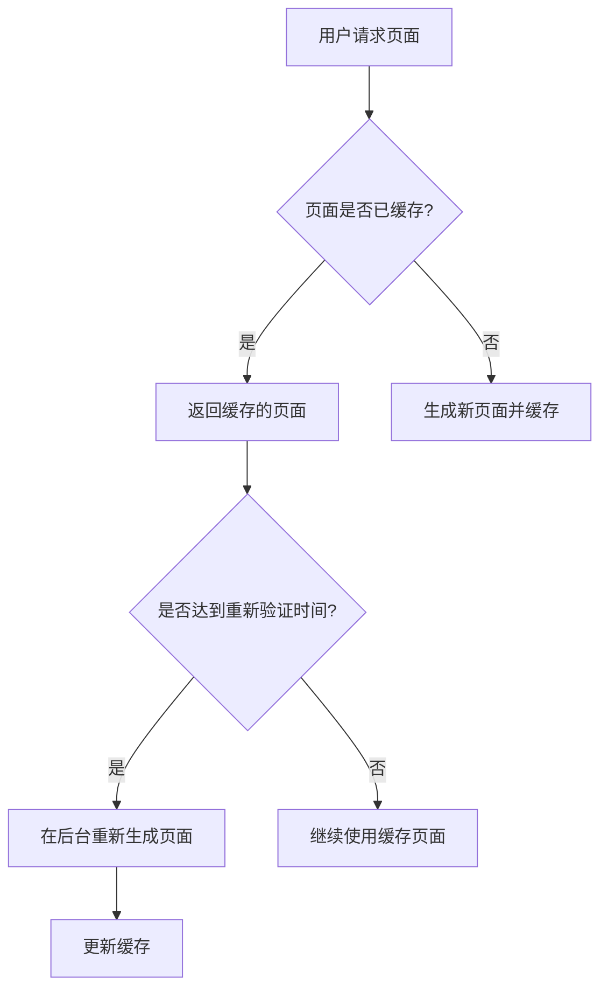

# Next.js 重新验证策略

在构建现代 Web 应用程序时，静态生成（Static Generation）是一种非常高效的方式，可以生成快速加载的页面。然而，静态内容可能会过时，尤其是在数据频繁更新的情况下。为了解决这个问题，Next.js 引入了**重新验证策略**，也称为**增量静态生成（Incremental Static Regeneration, ISR）**。本文将详细介绍这一策略，并通过示例帮助您理解其工作原理。

## 什么是重新验证策略？

重新验证策略允许您在页面构建后动态更新静态内容。通过 ISR，您可以在不重新构建整个站点的情况下，定期或在特定条件下更新页面内容。这意味着您的页面可以保持静态生成的高性能，同时确保内容的实时性。

### 核心概念

- **静态生成（Static Generation）**：在构建时生成静态 HTML 文件。
- **增量静态生成（ISR）**：在页面构建后，定期或在特定条件下重新生成页面内容。
- **重新验证时间（revalidate）**：定义页面内容更新的时间间隔（以秒为单位）。

## 如何使用重新验证策略？

在 Next.js 中，您可以通过在 `getStaticProps` 函数中设置 `revalidate` 属性来启用 ISR。以下是一个简单的示例：

```javascript
export async function getStaticProps() {
  const res = await fetch('https://api.example.com/data');
  const data = await res.json();

  return {
    props: {
      data,
    },
    revalidate: 10, // 每 10 秒重新验证一次
  };
}
```

在这个示例中，页面将在构建时生成静态 HTML 文件，并且每 10 秒重新验证一次数据。如果数据发生变化，页面将在后台重新生成，并在下次请求时提供更新后的内容。

### 输入与输出

- **输入**：API 端点 `https://api.example.com/data` 返回的数据。
- **输出**：包含最新数据的静态页面，每 10 秒更新一次。

## 实际应用场景

假设您正在构建一个新闻网站，新闻内容会频繁更新。使用 ISR，您可以在构建时生成静态页面，并定期更新新闻内容，而无需重新构建整个站点。

```javascript
export async function getStaticProps() {
  const res = await fetch('https://api.news.com/latest');
  const news = await res.json();

  return {
    props: {
      news,
    },
    revalidate: 60, // 每 60 秒重新验证一次
  };
}
```

在这个示例中，新闻页面将每 60 秒更新一次，确保用户始终看到最新的新闻内容。

## 重新验证的工作原理

为了更好地理解重新验证策略，让我们通过一个流程图来说明其工作原理：



1. 用户请求页面时，Next.js 首先检查是否有缓存的页面。
2. 如果有缓存页面，则返回缓存页面。
3. 如果没有缓存页面，则生成新页面并缓存。
4. 如果达到重新验证时间，Next.js 会在后台重新生成页面并更新缓存。

## 总结

Next.js 的重新验证策略（ISR）是一种强大的工具，可以帮助您在保持静态生成的高性能的同时，动态更新页面内容。通过设置 `revalidate` 属性，您可以轻松实现页面的定期更新，确保用户始终看到最新的数据。

### 附加资源

- [Next.js 官方文档 - 增量静态生成](https://nextjs.org/docs/basic-features/data-fetching/incremental-static-regeneration)
- [Next.js 数据获取指南](https://nextjs.org/docs/basic-features/data-fetching)

### 练习

1. 创建一个简单的 Next.js 页面，使用 ISR 每 30 秒更新一次数据。
2. 尝试在不同的 `revalidate` 时间间隔下测试页面的更新行为。

通过本文的学习，您应该已经掌握了 Next.js 重新验证策略的基本概念和应用方法。继续实践和探索，您将能够更好地利用这一功能来构建高性能的动态 Web 应用程序。