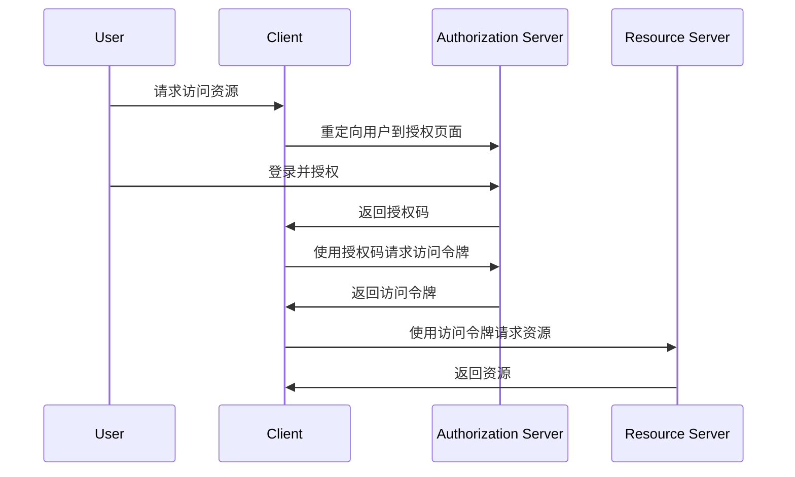

# Next.js OAuth 集成

OAuth 是一种开放标准，允许用户在不共享密码的情况下，授权第三方应用访问其资源。在 Next.js 中集成 OAuth 可以帮助你轻松实现用户身份验证与授权。本文将带你从基础概念开始，逐步完成 OAuth 的集成。

## 什么是 OAuth？

OAuth 是一种授权框架，允许用户授权第三方应用访问其资源，而无需共享密码。OAuth 2.0 是目前最常用的版本，它通过令牌（Token）机制来实现授权。

### OAuth 2.0 的基本流程



## 在 Next.js 中集成 OAuth

要在 Next.js 中集成 OAuth，通常需要以下几个步骤：

1. **注册 OAuth 应用**：在第三方服务（如 Google、GitHub 等）中注册你的应用，获取 `client_id` 和 `client_secret`。
2. **配置 Next.js 应用**：在 Next.js 应用中配置 OAuth 客户端。
3. **实现授权流程**：处理用户授权请求，获取访问令牌。
4. **使用访问令牌**：使用访问令牌访问受保护的资源。

### 1. 注册 OAuth 应用

以 GitHub 为例，首先需要在 GitHub 上注册一个新的 OAuth 应用。注册完成后，你将获得 `client_id` 和 `client_secret`。

### 2. 配置 Next.js 应用

在 Next.js 项目中，你可以使用 `next-auth` 库来简化 OAuth 的集成。首先，安装 `next-auth`：

```bash
npm install next-auth
```

然后，在 `pages/api/auth/[...nextauth].js` 中配置 `next-auth`：

```javascript
import NextAuth from "next-auth";
import Providers from "next-auth/providers";

export default NextAuth({
  providers: [
    Providers.GitHub({
      clientId: process.env.GITHUB_CLIENT_ID,
      clientSecret: process.env.GITHUB_CLIENT_SECRET,
    }),
  ],
});
```

### 3. 实现授权流程

在 `next-auth` 中，授权流程已经为你处理好了。你只需要在页面中使用 `useSession` 钩子来获取用户会话信息：

```javascript
import { useSession, signIn, signOut } from "next-auth/react";

export default function Component() {
  const { data: session } = useSession();

  if (session) {
    return (
      <>
        Signed in as {session.user.email} <br />
        <button onClick={() => signOut()}>Sign out</button>
      </>
    );
  }
  return (
    <>
      Not signed in <br />
      <button onClick={() => signIn()}>Sign in</button>
    </>
  );
}
```

### 4. 使用访问令牌

一旦用户登录成功，你可以通过 `session.accessToken` 获取访问令牌，并使用它来访问受保护的资源。

```javascript
const { data: session } = useSession();

if (session) {
  fetch("https://api.github.com/user", {
    headers: {
      Authorization: `Bearer ${session.accessToken}`,
    },
  })
    .then((response) => response.json())
    .then((data) => console.log(data));
}
```

## 实际案例

假设你正在开发一个博客平台，用户可以通过 GitHub 登录并发表评论。你可以使用上述方法集成 GitHub OAuth，并在用户登录后获取其 GitHub 信息，用于显示评论者的头像和用户名。

## 总结

在 Next.js 中集成 OAuth 可以帮助你轻松实现用户身份验证与授权。通过使用 `next-auth` 库，你可以快速集成多种 OAuth 提供商，并处理授权流程。本文介绍了 OAuth 的基本概念、Next.js 中的集成步骤，并提供了一个实际案例。

## 附加资源

- [OAuth 2.0 官方文档](https://oauth.net/2/)
- [next-auth 官方文档](https://next-auth.js.org/)
- [GitHub OAuth 文档](https://docs.github.com/en/developers/apps/building-oauth-apps)

## 练习

1. 尝试在 Next.js 中集成另一个 OAuth 提供商，如 Google 或 Facebook。
2. 修改代码，使得用户登录后可以访问其 GitHub 仓库列表。
