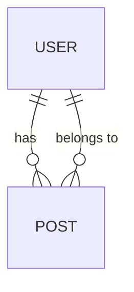

# Next.js 数据模型设计

在开发 Web 应用时，数据模型设计是一个至关重要的环节。它决定了数据的存储方式、结构以及如何与应用程序的其他部分交互。在 Next.js 中，数据模型设计通常与数据库集成密切相关。本文将带你了解如何在 Next.js 中设计数据模型，并通过实际案例帮助你掌握这一技能。

## 什么是数据模型？

数据模型是描述数据结构、数据关系以及数据约束的抽象模型。它定义了数据如何存储、访问和操作。在 Next.js 中，数据模型通常与数据库表或集合相对应，用于存储应用程序的核心数据。

### 数据模型的组成部分

1. **实体（Entities）**：表示应用程序中的核心对象，例如用户、文章、评论等。
2. **属性（Attributes）**：描述实体的特征，例如用户的姓名、文章的标题等。
3. **关系（Relationships）**：定义实体之间的关联，例如用户与文章之间的关系。

## 数据模型设计的基本步骤

### 1. 确定实体和属性

首先，你需要确定应用程序中的核心实体及其属性。例如，在一个博客应用中，主要的实体可能是 `User` 和 `Post`。

```javascript
// User 实体
const User = {
  id: "string", // 用户ID
  name: "string", // 用户名
  email: "string", // 用户邮箱
  password: "string", // 用户密码
};

// Post 实体
const Post = {
  id: "string", // 文章ID
  title: string, // 文章标题
  content: "string", // 文章内容
  authorId: "string", // 作者ID
};
```

### 2. 定义实体之间的关系

接下来，你需要定义实体之间的关系。例如，一个用户可以有多篇文章，而一篇文章只能属于一个用户。



### 3. 设计数据库表结构

根据实体和关系，设计数据库表结构。例如，使用 SQL 数据库时，可以创建 `users` 和 `posts` 表。

```sql
CREATE TABLE users (
  id SERIAL PRIMARY KEY,
  name VARCHAR(255) NOT NULL,
  email VARCHAR(255) UNIQUE NOT NULL,
  password VARCHAR(255) NOT NULL
);

CREATE TABLE posts (
  id SERIAL PRIMARY KEY,
  title VARCHAR(255) NOT NULL,
  content TEXT NOT NULL,
  author_id INTEGER REFERENCES users(id)
);
```

### 4. 在 Next.js 中实现数据模型

在 Next.js 中，你可以使用 ORM（对象关系映射）工具如 Prisma 或 Sequelize 来管理数据模型。以下是一个使用 Prisma 的示例：

```javascript
// prisma/schema.prisma
model User {
  id        Int      @id @default(autoincrement())
  name      String
  email     String   @unique
  password  String
  posts     Post[]
}

model Post {
  id        Int      @id @default(autoincrement())
  title     String
  content   String
  authorId  Int
  author    User     @relation(fields: [authorId], references: [id])
}
```

## 实际案例：博客应用的数据模型设计

假设你正在开发一个博客应用，以下是数据模型设计的实际案例：

1. **用户注册和登录**：用户需要注册并登录才能发布文章。
2. **文章发布**：用户可以发布文章，文章包含标题和内容。
3. **文章列表**：用户可以查看所有文章，并点击查看文章详情。

### 数据模型实现

```javascript
// prisma/schema.prisma
model User {
  id        Int      @id @default(autoincrement())
  name      String
  email     String   @unique
  password  String
  posts     Post[]
}

model Post {
  id        Int      @id @default(autoincrement())
  title     String
  content   String
  authorId  Int
  author    User     @relation(fields: [authorId], references: [id])
}
```

### 数据操作示例

以下是如何在 Next.js 中使用 Prisma 进行数据操作的示例：

```javascript
// pages/api/posts.js
import { PrismaClient } from '@prisma/client';

const prisma = new PrismaClient();

export default async function handler(req, res) {
  if (req.method === 'GET') {
    const posts = await prisma.post.findMany({
      include: { author: true },
    });
    res.status(200).json(posts);
  } else if (req.method === 'POST') {
    const { title, content, authorId } = req.body;
    const post = await prisma.post.create({
      data: {
        title,
        content,
        authorId: parseInt(authorId),
      },
    });
    res.status(201).json(post);
  } else {
    res.status(405).json({ message: 'Method not allowed' });
  }
}
```

## 总结

数据模型设计是 Next.js 应用开发中的关键步骤。通过合理设计数据模型，你可以确保数据的结构化和一致性，从而提高应用程序的可维护性和扩展性。本文介绍了数据模型的基本概念、设计步骤以及如何在 Next.js 中实现数据模型。希望这些内容能帮助你更好地理解并应用数据模型设计。

## 附加资源

- [Prisma 官方文档](https://www.prisma.io/docs)
- [Sequelize 官方文档](https://sequelize.org/)
- [Next.js 官方文档](https://nextjs.org/docs)

## 练习

1. 设计一个简单的电商应用的数据模型，包括 `Product` 和 `Order` 实体。
2. 使用 Prisma 实现上述数据模型，并编写 API 端点来创建和查询产品及订单。