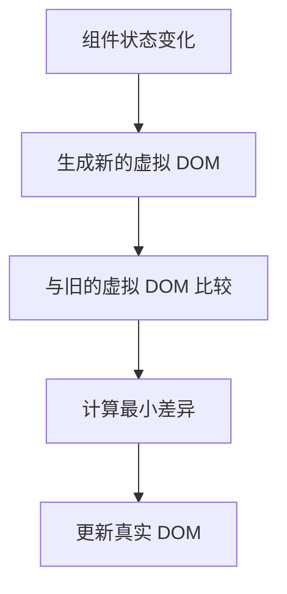

# React 简介

React 是一个用于构建用户界面的 JavaScript 库，由 Facebook 开发并开源。它以其组件化、声明式编程和高效的虚拟 DOM 机制而闻名，是现代前端开发中最流行的工具之一。无论你是初学者还是有一定经验的开发者，掌握 React 都将为你的前端开发之旅带来巨大的帮助。

## 什么是 React？

React 的核心思想是**组件化**。它将用户界面拆分为多个独立的、可复用的组件，每个组件负责管理自己的状态和渲染逻辑。通过这种方式，开发者可以更高效地构建复杂的用户界面。

React 的另一个重要特性是**声明式编程**。与传统的命令式编程不同，声明式编程允许开发者描述“界面应该是什么样子”，而不是“如何一步步实现它”。这使得代码更易于理解和维护。

## React 的核心概念

### 1. 组件（Component）

组件是 React 应用的基本构建块。每个组件都是一个独立的模块，可以包含 HTML、CSS 和 JavaScript 代码。组件可以是函数组件或类组件。

#### 函数组件示例

```jsx
function Welcome(props) {
  return <h1>Hello, {props.name}</h1>;
}
```

#### 类组件示例

```jsx
class Welcome extends React.Component {
  render() {
    return <h1>Hello, {this.props.name}</h1>;
  }
}
```

### 2. JSX

JSX 是 JavaScript 的语法扩展，允许你在 JavaScript 代码中编写类似 HTML 的标记。虽然 JSX 看起来像 HTML，但它实际上是 JavaScript 的语法糖，最终会被编译为 `React.createElement` 调用。

```jsx
const element = <h1>Hello, world!</h1>;
```

### 3. 虚拟 DOM

React 使用虚拟 DOM 来提高性能。虚拟 DOM 是真实 DOM 的轻量级副本，React 通过比较虚拟 DOM 的变化来最小化对真实 DOM 的操作，从而提高渲染效率。



### 4. 状态（State）和属性（Props）

- **State**：组件的内部状态，可以通过 `this.setState` 或 `useState` 钩子来管理。
- **Props**：从父组件传递给子组件的数据，是只读的。

```jsx
function Counter() {
  const [count, setCount] = React.useState(0);

  return (
    <div>
      <p>You clicked {count} times</p>
      <button onClick={() => setCount(count + 1)}>
        Click me
      </button>
    </div>
  );
}
```

## 实际应用场景

React 广泛应用于现代 Web 开发中，尤其是在单页应用（SPA）和动态用户界面中。以下是一些常见的应用场景：

1. **社交媒体平台**：如 Facebook、Instagram 等，使用 React 来构建动态、交互性强的用户界面。
2. **电商网站**：如 Shopify，使用 React 来管理复杂的商品展示和购物车功能。
3. **数据可视化**：如 Airbnb，使用 React 来构建交互式的数据仪表盘。

## 总结

React 是一个强大且灵活的前端库，适合构建各种规模的 Web 应用。通过组件化、声明式编程和虚拟 DOM，React 使得开发者能够更高效地构建和维护复杂的用户界面。

## 附加资源

- [React 官方文档](https://reactjs.org/docs/getting-started.html)
- [React 入门教程](https://reactjs.org/tutorial/tutorial.html)
- [React Hooks 指南](https://reactjs.org/docs/hooks-intro.html)

## 练习

1. 创建一个简单的 React 组件，显示当前时间，并每秒更新一次。
2. 使用 React 构建一个待办事项列表，允许用户添加和删除任务。

:::tip
在练习过程中，如果遇到问题，可以参考 React 官方文档或社区资源，它们提供了丰富的示例和解决方案。
:::