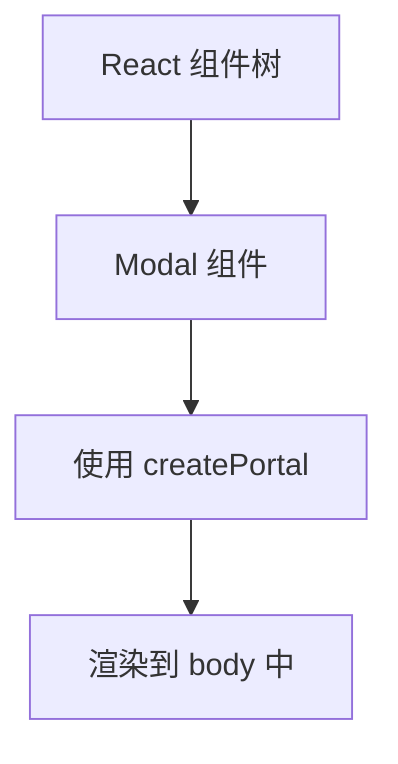

## 什么是 Portals？

在 React 中，组件的渲染通常遵循父子组件的层级结构。然而，有时我们希望将某些组件渲染到 DOM 树中的其他位置，而不是直接嵌套在父组件中。这时，React 的 **Portals** 功能就派上用场了。

Portals 允许你将子组件渲染到 DOM 树中的任意节点，即使该节点位于父组件的 DOM 层级之外。这在处理模态框、弹出层、工具提示等场景时非常有用。

---

## 如何使用 Portals？

要使用 Portals，你需要使用 `ReactDOM.createPortal` 方法。这个方法接受两个参数：
1. 要渲染的 React 子元素。
2. 目标 DOM 节点（通常是 `document.body` 或其他 DOM 元素）。

以下是一个简单的示例：

```jsx
import React from 'react';
import ReactDOM from 'react-dom';

function Modal({ children }) {
  return ReactDOM.createPortal(
    <div className="modal">
      {children}
    </div>,
    document.body // 将模态框渲染到 body 中
  );
}

function App() {
  return (
    <div>
      <h1>我的应用</h1>
      <Modal>
        <p>这是一个模态框！</p>
      </Modal>
    </div>
  );
}

export default App;
```

### 代码解析
1. `Modal` 组件使用 `ReactDOM.createPortal` 将内容渲染到 `document.body` 中。
2. 即使 `Modal` 在 `App` 组件中嵌套，它的 DOM 结构会被渲染到 `body` 中，而不是 `App` 的 DOM 层级内。

---

## Portals 的实际应用场景

Portals 最常见的应用场景包括：

### 1. 模态框（Modal）
模态框通常需要覆盖整个页面，并且位于 DOM 树的顶层。使用 Portals 可以轻松实现这一点。

```jsx
function Modal({ isOpen, onClose, children }) {
  if (!isOpen) return null;

  return ReactDOM.createPortal(
    <div className="modal-overlay">
      <div className="modal-content">
        {children}
        <button onClick={onClose}>关闭</button>
      </div>
    </div>,
    document.body
  );
}
```

### 2. 工具提示（Tooltip）
工具提示通常需要浮动在其他元素之上，使用 Portals 可以避免 CSS 层级问题。

```jsx
function Tooltip({ text, children }) {
  const [show, setShow] = React.useState(false);

  return (
    <div
      onMouseEnter={() => setShow(true)}
      onMouseLeave={() => setShow(false)}
    >
      {children}
      {show &&
        ReactDOM.createPortal(
          <div className="tooltip">{text}</div>,
          document.body
        )}
    </div>
  );
}
```

### 3. 通知栏（Notification）
通知栏通常需要显示在页面的顶部或底部，使用 Portals 可以将其渲染到页面的特定位置。

---

## Portals 的工作原理

Portals 的核心是将 React 组件的逻辑层级与 DOM 层级解耦。React 仍然管理组件的生命周期和状态，但 DOM 结构可以位于任何地方。

以下是一个简单的流程图，展示了 Portals 的工作机制：



---

## 注意事项

:::caution
1. **事件冒泡**：虽然 Portals 将组件渲染到 DOM 树的其他位置，但事件仍然会按照 React 的组件树冒泡。例如，点击模态框中的按钮，事件会冒泡到 `App` 组件。
2. **样式隔离**：确保目标 DOM 节点的样式不会影响 Portal 中的内容。
3. **性能**：频繁使用 Portals 可能会导致性能问题，尤其是在渲染大量动态内容时。
:::

---

## 总结

Portals 是 React 中一个强大的功能，允许你将组件渲染到 DOM 树中的任意位置。它在处理模态框、工具提示、通知栏等场景时非常有用。通过 `ReactDOM.createPortal`，你可以轻松突破组件层级的限制，实现更灵活的 UI 设计。

---

## 附加资源与练习

### 练习
1. 创建一个模态框组件，使用 Portals 将其渲染到 `body` 中。
2. 实现一个工具提示组件，当用户悬停在某个元素上时显示提示信息。
3. 尝试将通知栏组件渲染到页面的顶部。

### 进一步学习
- [React 官方文档 - Portals](https://reactjs.org/docs/portals.html)
- [深入理解 React Portals](https://blog.logrocket.com/understanding-react-portals/)（英文）

希望这篇内容能帮助你更好地理解和使用 React Portals！继续加油学习吧！