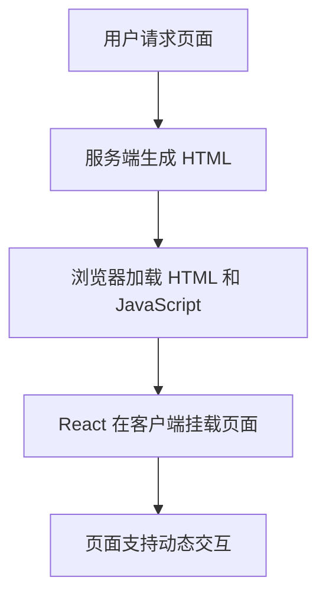

## 什么是混合渲染策略？

混合渲染策略（Hybrid Rendering）是一种结合了客户端渲染（CSR）和服务端渲染（SSR）的技术方案。它的目标是充分利用两者的优势，以提升应用的性能和用户体验。通过混合渲染，我们可以在服务端生成初始 HTML 内容，同时在客户端接管后续的交互和动态更新。

:::note
**为什么需要混合渲染？**
- **服务端渲染（SSR）**：提供更快的首屏加载速度，有利于 SEO。
- **客户端渲染（CSR）**：支持动态交互和更流畅的用户体验。
:::

混合渲染策略的核心思想是：在服务端生成静态内容，然后在客户端通过 JavaScript 接管页面，使其具备动态交互能力。

---

## 混合渲染的工作原理

混合渲染的工作流程可以分为以下几个步骤：

1. **服务端渲染初始页面**：服务器生成 HTML 内容并发送给客户端。
2. **客户端接管页面**：浏览器加载 JavaScript 文件，React 在客户端重新挂载（hydrate）页面。
3. **动态交互**：客户端接管后，页面可以响应动态交互，例如点击事件、路由切换等。

以下是一个简单的流程图：



---

## 实现混合渲染的步骤

### 1. 配置服务端渲染（SSR）

首先，我们需要在服务端生成 HTML 内容。以下是一个简单的 React 服务端渲染示例：

```javascript
// server.js
import express from 'express';
import React from 'react';
import { renderToString } from 'react-dom/server';
import App from './App';

const app = express();

app.get('/', (req, res) => {
  const html = renderToString(<App />);
  res.send(`
    <!DOCTYPE html>
    <html>
      <head><title>混合渲染示例</title></head>
      <body>
        <div id="root">${html}</div>
        <script src="/client.js"></script>
      </body>
    </html>
  `);
});

app.listen(3000, () => {
  console.log('Server is running on http://localhost:3000');
});
```

### 2. 配置客户端渲染（CSR）

在客户端，我们需要使用 `ReactDOM.hydrate` 方法重新挂载页面：

```javascript
// client.js
import React from 'react';
import ReactDOM from 'react-dom';
import App from './App';

ReactDOM.hydrate(<App />, document.getElementById('root'));
```

### 3. 结合动态路由和数据获取

为了实现更复杂的混合渲染，我们可以结合动态路由和数据获取。例如，使用 `React Router` 和 `fetch`：

```javascript
// App.js
import React, { useEffect, useState } from 'react';
import { BrowserRouter as Router, Route, Switch } from 'react-router-dom';

const Home = () => {
  const [data, setData] = useState(null);

  useEffect(() => {
    fetch('/api/data')
      .then((res) => res.json())
      .then((data) => setData(data));
  }, []);

  return <div>{data ? data.message : 'Loading...'}</div>;
};

const App = () => (
  <Router>
    <Switch>
      <Route path="/" component={Home} />
    </Switch>
  </Router>
);

export default App;
```

---

## 实际应用场景

混合渲染策略在以下场景中非常有用：

1. **内容型网站**：例如新闻网站或博客，需要快速加载首屏内容并支持 SEO。
2. **电商平台**：商品列表页可以通过 SSR 快速加载，而购物车和用户交互部分则通过 CSR 实现动态更新。
3. **社交媒体**：动态内容（如帖子）可以通过 SSR 加载，而评论和点赞功能则通过 CSR 实现。

---

## 总结

混合渲染策略结合了服务端渲染和客户端渲染的优势，既能提升首屏加载速度，又能支持动态交互。通过合理配置 SSR 和 CSR，我们可以为用户提供更流畅的体验。

:::tip
**进一步学习**
- 阅读 [React 官方文档](https://reactjs.org/docs/react-dom-server.html) 了解更多关于服务端渲染的内容。
- 尝试在项目中实现混合渲染，并优化性能。
:::

:::caution
**注意事项**
- 混合渲染可能会增加项目的复杂性，请确保在必要时使用。
- 注意处理服务端和客户端的数据一致性。
:::

希望这篇内容能帮助你理解混合渲染策略，并在实际项目中应用它！