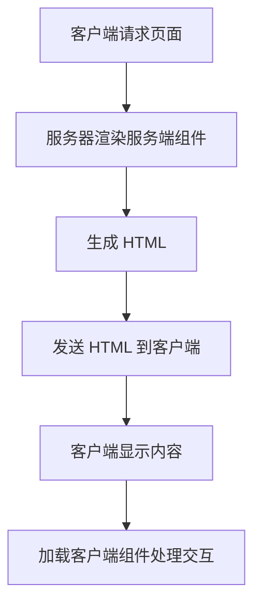

# 服务端组件

在现代 Web 开发中，React 服务端渲染（SSR）是一种常见的技术，用于提升应用的性能和 SEO 友好性。服务端组件（Server Components）是 React 服务端渲染中的一个重要概念，它允许开发者在服务器端渲染组件，从而减少客户端的工作量并优化性能。

## 什么是服务端组件？

服务端组件是 React 中的一种新型组件，它们在服务器端渲染并发送到客户端。与传统的客户端组件不同，服务端组件不会在客户端重新渲染，而是直接使用服务器生成的内容。这种方式可以减少客户端的 JavaScript 加载量，从而提升页面加载速度和性能。

:::note
服务端组件的主要优势在于它们可以在服务器端获取数据并生成 HTML，而无需在客户端进行额外的数据请求或渲染。
:::

## 服务端组件的工作原理

服务端组件的工作原理可以分为以下几个步骤：

1. **服务器端渲染**：服务器接收到请求后，渲染服务端组件并生成 HTML。
2. **发送到客户端**：生成的 HTML 被发送到客户端，客户端直接显示这些内容。
3. **客户端交互**：客户端可以加载其他客户端组件，用于处理用户交互。



## 代码示例

以下是一个简单的服务端组件示例，展示了如何在服务器端渲染一个组件：

```jsx
// ServerComponent.js
export default function ServerComponent() {
  const data = fetchDataFromServer(); // 从服务器获取数据
  return (
    <div>
      <h1>服务端组件</h1>
      <p>数据: {data}</p>
    </div>
  );
}

// 模拟从服务器获取数据的函数
function fetchDataFromServer() {
  return "这是从服务器获取的数据";
}
```

在服务器端，你可以使用以下代码来渲染这个组件：

```jsx
import React from 'react';
import { renderToString } from 'react-dom/server';
import ServerComponent from './ServerComponent';

const html = renderToString(<ServerComponent />);
console.log(html);
```

输出结果将是：

```html
<div>
  <h1>服务端组件</h1>
  <p>数据: 这是从服务器获取的数据</p>
</div>
```

## 实际应用场景

服务端组件在以下场景中非常有用：

1. **SEO 优化**：服务端组件可以在服务器端生成完整的 HTML，这对于搜索引擎优化（SEO）非常有利。
2. **性能优化**：通过减少客户端的 JavaScript 加载量，服务端组件可以显著提升页面加载速度。
3. **数据获取**：服务端组件可以在服务器端获取数据，从而减少客户端的网络请求。

:::tip
在实际项目中，服务端组件通常与客户端组件结合使用，以实现最佳的性能和用户体验。
:::

## 总结

服务端组件是 React 服务端渲染中的一个重要概念，它允许开发者在服务器端渲染组件并生成 HTML，从而减少客户端的工作量并优化性能。通过理解服务端组件的工作原理和实际应用场景，你可以更好地利用这一技术来提升你的 Web 应用。

## 附加资源

- [React 官方文档](https://reactjs.org/docs/react-dom-server.html)
- [服务端组件与客户端组件的区别](https://reactjs.org/docs/server-components.html)
- [React 服务端渲染的最佳实践](https://nextjs.org/docs/advanced-features/react-18/server-components)

## 练习

1. 尝试创建一个简单的服务端组件，并在服务器端渲染它。
2. 将服务端组件与客户端组件结合使用，观察它们的交互方式。
3. 探索如何在服务端组件中获取数据，并将其传递给客户端组件。

通过以上练习，你将更深入地理解服务端组件的使用方法和优势。