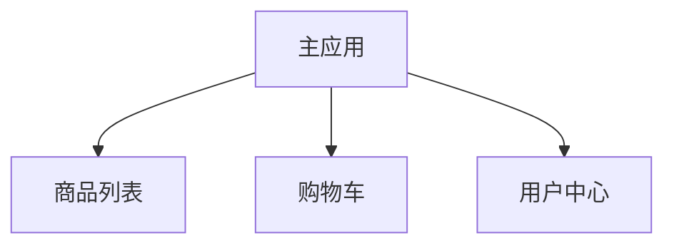

# 微前端架构

## 介绍

微前端架构（Micro Frontends）是一种将前端应用程序拆分为多个独立模块的开发模式。每个模块可以独立开发、测试和部署，最终组合成一个完整的应用程序。这种架构模式借鉴了微服务的思想，旨在解决大型前端项目的复杂性问题。

微前端架构的核心思想是将前端应用拆分为多个小型、独立的“微应用”，每个微应用可以由不同的团队负责开发和维护。这种方式不仅提高了开发效率，还增强了系统的可维护性和可扩展性。

## 为什么需要微前端架构？

随着前端应用的复杂性不断增加，传统的单体前端架构面临以下挑战：

1. **代码库庞大**：随着功能的增加，代码库变得臃肿，难以维护。
2. **团队协作困难**：多个团队在同一个代码库中工作，容易产生冲突。
3. **技术栈限制**：所有功能必须使用相同的技术栈，限制了技术的灵活性。
4. **部署风险高**：每次更新都需要重新部署整个应用，增加了风险。

微前端架构通过将应用拆分为多个独立的微应用，解决了上述问题。每个微应用可以独立开发、测试和部署，从而提高了开发效率和系统的稳定性。

## 微前端架构的核心概念

### 1. 独立开发与部署

每个微应用都是一个独立的项目，可以有自己的技术栈、开发流程和部署策略。这种方式使得团队可以独立工作，减少了协作成本。

### 2. 动态加载

微前端架构通常通过动态加载的方式将各个微应用组合在一起。主应用负责加载和协调各个微应用，而微应用则负责渲染自己的内容。

### 3. 通信机制

微应用之间需要通过某种机制进行通信。常见的通信方式包括：

- **自定义事件**：通过 `window.dispatchEvent` 和 `window.addEventListener` 实现跨微应用通信。
- **状态管理**：使用全局状态管理工具（如 Redux 或 MobX）共享状态。

## 实现微前端架构

### 1. 使用 Webpack 的 Module Federation

Webpack 5 引入了 Module Federation 功能，允许在运行时动态加载远程模块。这是实现微前端架构的一种常见方式。

```javascript
// 主应用的 webpack.config.js
const ModuleFederationPlugin = require("webpack/lib/container/ModuleFederationPlugin");

module.exports = {
  plugins: [
    new ModuleFederationPlugin({
      name: "mainApp",
      remotes: {
        microApp1: "microApp1@http://localhost:3001/remoteEntry.js",
        microApp2: "microApp2@http://localhost:3002/remoteEntry.js",
      },
      shared: ["react", "react-dom"],
    }),
  ],
};
```

```javascript
// 微应用的 webpack.config.js
const ModuleFederationPlugin = require("webpack/lib/container/ModuleFederationPlugin");

module.exports = {
  plugins: [
    new ModuleFederationPlugin({
      name: "microApp1",
      filename: "remoteEntry.js",
      exposes: {
        "./App": "./src/App",
      },
      shared: ["react", "react-dom"],
    }),
  ],
};
```

### 2. 动态加载微应用

在主应用中，可以通过动态加载的方式加载微应用：

```javascript
import React, { useEffect, useState } from "react";

const MicroApp1 = React.lazy(() => import("microApp1/App"));

function App() {
  return (
    <div>
      <h1>主应用</h1>
      <React.Suspense fallback="加载中...">
        <MicroApp1 />
      </React.Suspense>
    </div>
  );
}

export default App;
```

## 实际案例

### 案例：电商平台

假设我们正在开发一个电商平台，平台包含以下功能模块：

1. **商品列表**：展示商品信息。
2. **购物车**：管理用户的购物车。
3. **用户中心**：管理用户的个人信息和订单。

每个功能模块可以由不同的团队独立开发，并通过微前端架构组合在一起。主应用负责加载和协调各个微应用，而每个微应用则负责渲染自己的内容。



## 总结

微前端架构是一种解决大型前端项目复杂性的有效方式。通过将应用拆分为多个独立的微应用，可以提高开发效率、增强系统的可维护性和可扩展性。Webpack 的 Module Federation 是实现微前端架构的一种常见方式，它允许在运行时动态加载远程模块。

## 附加资源与练习

- **资源**：
  - [Webpack Module Federation 官方文档](https://webpack.js.org/concepts/module-federation/)
  - [微前端架构实战指南](https://micro-frontends.org/)

- **练习**：
  1. 尝试使用 Webpack 的 Module Federation 实现一个简单的微前端应用。
  2. 在微应用之间实现自定义事件通信。
  3. 探索如何在微前端架构中使用不同的技术栈（如 Vue 和 React）。

:::tip
微前端架构适合大型项目，但对于小型项目，可能会增加复杂性。在决定是否使用微前端架构时，请根据项目的实际需求进行评估。
:::