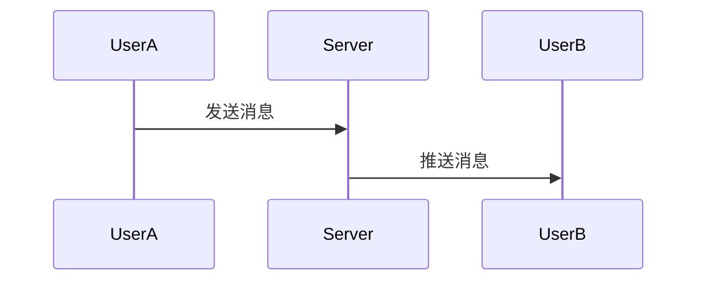
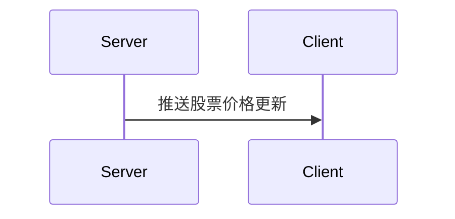

# 实时数据更新

在现代 Web 应用程序中，实时数据更新是一个关键功能。它允许用户在无需手动刷新页面的情况下，看到最新的数据变化。这对于聊天应用、实时通知、股票市场数据等场景尤为重要。本文将介绍如何在 React 中实现实时数据更新，并确保应用程序的状态与服务器数据保持同步。

## 什么是实时数据更新？

实时数据更新是指应用程序能够自动获取并显示最新的数据，而无需用户手动刷新页面。这通常通过以下几种方式实现：

1. **轮询（Polling）**：定期向服务器发送请求以获取最新数据。
2. **WebSocket**：建立持久的双向通信连接，服务器可以主动向客户端推送数据。
3. **Server-Sent Events (SSE)**：服务器向客户端单向推送数据。

在 React 中，我们可以通过结合状态管理和上述技术来实现实时数据更新。

## 实现实时数据更新的步骤

### 1. 使用轮询实现实时更新

轮询是最简单的实现方式之一。通过定期发送请求，我们可以获取最新的数据并更新 React 组件的状态。

```jsx
import React, { useState, useEffect } from 'react';

function PollingExample() {
  const [data, setData] = useState(null);

  useEffect(() => {
    const fetchData = async () => {
      const response = await fetch('https://api.example.com/data');
      const result = await response.json();
      setData(result);
    };

    const intervalId = setInterval(fetchData, 5000); // 每5秒轮询一次

    return () => clearInterval(intervalId); // 清除定时器
  }, []);

  return (
    <div>
      {data ? <pre>{JSON.stringify(data, null, 2)}</pre> : 'Loading...'}
    </div>
  );
}

export default PollingExample;
```

:::note
轮询虽然简单，但可能会对服务器造成不必要的负载，尤其是在数据更新不频繁的情况下。
:::

### 2. 使用 WebSocket 实现实时更新

WebSocket 提供了更高效的实时通信方式。通过建立持久的双向连接，服务器可以在数据变化时主动推送更新。

```jsx
import React, { useState, useEffect } from 'react';

function WebSocketExample() {
  const [data, setData] = useState(null);

  useEffect(() => {
    const socket = new WebSocket('wss://api.example.com/socket');

    socket.onmessage = (event) => {
      const newData = JSON.parse(event.data);
      setData(newData);
    };

    return () => socket.close(); // 关闭 WebSocket 连接
  }, []);

  return (
    <div>
      {data ? <pre>{JSON.stringify(data, null, 2)}</pre> : 'Connecting...'}
    </div>
  );
}

export default WebSocketExample;
```

:::tip
WebSocket 适用于需要频繁更新的场景，如聊天应用或实时协作工具。
:::

### 3. 使用 Server-Sent Events (SSE) 实现实时更新

SSE 是一种服务器向客户端单向推送数据的技术。与 WebSocket 不同，SSE 只允许服务器向客户端发送数据。

```jsx
import React, { useState, useEffect } from 'react';

function SSEExample() {
  const [data, setData] = useState(null);

  useEffect(() => {
    const eventSource = new EventSource('https://api.example.com/events');

    eventSource.onmessage = (event) => {
      const newData = JSON.parse(event.data);
      setData(newData);
    };

    return () => eventSource.close(); // 关闭 SSE 连接
  }, []);

  return (
    <div>
      {data ? <pre>{JSON.stringify(data, null, 2)}</pre> : 'Connecting...'}
    </div>
  );
}

export default SSEExample;
```

:::caution
SSE 只支持服务器向客户端推送数据，如果需要双向通信，建议使用 WebSocket。
:::

## 实际应用场景

### 实时聊天应用

在实时聊天应用中，用户发送的消息需要立即显示给其他用户。使用 WebSocket 可以确保消息的实时传递。



### 实时股票市场数据

在股票市场应用中，股票价格的变化需要实时更新。使用 SSE 可以确保用户看到最新的价格。



## 总结

实时数据更新是现代 Web 应用程序中的重要功能。通过轮询、WebSocket 或 SSE，我们可以确保应用程序的状态与服务器数据保持同步。选择合适的技术取决于具体的应用场景和需求。

## 附加资源与练习

- **练习**：尝试使用 WebSocket 实现一个简单的聊天应用。
- **资源**：
  - [WebSocket 文档](https://developer.mozilla.org/en-US/docs/Web/API/WebSocket)
  - [Server-Sent Events 文档](https://developer.mozilla.org/en-US/docs/Web/API/Server-sent_events)
  - [React 官方文档](https://reactjs.org/docs/hooks-effect.html)

通过本文的学习，你应该能够在 React 中实现实时数据更新，并将其应用到实际项目中。继续练习和探索，你将掌握更多高级技巧！