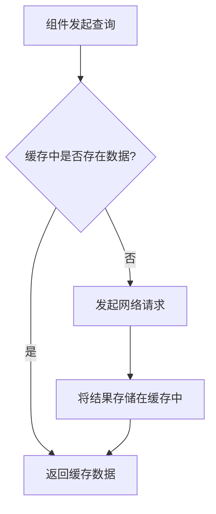

# React Query 缓存

在现代 Web 应用中，数据获取和状态管理是至关重要的部分。React Query 是一个强大的库，专门用于处理数据获取、缓存和状态同步。它可以帮助开发者轻松管理服务器状态，同时提供高效的缓存机制，减少不必要的网络请求，提升应用性能。

本文将带你深入了解 React Query 的缓存机制，并通过实际案例展示如何在实际项目中应用这些概念。

## 什么是 React Query 缓存？

React Query 的核心功能之一是缓存。缓存是指将数据存储在内存中，以便在后续请求中快速访问，而不必每次都从服务器重新获取数据。React Query 的缓存机制可以自动管理数据的生命周期，确保数据始终是最新的，同时减少网络请求的次数。

### 缓存的工作原理

React Query 使用一个全局的缓存存储（称为 `QueryClient`）来管理所有查询的数据。每个查询都有一个唯一的键（`queryKey`），用于标识和检索缓存中的数据。当组件发起一个查询时，React Query 会首先检查缓存中是否已经存在该数据。如果存在，则直接返回缓存中的数据；如果不存在，则发起网络请求，并将结果存储在缓存中。



## 如何使用 React Query 缓存

### 安装 React Query

首先，你需要安装 React Query 库：

```bash
npm install @tanstack/react-query
```

### 创建 QueryClient

在使用 React Query 之前，你需要创建一个 `QueryClient` 实例，并将其提供给整个应用。通常，你可以在应用的根组件中完成这一步骤：

```jsx
import { QueryClient, QueryClientProvider } from '@tanstack/react-query';

const queryClient = new QueryClient();

function App() {
  return (
    <QueryClientProvider client={queryClient}>
      {/* 你的应用组件 */}
    </QueryClientProvider>
  );
}
```

### 发起查询

接下来，你可以使用 `useQuery` 钩子来发起查询。`useQuery` 接受两个参数：查询键（`queryKey`）和查询函数（`queryFn`）。查询键用于唯一标识查询，而查询函数用于实际获取数据。

```jsx
import { useQuery } from '@tanstack/react-query';

function fetchUserData(userId) {
  return fetch(`/api/users/${userId}`).then((response) => response.json());
}

function UserProfile({ userId }) {
  const { data, isLoading, error } = useQuery(['user', userId], () => fetchUserData(userId));

  if (isLoading) return <div>Loading...</div>;
  if (error) return <div>Error: {error.message}</div>;

  return (
    <div>
      <h1>{data.name}</h1>
      <p>{data.email}</p>
    </div>
  );
}
```

在这个例子中，`['user', userId]` 是查询键，`fetchUserData` 是查询函数。React Query 会自动缓存查询结果，并在后续请求中重用缓存数据。

### 缓存失效与更新

有时，你可能需要手动更新缓存或使其失效。React Query 提供了多种方法来实现这一点。例如，你可以使用 `queryClient.invalidateQueries` 来使特定查询的缓存失效，从而强制重新获取数据：

```jsx
import { useQueryClient } from '@tanstack/react-query';

function UpdateUserButton({ userId }) {
  const queryClient = useQueryClient();

  const handleUpdate = async () => {
    await updateUserData(userId); // 假设这是一个更新用户数据的函数
    queryClient.invalidateQueries(['user', userId]); // 使缓存失效
  };

  return <button onClick={handleUpdate}>Update User</button>;
}
```

在这个例子中，当用户点击按钮时，`updateUserData` 函数会更新用户数据，然后 `queryClient.invalidateQueries` 会使 `['user', userId]` 查询的缓存失效，从而触发重新获取数据。

## 实际案例：缓存用户数据

假设你正在开发一个社交网络应用，用户可以在不同的页面之间导航。你希望在每个页面中显示用户的个人资料，但不希望每次导航到新页面时都重新获取用户数据。这时，React Query 的缓存机制就派上用场了。

```jsx
function UserProfile({ userId }) {
  const { data, isLoading, error } = useQuery(['user', userId], () => fetchUserData(userId));

  if (isLoading) return <div>Loading...</div>;
  if (error) return <div>Error: {error.message}</div>;

  return (
    <div>
      <h1>{data.name}</h1>
      <p>{data.email}</p>
    </div>
  );
}

function UserPosts({ userId }) {
  const { data, isLoading, error } = useQuery(['userPosts', userId], () => fetchUserPosts(userId));

  if (isLoading) return <div>Loading...</div>;
  if (error) return <div>Error: {error.message}</div>;

  return (
    <ul>
      {data.map((post) => (
        <li key={post.id}>{post.title}</li>
      ))}
    </ul>
  );
}
```

在这个例子中，`UserProfile` 和 `UserPosts` 组件都依赖于 `userId` 来获取数据。由于 React Query 会自动缓存查询结果，用户在导航到不同页面时，不会重复发起相同的网络请求，从而提升了应用的性能。

## 总结

React Query 的缓存机制为开发者提供了一种简单而强大的方式来管理服务器状态。通过自动缓存数据，React Query 可以减少不必要的网络请求，提升应用性能。同时，它还提供了丰富的 API 来手动控制缓存的生命周期，确保数据始终是最新的。

在实际开发中，合理利用 React Query 的缓存功能可以显著提升用户体验，特别是在数据频繁变化的场景中。希望本文能帮助你更好地理解和使用 React Query 的缓存机制。

## 附加资源与练习

- [React Query 官方文档](https://tanstack.com/query/v4/docs/overview)
- 练习：尝试在一个 React 项目中集成 React Query，并使用缓存机制优化数据获取逻辑。
- 练习：探索 React Query 的其他功能，如 `useMutation` 和 `queryClient.setQueryData`，了解它们如何与缓存机制协同工作。