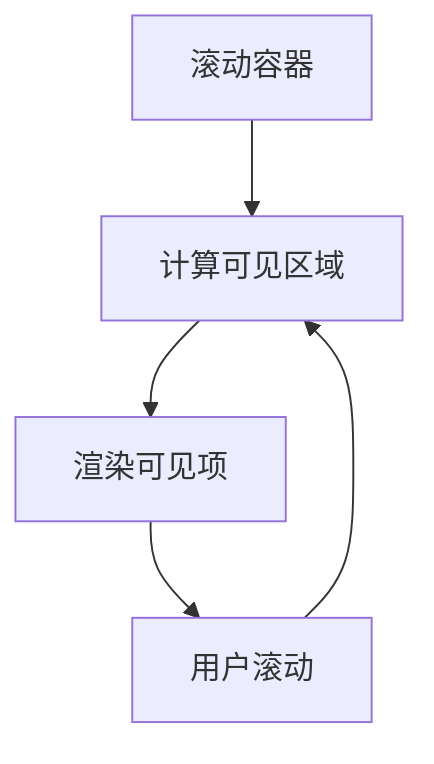

# 虚拟滚动列表

在现代 Web 应用中，处理大量数据列表是一个常见的需求。然而，直接渲染大量数据可能会导致性能问题，例如页面卡顿或内存占用过高。虚拟滚动列表（Virtual Scrolling List）是一种优化技术，它通过仅渲染当前可见的列表项来提升性能。

## 什么是虚拟滚动列表？

虚拟滚动列表是一种优化技术，用于高效地渲染大量数据。它的核心思想是只渲染用户当前可见的部分数据，而不是一次性渲染整个列表。当用户滚动列表时，虚拟滚动列表会动态加载和卸载列表项，从而减少 DOM 元素的数量，提升性能。

### 虚拟滚动列表的工作原理

虚拟滚动列表通过以下步骤实现：

1. **计算可见区域**：根据滚动容器的尺寸和滚动位置，计算出当前可见的区域。
2. **渲染可见项**：仅渲染当前可见的列表项，其他项不渲染。
3. **动态更新**：当用户滚动时，动态更新可见区域并重新渲染相应的列表项。



## 实现虚拟滚动列表

在 React 中，我们可以使用 `react-window` 或 `react-virtualized` 等库来实现虚拟滚动列表。下面是一个使用 `react-window` 的简单示例。

### 安装依赖

首先，安装 `react-window`：

```bash
npm install react-window
```

### 基本示例

以下是一个简单的虚拟滚动列表实现：

```jsx
import React from 'react';
import { FixedSizeList as List } from 'react-window';

const Row = ({ index, style }) => (
  <div style={style}>Row {index}</div>
);

const VirtualScrollList = () => (
  <List
    height={300}
    itemCount={1000}
    itemSize={35}
    width={300}
  >
    {Row}
  </List>
);

export default VirtualScrollList;
```

### 代码解释

- `FixedSizeList`：这是 `react-window` 提供的一个组件，用于渲染固定高度的列表项。
- `height`：列表容器的高度。
- `itemCount`：列表项的总数。
- `itemSize`：每个列表项的高度。
- `Row`：这是一个渲染函数，用于渲染每个列表项。

### 输出效果

运行上述代码后，你将看到一个包含 1000 行的列表，但只会渲染当前可见的部分行。当你滚动列表时，列表项会动态更新。

## 实际应用场景

虚拟滚动列表在许多实际场景中都非常有用，例如：

- **社交媒体动态**：在社交媒体应用中，用户可能会浏览大量的动态消息。使用虚拟滚动列表可以显著提升性能。
- **数据表格**：在数据密集型应用中，表格可能包含数千行数据。虚拟滚动列表可以确保表格的流畅滚动。
- **聊天记录**：在聊天应用中，虚拟滚动列表可以高效地渲染大量的聊天记录。

:::tip
在实际项目中，虚拟滚动列表不仅可以提升性能，还可以减少内存占用，特别是在移动设备上。
:::

## 总结

虚拟滚动列表是一种强大的优化技术，特别适用于需要渲染大量数据的场景。通过仅渲染当前可见的列表项，虚拟滚动列表可以显著提升性能，减少内存占用。在 React 生态系统中，`react-window` 和 `react-virtualized` 是实现虚拟滚动列表的常用工具。

## 附加资源

- [react-window 官方文档](https://react-window.vercel.app/)
- [react-virtualized 官方文档](https://bvaughn.github.io/react-virtualized/)

## 练习

1. 尝试使用 `react-window` 实现一个包含 5000 行数据的虚拟滚动列表。
2. 修改上述示例，使每个列表项的高度动态变化。
3. 探索 `react-window` 的其他组件，如 `VariableSizeList`，并实现一个动态高度的虚拟滚动列表。

通过以上练习，你将更深入地理解虚拟滚动列表的工作原理及其在 React 中的应用。