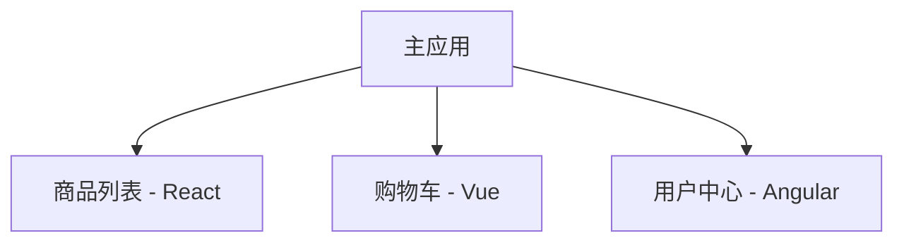

# 微前端应用

## 介绍

微前端（Micro Frontends）是一种将前端应用程序拆分为多个独立模块的架构模式。每个模块可以由不同的团队独立开发、测试和部署，最终组合成一个完整的应用程序。这种架构模式特别适合大型项目，能够提高开发效率、降低耦合度，并支持渐进式升级。

微前端的核心思想是将前端应用拆分为多个小型、自治的“微应用”，每个微应用可以独立运行，同时又能与其他微应用协同工作。这种模式类似于后端微服务架构，但应用于前端开发。

## 为什么需要微前端？

1. **团队自治**：不同团队可以独立开发和部署各自的微应用，减少团队间的依赖。
2. **技术栈灵活性**：每个微应用可以使用不同的技术栈（如 React、Vue、Angular），适合多技术栈共存的项目。
3. **渐进式升级**：可以逐步替换旧代码，而不需要一次性重构整个应用。
4. **独立部署**：每个微应用可以独立部署，减少发布风险。

## 微前端的实现方式

在 React 生态系统中，常见的微前端实现方式包括：

1. **模块联邦（Module Federation）**：通过 Webpack 5 的模块联邦功能，动态加载远程模块。
2. **iframe**：使用 iframe 嵌入其他微应用，简单但存在性能问题。
3. **自定义元素（Custom Elements）**：通过 Web Components 实现微前端。

下面我们将重点介绍如何使用 **模块联邦** 实现微前端。

---

## 使用模块联邦实现微前端

模块联邦是 Webpack 5 引入的一项功能，允许将应用程序拆分为多个独立的模块，并在运行时动态加载这些模块。以下是一个简单的示例，展示如何在 React 项目中实现模块联邦。

### 1. 设置主应用（Host App）

主应用负责加载其他微应用。首先，在主应用的 `webpack.config.js` 中配置模块联邦：

```javascript
const { ModuleFederationPlugin } = require("webpack").container;

module.exports = {
  plugins: [
    new ModuleFederationPlugin({
      name: "host",
      remotes: {
        app1: "app1@http://localhost:3001/remoteEntry.js",
      },
      shared: ["react", "react-dom"],
    }),
  ],
};
```

- `name`：主应用的名称。
- `remotes`：定义远程微应用的入口文件。
- `shared`：共享的依赖库，避免重复加载。

### 2. 设置微应用（Remote App）

微应用需要暴露一些模块供主应用使用。在微应用的 `webpack.config.js` 中配置模块联邦：

```javascript
const { ModuleFederationPlugin } = require("webpack").container;

module.exports = {
  plugins: [
    new ModuleFederationPlugin({
      name: "app1",
      filename: "remoteEntry.js",
      exposes: {
        "./App": "./src/App",
      },
      shared: ["react", "react-dom"],
    }),
  ],
};
```

- `name`：微应用的名称。
- `filename`：生成的入口文件名称。
- `exposes`：暴露的模块路径。

### 3. 在主应用中加载微应用

在主应用的 React 组件中，动态加载微应用：

```javascript
import React, { useEffect, useState } from "react";

const RemoteApp = React.lazy(() => import("app1/App"));

function App() {
  return (
    <div>
      <h1>主应用</h1>
      <React.Suspense fallback="加载中...">
        <RemoteApp />
      </React.Suspense>
    </div>
  );
}

export default App;
```

- `React.lazy`：用于动态加载远程模块。
- `React.Suspense`：提供加载中的占位符。

### 4. 运行效果

启动主应用和微应用后，主应用会动态加载微应用的 `App` 组件，并显示在页面上。

---

## 实际案例

### 案例：电商平台

假设我们正在开发一个电商平台，包含以下功能模块：

1. **商品列表**：由团队 A 使用 React 开发。
2. **购物车**：由团队 B 使用 Vue 开发。
3. **用户中心**：由团队 C 使用 Angular 开发。

通过微前端架构，每个团队可以独立开发和部署各自的模块，最终组合成一个完整的电商平台。



---

## 总结

微前端是一种强大的架构模式，特别适合大型项目和分布式团队。通过将前端应用拆分为多个独立的微应用，可以提高开发效率、降低耦合度，并支持渐进式升级。在 React 生态系统中，模块联邦是实现微前端的常用方式。

:::tip
如果你对微前端感兴趣，可以尝试以下练习：
1. 使用模块联邦实现一个包含多个微应用的简单项目。
2. 探索其他微前端实现方式，如 iframe 或 Web Components。
:::

---

## 附加资源

- [Webpack 模块联邦文档](https://webpack.js.org/concepts/module-federation/)
- [微前端架构指南](https://micro-frontends.org/)
- [React 官方文档](https://reactjs.org/)