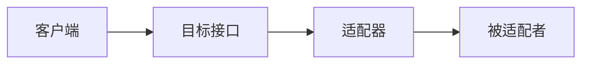

## 什么是适配器模式？

适配器模式（Adapter Pattern）是一种结构型设计模式，它允许两个不兼容的接口能够协同工作。适配器模式通过将一个类的接口转换成客户端期望的另一个接口，解决了接口不兼容的问题。

在 React 中，适配器模式常用于将第三方库或遗留代码的接口转换为与 React 组件兼容的接口。这种模式使得我们可以在不修改现有代码的情况下，轻松地集成新的功能或库。

## 适配器模式的工作原理

适配器模式的核心思想是创建一个适配器类，该类实现了目标接口，并在内部持有一个被适配者的实例。适配器类通过调用被适配者的方法来实现目标接口的功能。



在上图中，客户端通过目标接口与适配器交互，适配器再将请求转发给被适配者。

## 代码示例

假设我们有一个第三方库，它提供了一个 `LegacyLogger` 类，用于记录日志。然而，我们的 React 应用使用的是 `ModernLogger` 接口。为了使 `LegacyLogger` 能够与 `ModernLogger` 兼容，我们可以创建一个适配器类。

```javascript
// 被适配者：LegacyLogger
class LegacyLogger {
  logMessage(message) {
    console.log(`Legacy Logger: ${message}`);
  }
}

// 目标接口：ModernLogger
class ModernLogger {
  log(message) {
    throw new Error("Method not implemented.");
  }
}

// 适配器：LegacyLoggerAdapter
class LegacyLoggerAdapter extends ModernLogger {
  constructor(legacyLogger) {
    super();
    this.legacyLogger = legacyLogger;
  }

  log(message) {
    this.legacyLogger.logMessage(message);
  }
}

// 客户端代码
const legacyLogger = new LegacyLogger();
const loggerAdapter = new LegacyLoggerAdapter(legacyLogger);

loggerAdapter.log("This is a modern log message!");
```

**输出：**
```
Legacy Logger: This is a modern log message!
```

在这个例子中，`LegacyLoggerAdapter` 将 `ModernLogger` 的 `log` 方法转换为 `LegacyLogger` 的 `logMessage` 方法，从而实现了接口的兼容。

## 实际应用场景

### 1. 集成第三方库

在 React 应用中，我们经常需要集成第三方库。如果这些库的接口与我们的应用不兼容，适配器模式可以帮助我们轻松地解决这个问题。

例如，假设我们使用了一个日期处理库 `Moment.js`，但我们的应用使用的是 `date-fns` 的接口。我们可以创建一个适配器，将 `Moment.js` 的接口转换为 `date-fns` 的接口。

```javascript
import moment from 'moment';
import { format } from 'date-fns';

class MomentToDateFnsAdapter {
  formatDate(date, formatString) {
    const momentDate = moment(date);
    return format(momentDate.toDate(), formatString);
  }
}

const adapter = new MomentToDateFnsAdapter();
console.log(adapter.formatDate(new Date(), 'yyyy-MM-dd'));
```

### 2. 处理遗留代码

在大型项目中，可能会存在一些遗留代码，这些代码的接口可能与新代码不兼容。适配器模式可以帮助我们在不修改遗留代码的情况下，将其集成到新系统中。

## 总结

适配器模式是一种非常有用的设计模式，特别是在需要集成不兼容的接口时。通过创建一个适配器类，我们可以将不兼容的接口转换为可用的接口，从而避免对现有代码的修改。

在 React 中，适配器模式常用于集成第三方库或处理遗留代码。通过使用适配器模式，我们可以保持代码的整洁和可维护性。

## 附加资源与练习

- **练习**：尝试为一个现有的第三方库创建一个适配器，并将其集成到你的 React 项目中。
- **进一步阅读**：了解其他结构型设计模式，如装饰器模式、代理模式等。

:::tip
适配器模式不仅适用于 React，它在任何需要处理接口不兼容的场景中都非常有用。掌握这种模式将帮助你更好地设计和维护你的代码。
:::