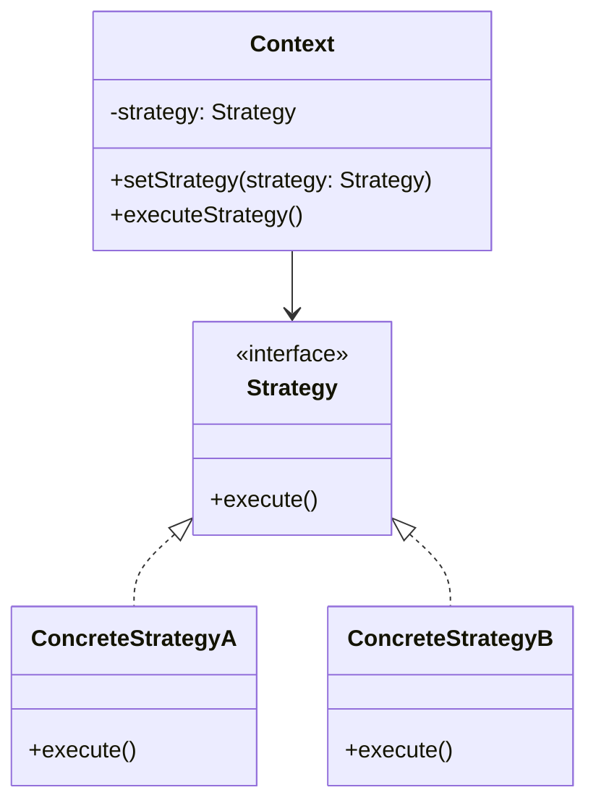

## 什么是策略模式？

策略模式（Strategy Pattern）是一种行为设计模式，它允许你定义一系列算法或行为，并将它们封装在独立的类中，使得它们可以相互替换。策略模式使得算法可以独立于使用它的客户端而变化。

简单来说，策略模式的核心思想是将**做什么**和**怎么做**分离。通过将不同的算法或行为封装成独立的策略类，客户端可以根据需要动态选择使用哪种策略，而不需要修改客户端代码。

## 策略模式的结构

策略模式通常由以下几个部分组成：

1. **策略接口（Strategy Interface）**：定义所有具体策略类必须实现的接口。
2. **具体策略类（Concrete Strategies）**：实现策略接口的具体算法或行为。
3. **上下文类（Context）**：持有一个策略对象的引用，并通过策略接口与具体策略类进行交互。



## 策略模式的实现

让我们通过一个简单的例子来理解策略模式的实现。假设我们有一个应用程序，需要根据不同的排序策略对数组进行排序。

### 1. 定义策略接口

首先，我们定义一个策略接口 `SortStrategy`，它包含一个 `sort` 方法。

```javascript
interface SortStrategy {
  sort(array: number[]): number[];
}
```

### 2. 实现具体策略类

接下来，我们实现两个具体的排序策略类：`BubbleSortStrategy` 和 `QuickSortStrategy`。

```javascript
class BubbleSortStrategy implements SortStrategy {
  sort(array: number[]): number[] {
    console.log("Sorting using bubble sort");
    // 实现冒泡排序算法
    return array.slice().sort((a, b) => a - b);
  }
}

class QuickSortStrategy implements SortStrategy {
  sort(array: number[]): number[] {
    console.log("Sorting using quick sort");
    // 实现快速排序算法
    return array.slice().sort((a, b) => a - b);
  }
}
```

### 3. 创建上下文类

然后，我们创建一个上下文类 `Sorter`，它持有一个 `SortStrategy` 的引用，并提供一个方法来执行排序。

```javascript
class Sorter {
  private strategy: SortStrategy;

  constructor(strategy: SortStrategy) {
    this.strategy = strategy;
  }

  setStrategy(strategy: SortStrategy) {
    this.strategy = strategy;
  }

  sort(array: number[]): number[] {
    return this.strategy.sort(array);
  }
}
```

### 4. 使用策略模式

最后，我们可以通过以下方式使用策略模式：

```javascript
const array = [3, 1, 4, 1, 5, 9, 2, 6, 5, 3, 5];

const sorter = new Sorter(new BubbleSortStrategy());
console.log(sorter.sort(array)); // 使用冒泡排序

sorter.setStrategy(new QuickSortStrategy());
console.log(sorter.sort(array)); // 使用快速排序
```

:::note
在这个例子中，`Sorter` 类并不关心具体的排序算法是如何实现的，它只需要知道如何调用 `sort` 方法即可。这使得我们可以在运行时动态地切换排序策略，而不需要修改 `Sorter` 类的代码。
:::

## 策略模式在 React 中的应用

在 React 中，策略模式可以用于处理不同的渲染逻辑或行为。例如，假设我们有一个组件，需要根据不同的用户角色显示不同的内容。

### 1. 定义策略接口

首先，我们定义一个策略接口 `ContentStrategy`，它包含一个 `render` 方法。

```javascript
interface ContentStrategy {
  render(): JSX.Element;
}
```

### 2. 实现具体策略类

接下来，我们实现两个具体的内容策略类：`AdminContentStrategy` 和 `UserContentStrategy`。

```javascript
class AdminContentStrategy implements ContentStrategy {
  render(): JSX.Element {
    return <div>Admin Content</div>;
  }
}

class UserContentStrategy implements ContentStrategy {
  render(): JSX.Element {
    return <div>User Content</div>;
  }
}
```

### 3. 创建上下文组件

然后，我们创建一个上下文组件 `ContentRenderer`，它持有一个 `ContentStrategy` 的引用，并根据策略渲染内容。

```javascript
const ContentRenderer = ({ strategy }: { strategy: ContentStrategy }) => {
  return <div>{strategy.render()}</div>;
};
```

### 4. 使用策略模式

最后，我们可以通过以下方式使用策略模式：

```javascript
const App = () => {
  const [role, setRole] = useState("user");

  const strategy = role === "admin" ? new AdminContentStrategy() : new UserContentStrategy();

  return (
    <div>
      <button onClick={() => setRole("admin")}>Switch to Admin</button>
      <button onClick={() => setRole("user")}>Switch to User</button>
      <ContentRenderer strategy={strategy} />
    </div>
  );
};
```

:::tip
在这个例子中，`ContentRenderer` 组件并不关心具体的内容是如何渲染的，它只需要知道如何调用 `render` 方法即可。这使得我们可以在运行时动态地切换内容渲染策略，而不需要修改 `ContentRenderer` 组件的代码。
:::

## 总结

策略模式是一种非常有用的设计模式，它可以帮助我们将算法或行为封装在独立的类中，使得它们可以相互替换。通过使用策略模式，我们可以使代码更加灵活、可扩展，并且易于维护。

在实际开发中，策略模式可以应用于各种场景，例如排序算法、内容渲染、支付方式选择等。通过将不同的策略封装成独立的类，我们可以轻松地在运行时切换策略，而不需要修改客户端代码。

## 附加资源与练习

- **练习**：尝试在 React 中实现一个表单验证策略模式，根据不同的验证规则动态切换验证策略。
- **资源**：阅读《设计模式：可复用面向对象软件的基础》一书，深入了解策略模式及其他设计模式。

希望本文能帮助你理解策略模式的概念及其在 React 中的应用。如果你有任何问题或建议，欢迎在评论区留言！