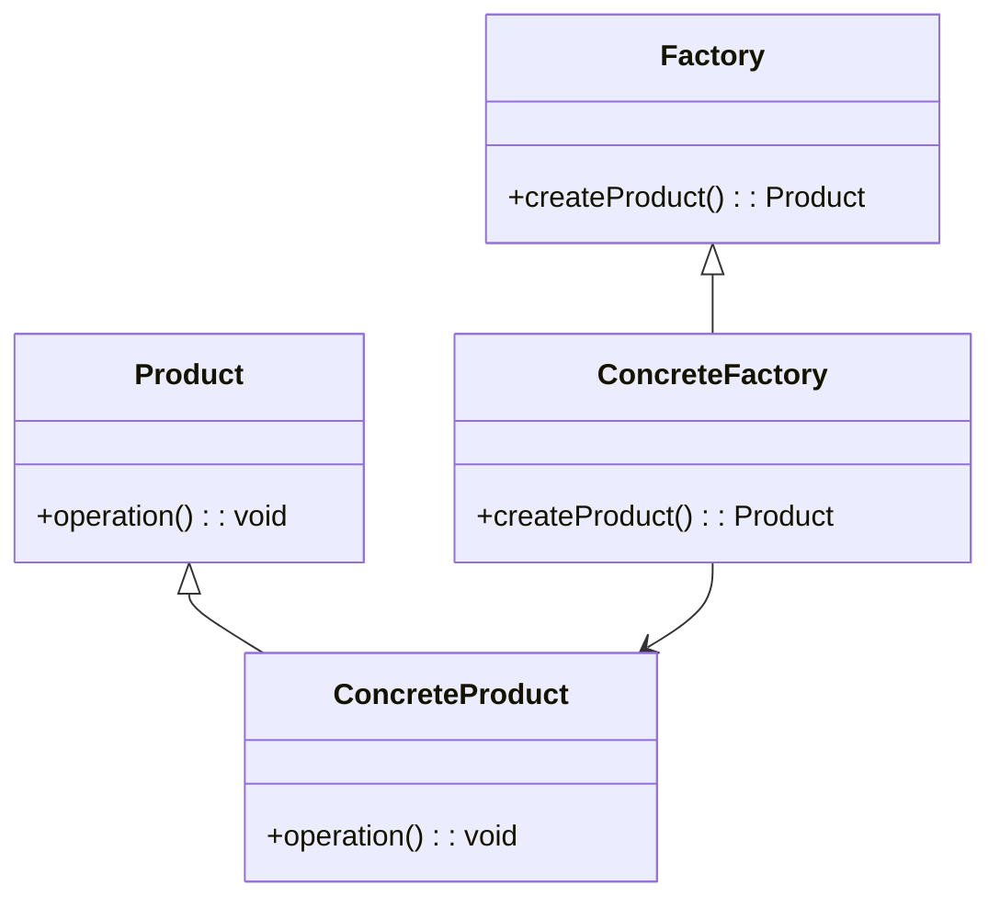

# 工厂模式

工厂模式是一种创建型设计模式，它提供了一种创建对象的方式，而无需指定具体的类。通过使用工厂模式，您可以将对象的创建逻辑与使用逻辑分离，从而使代码更加模块化和可维护。

## 什么是工厂模式？

工厂模式的核心思想是**封装对象的创建过程**。它允许您定义一个接口或类来创建对象，但将具体的实例化逻辑推迟到子类或工厂函数中。这样，您可以在不修改客户端代码的情况下更改对象的创建方式。

在 React 中，工厂模式通常用于创建组件或管理复杂对象的实例化过程。

## 工厂模式的基本结构

工厂模式通常由以下几个部分组成：

1. **工厂接口或抽象类**：定义创建对象的接口。
2. **具体工厂类**：实现工厂接口，负责创建具体的对象。
3. **产品接口或抽象类**：定义产品的接口。
4. **具体产品类**：实现产品接口，是工厂创建的对象。



## 工厂模式的实现

让我们通过一个简单的例子来理解工厂模式。假设我们有一个应用程序，需要根据用户的角色创建不同的用户界面组件。

### 1. 定义产品接口

首先，我们定义一个产品接口 `UserComponent`，它代表用户界面组件。

```jsx
interface UserComponent {
  render(): JSX.Element;
}
```

### 2. 创建具体产品类

接下来，我们创建两个具体的产品类：`AdminComponent` 和 `UserComponent`。

```jsx
class AdminComponent implements UserComponent {
  render() {
    return <div>Admin Dashboard</div>;
  }
}

class RegularUserComponent implements UserComponent {
  render() {
    return <div>User Profile</div>;
  }
}
```

### 3. 创建工厂类

然后，我们创建一个工厂类 `UserComponentFactory`，它根据用户的角色返回相应的组件。

```jsx
class UserComponentFactory {
  static createComponent(role: string): UserComponent {
    switch (role) {
      case 'admin':
        return new AdminComponent();
      case 'user':
        return new RegularUserComponent();
      default:
        throw new Error('Invalid role');
    }
  }
}
```

### 4. 使用工厂类

最后，我们可以在应用程序中使用工厂类来创建组件。

```jsx
function App() {
  const role = 'admin'; // 假设用户角色为 admin
  const component = UserComponentFactory.createComponent(role);

  return (
    <div>
      {component.render()}
    </div>
  );
}
```

在这个例子中，`UserComponentFactory` 负责根据用户的角色创建相应的组件。这样，我们可以在不修改客户端代码的情况下更改组件的创建逻辑。

## 工厂模式的实际应用场景

工厂模式在 React 中有许多实际应用场景，例如：

1. **动态组件创建**：根据用户的输入或配置动态创建不同的组件。
2. **复杂对象的创建**：当对象的创建过程比较复杂时，可以使用工厂模式来封装创建逻辑。
3. **依赖注入**：在依赖注入框架中，工厂模式常用于创建和管理依赖对象。

## 总结

工厂模式是一种强大的设计模式，它可以帮助您将对象的创建逻辑与使用逻辑分离，从而使代码更加模块化和可维护。通过使用工厂模式，您可以轻松地扩展和修改对象的创建过程，而无需修改客户端代码。

## 附加资源与练习

- **练习**：尝试在您的 React 项目中使用工厂模式来创建不同的组件。例如，根据用户的权限级别创建不同的导航栏组件。
- **进一步阅读**：了解更多关于设计模式的内容，例如单例模式、观察者模式等。

:::tip
工厂模式非常适合用于管理复杂对象的创建过程。如果您发现自己在代码中频繁地使用 `new` 关键字来创建对象，那么工厂模式可能是一个很好的解决方案。
:::