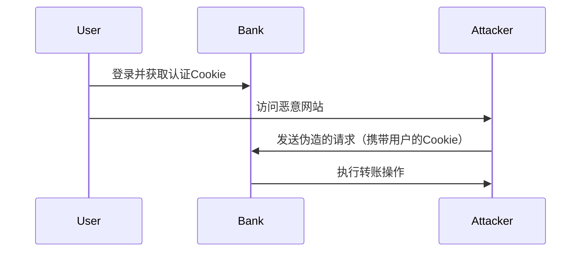

## 什么是CSRF攻击？

CSRF（Cross-Site Request Forgery，跨站请求伪造）是一种常见的Web安全漏洞。攻击者通过诱使用户在已认证的Web应用中执行非预期的操作，从而利用用户的身份进行恶意操作。例如，攻击者可能会诱使用户点击一个链接，导致用户在不知情的情况下发送请求，如转账、更改密码等。

:::note
CSRF攻击通常依赖于用户已经登录了目标网站，并且浏览器会自动携带用户的认证信息（如Cookie）发送请求。
:::

## CSRF攻击的工作原理

为了更好地理解CSRF攻击，让我们来看一个简单的例子：

1. 用户登录了一个银行网站，并获得了认证Cookie。
2. 用户在不退出银行网站的情况下，访问了一个恶意网站。
3. 恶意网站包含一个隐藏的表单，该表单会自动向银行网站发送一个转账请求。
4. 由于用户的浏览器会自动携带认证Cookie，银行网站会认为这是用户发起的合法请求，并执行转账操作。



## 如何在React中防护CSRF攻击？

在React应用中，我们可以通过以下几种方式来防护CSRF攻击：

### 1. 使用CSRF Token

CSRF Token是一种常见的防护机制。它的工作原理是：服务器生成一个随机的Token，并将其嵌入到表单或请求头中。当用户提交表单时，服务器会验证该Token是否匹配，如果不匹配，则拒绝请求。

#### 实现步骤：

1. **服务器生成Token**：在用户访问页面时，服务器生成一个随机的CSRF Token，并将其嵌入到页面中。
2. **客户端发送Token**：当用户提交表单时，客户端将Token一并发送给服务器。
3. **服务器验证Token**：服务器验证Token的有效性，如果验证通过，则处理请求。

#### 代码示例：

```jsx
// 服务器端生成CSRF Token
const csrfToken = generateRandomToken();

// 将Token嵌入到页面中
res.render('form', { csrfToken });

// 客户端表单提交
function Form() {
  const [csrfToken, setCsrfToken] = useState('');

  useEffect(() => {
    // 从服务器获取CSRF Token
    fetch('/get-csrf-token')
      .then(response => response.json())
      .then(data => setCsrfToken(data.token));
  }, []);

  const handleSubmit = (e) => {
    e.preventDefault();
    fetch('/submit-form', {
      method: 'POST',
      headers: {
        'Content-Type': 'application/json',
        'X-CSRF-Token': csrfToken,
      },
      body: JSON.stringify({ /* 表单数据 */ }),
    });
  };

  return (
    <form onSubmit={handleSubmit}>
      <input type="hidden" name="csrfToken" value={csrfToken} />
      {/* 其他表单字段 */}
      <button type="submit">提交</button>
    </form>
  );
}
```

### 2. 使用SameSite Cookie属性

现代浏览器支持`SameSite` Cookie属性，它可以防止浏览器在跨站请求中发送Cookie。通过将Cookie的`SameSite`属性设置为`Strict`或`Lax`，可以有效防止CSRF攻击。

#### 代码示例：

```js
// 设置SameSite属性
res.cookie('sessionId', '12345', { sameSite: 'Strict', httpOnly: true });
```

:::tip
`SameSite=Strict`会完全阻止跨站请求携带Cookie，而`SameSite=Lax`则允许某些安全的跨站请求（如导航请求）携带Cookie。
:::

### 3. 验证请求来源

服务器可以通过检查请求头中的`Origin`或`Referer`字段来验证请求是否来自合法的源。如果请求来源与预期不符，则拒绝请求。

#### 代码示例：

```js
app.use((req, res, next) => {
  const origin = req.get('Origin');
  if (origin !== 'https://your-legitimate-site.com') {
    return res.status(403).send('Forbidden');
  }
  next();
});
```

## 实际案例

假设你正在开发一个电商网站，用户可以在该网站上购买商品。为了防止CSRF攻击，你可以在用户提交订单时使用CSRF Token进行验证。

1. 当用户访问订单页面时，服务器生成一个CSRF Token，并将其嵌入到页面中。
2. 用户提交订单时，客户端将CSRF Token一并发送给服务器。
3. 服务器验证CSRF Token的有效性，如果验证通过，则处理订单。

通过这种方式，即使攻击者诱使用户点击恶意链接，也无法伪造订单请求，因为请求中缺少有效的CSRF Token。

## 总结

CSRF攻击是一种常见的Web安全威胁，但通过使用CSRF Token、SameSite Cookie属性以及验证请求来源等方法，我们可以有效地防护这种攻击。在React应用中，结合这些防护措施，可以大大提高应用的安全性。

:::caution
虽然CSRF Token是一种有效的防护机制，但它并不能完全防止所有类型的CSRF攻击。因此，建议结合多种防护措施，以提高安全性。
:::

## 附加资源

- [OWASP CSRF防护指南](https://owasp.org/www-community/attacks/csrf)
- [MDN SameSite Cookie文档](https://developer.mozilla.org/en-US/docs/Web/HTTP/Headers/Set-Cookie/SameSite)
- [React官方安全指南](https://reactjs.org/docs/security.html)

## 练习

1. 在你的React应用中实现CSRF Token机制，并测试其有效性。
2. 尝试将Cookie的`SameSite`属性设置为`Strict`，并观察其对跨站请求的影响。
3. 编写一个中间件，验证请求的`Origin`或`Referer`字段，确保请求来自合法的源。