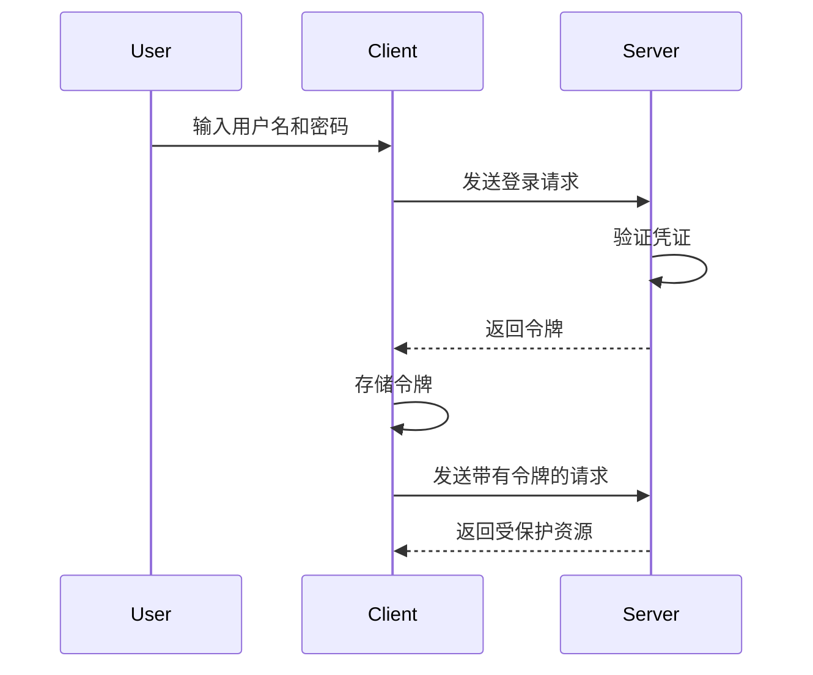

## 介绍

身份认证是 Web 应用中的核心功能之一，它确保只有经过验证的用户才能访问特定资源。在 React 应用中，身份认证的安全性至关重要，因为它直接关系到用户数据的安全和隐私。本文将逐步讲解如何在 React 应用中实现安全的身份认证机制，并提供实际案例和代码示例。

## 什么是身份认证？

身份认证是验证用户身份的过程。通常，用户通过提供用户名和密码来证明自己的身份。一旦认证成功，系统会生成一个令牌（如 JWT），用于后续请求的身份验证。

## 基本身份认证流程

以下是身份认证的基本流程：

1. **用户登录**：用户输入用户名和密码。
2. **验证凭证**：服务器验证用户名和密码是否正确。
3. **生成令牌**：如果凭证正确，服务器生成一个令牌并返回给客户端。
4. **存储令牌**：客户端（通常是浏览器）存储令牌（通常在 `localStorage` 或 `sessionStorage` 中）。
5. **发送令牌**：客户端在后续请求中发送令牌以验证身份。



## 实现安全的身份认证

### 1. 使用 HTTPS

确保所有通信都通过 HTTPS 进行，以防止中间人攻击（MITM）。

### 2. 使用 JWT（JSON Web Token）

JWT 是一种开放标准（RFC 7519），用于在各方之间安全地传输信息。它通常用于身份认证。

#### 生成 JWT

```javascript
const jwt = require('jsonwebtoken');

const user = { id: 1, username: 'john_doe' };
const token = jwt.sign(user, 'your-secret-key', { expiresIn: '1h' });

console.log(token);
```

#### 验证 JWT

```javascript
const jwt = require('jsonwebtoken');

const token = 'your-jwt-token';
jwt.verify(token, 'your-secret-key', (err, decoded) => {
    if (err) {
        console.error('Token verification failed:', err);
    } else {
        console.log('Decoded token:', decoded);
    }
});
```

### 3. 安全存储令牌

将 JWT 存储在 `localStorage` 或 `sessionStorage` 中时，确保不要存储敏感信息。可以考虑使用 `httpOnly` 和 `secure` 标志的 cookie 来存储令牌。

### 4. 防止 CSRF 攻击

使用 CSRF 令牌来防止跨站请求伪造攻击。每次请求时，客户端需要发送一个 CSRF 令牌，服务器验证该令牌是否有效。

### 5. 定期刷新令牌

为了防止令牌被盗用，建议定期刷新令牌。可以设置一个较短的过期时间，并在令牌即将过期时自动刷新。

## 实际案例

假设我们有一个 React 应用，用户可以通过登录表单进行身份认证。以下是一个简单的实现：

```javascript
import React, { useState } from 'react';
import axios from 'axios';

const LoginForm = () => {
    const [username, setUsername] = useState('');
    const [password, setPassword] = useState('');

    const handleLogin = async () => {
        try {
            const response = await axios.post('/api/login', { username, password });
            localStorage.setItem('token', response.data.token);
            console.log('Login successful');
        } catch (error) {
            console.error('Login failed:', error);
        }
    };

    return (
        <div>
            <input type="text" value={username} onChange={(e) => setUsername(e.target.value)} placeholder="Username" />
            <input type="password" value={password} onChange={(e) => setPassword(e.target.value)} placeholder="Password" />
            <button onClick={handleLogin}>Login</button>
        </div>
    );
};

export default LoginForm;
```

## 总结

身份认证是保护用户数据和隐私的关键。通过使用 HTTPS、JWT、安全存储令牌、防止 CSRF 攻击和定期刷新令牌，可以在 React 应用中实现安全的身份认证机制。

## 附加资源

- [JWT 官方文档](https://jwt.io/)
- [OWASP 身份认证指南](https://owasp.org/www-project-cheat-sheets/cheatsheets/Authentication_Cheat_Sheet.html)
- [React 官方文档](https://reactjs.org/docs/getting-started.html)

## 练习

1. 实现一个 React 登录表单，使用 JWT 进行身份认证。
2. 尝试在登录成功后，将 JWT 存储在 `localStorage` 中，并在后续请求中发送该令牌。
3. 研究并实现 CSRF 保护机制。
