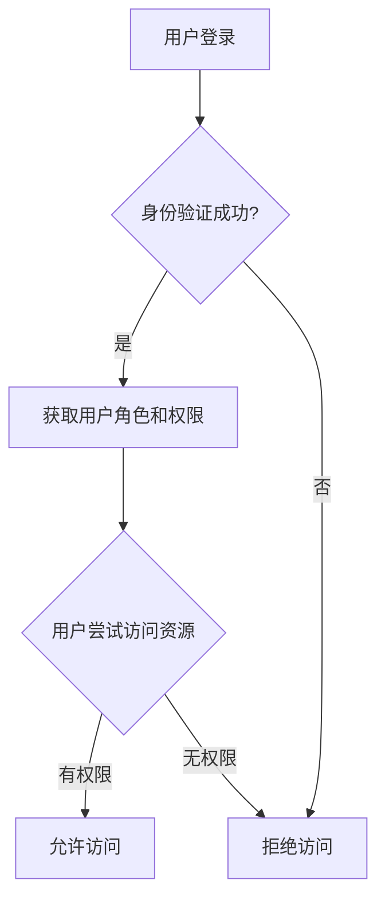

在构建现代 Web 应用时，授权与权限控制是确保应用安全性的关键部分。授权是指确定用户是否有权限执行特定操作或访问特定资源的过程。权限控制则是实现这一目标的具体机制。本文将逐步讲解如何在 React 应用中实现授权与权限控制，并通过实际案例帮助你理解其应用场景。

## 什么是授权与权限控制？

授权（Authorization）是验证用户是否有权限执行某项操作或访问某项资源的过程。与身份验证（Authentication）不同，身份验证是确认用户是谁，而授权是确认用户可以做什么。

权限控制（Permission Control）是实现授权的具体机制。它通常包括角色管理、权限分配以及访问控制列表（ACL）等技术手段。

## 为什么需要授权与权限控制？

在一个多用户系统中，不同的用户可能具有不同的权限。例如，管理员可以管理用户，而普通用户只能查看自己的信息。如果没有适当的授权与权限控制，可能会导致以下问题：

- 用户访问未授权的资源。
- 数据泄露或数据篡改。
- 系统安全性受到威胁。

因此，授权与权限控制是确保应用安全性和数据完整性的重要手段。

---

## 实现授权与权限控制的基本步骤

在 React 应用中，授权与权限控制通常通过以下步骤实现：

1. **定义角色和权限**：明确系统中存在哪些角色，以及每个角色具有哪些权限。
2. **用户身份验证**：通过身份验证确认用户身份。
3. **权限检查**：在用户尝试访问资源或执行操作时，检查其权限。
4. **渲染受控组件**：根据用户权限动态渲染界面。

### 1. 定义角色和权限

首先，我们需要定义系统中的角色及其权限。例如：

```javascript
const roles = {
  admin: {
    canViewDashboard: true,
    canManageUsers: true,
  },
  user: {
    canViewDashboard: true,
    canManageUsers: false,
  },
};
```

### 2. 用户身份验证

用户登录后，通常会从服务器获取一个包含用户角色和权限的令牌（如 JWT）。我们可以将其存储在状态管理工具（如 Redux 或 Context API）中。

```javascript
const user = {
  role: 'admin',
  permissions: roles['admin'],
};
```

### 3. 权限检查

在用户尝试访问资源时，我们需要检查其权限。例如：

```javascript
function checkPermission(user, permission) {
  return user.permissions[permission];
}
```

### 4. 渲染受控组件

根据用户权限动态渲染界面。例如：

```javascript
function Dashboard({ user }) {
  return (
    <div>
      {checkPermission(user, 'canViewDashboard') && <h1>Welcome to the Dashboard</h1>}
      {checkPermission(user, 'canManageUsers') && <button>Manage Users</button>}
    </div>
  );
}
```

---

## 实际案例：基于角色的权限控制

假设我们正在构建一个博客平台，其中包含以下角色：

- **管理员**：可以管理所有文章和用户。
- **作者**：可以创建和编辑自己的文章。
- **读者**：只能查看文章。

### 定义角色和权限

```javascript
const roles = {
  admin: {
    canViewArticles: true,
    canEditArticles: true,
    canDeleteArticles: true,
    canManageUsers: true,
  },
  author: {
    canViewArticles: true,
    canEditArticles: true,
    canDeleteArticles: false,
    canManageUsers: false,
  },
  reader: {
    canViewArticles: true,
    canEditArticles: false,
    canDeleteArticles: false,
    canManageUsers: false,
  },
};
```

### 动态渲染界面

根据用户角色渲染不同的界面：

```javascript
function ArticlePage({ user }) {
  return (
    <div>
      <h1>Article Title</h1>
      <p>Article content...</p>
      {checkPermission(user, 'canEditArticles') && <button>Edit Article</button>}
      {checkPermission(user, 'canDeleteArticles') && <button>Delete Article</button>}
    </div>
  );
}
```

---

## 使用 Mermaid 绘制权限流程图

以下是一个简单的权限控制流程图：



---

## 总结

授权与权限控制是确保 React 应用安全性的重要手段。通过定义角色和权限、检查用户权限以及动态渲染界面，我们可以有效地控制用户对资源的访问。在实际开发中，建议结合后端权限验证，以确保系统的整体安全性。

---

## 附加资源与练习

- **练习**：尝试在你的 React 项目中实现一个简单的权限控制系统，支持管理员和普通用户两种角色。
- **资源**：
  - [React 官方文档](https://reactjs.org/docs/getting-started.html)
  - [JWT 授权指南](https://jwt.io/introduction)
  - [Redux 状态管理](https://redux.js.org/)

通过不断实践和学习，你将能够掌握授权与权限控制的精髓，并构建出更加安全的 React 应用！