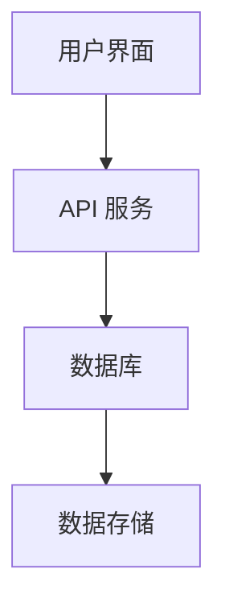

# 项目文档维护

在 React 项目中，文档维护是确保代码可读性和可维护性的关键部分。良好的文档不仅帮助开发者理解代码的功能和结构，还能为新加入的团队成员提供快速上手的指南。本文将详细介绍如何在 React 项目中有效地维护文档。

## 为什么需要文档维护？

文档维护不仅仅是编写代码注释，它还包括编写清晰的 README 文件、API 文档、以及项目架构说明。良好的文档可以帮助开发者：

- 快速理解项目结构和代码逻辑
- 减少代码维护成本
- 提高团队协作效率
- 为新成员提供快速上手的指南

## 文档维护的最佳实践

### 1. 编写清晰的 README 文件

README 文件是项目的门面，它应该包含项目的基本信息、安装步骤、使用说明、以及贡献指南。以下是一个简单的 README 文件示例：

```markdown
# My React Project

## 项目简介

这是一个使用 React 构建的示例项目，旨在展示如何有效地维护项目文档。

## 安装步骤

1. 克隆仓库：
   ```bash
   git clone https://github.com/your-username/my-react-project.git
   ```
2. 安装依赖：
   ```bash
   npm install
   ```
3. 启动开发服务器：
   ```bash
   npm start
   ```

## 使用说明

- 运行 `npm start` 启动开发服务器。
- 运行 `npm test` 运行测试。

## 贡献指南

欢迎贡献！请阅读 `CONTRIBUTING.md` 了解更多信息。
```

### 2. 使用 JSDoc 注释

JSDoc 是一种用于 JavaScript 的文档生成工具，它可以帮助你为函数、类和模块生成详细的 API 文档。以下是一个使用 JSDoc 注释的示例：

```javascript
/**
 * 计算两个数字的和
 * @param {number} a - 第一个数字
 * @param {number} b - 第二个数字
 * @returns {number} 两个数字的和
 */
function add(a, b) {
  return a + b;
}
```

### 3. 维护项目架构文档

项目架构文档可以帮助开发者理解项目的整体结构和各个模块之间的关系。你可以使用图表来展示项目的架构。以下是一个使用 Mermaid 绘制的简单架构图：



### 4. 使用 Storybook 进行组件文档化

Storybook 是一个用于开发和展示 UI 组件的工具，它可以帮助你为每个组件生成详细的文档。以下是一个简单的 Storybook 示例：

```javascript
import React from 'react';
import { Button } from './Button';

export default {
  title: 'Button',
  component: Button,
};

export const Primary = () => <Button primary>Primary Button</Button>;
export const Secondary = () => <Button>Secondary Button</Button>;
```

### 5. 定期更新文档

文档不是一成不变的，随着项目的演进，文档也需要不断更新。确保每次代码变更后，相关的文档也得到相应的更新。

## 实际案例

假设你正在开发一个 React 项目，项目中包含多个组件和 API 服务。你可以按照以下步骤维护文档：

1. 编写一个详细的 README 文件，介绍项目的背景、安装步骤和使用说明。
2. 使用 JSDoc 为每个函数和类添加注释，生成 API 文档。
3. 使用 Mermaid 绘制项目架构图，帮助开发者理解项目的整体结构。
4. 使用 Storybook 为每个 UI 组件生成文档，展示组件的不同状态和用法。
5. 定期检查并更新文档，确保文档与代码保持一致。

## 总结

项目文档维护是 React 项目开发中不可忽视的一部分。通过编写清晰的 README 文件、使用 JSDoc 注释、维护项目架构文档、使用 Storybook 进行组件文档化，以及定期更新文档，你可以确保项目的可读性和可维护性。

## 附加资源

- [JSDoc 官方文档](https://jsdoc.app/)
- [Storybook 官方文档](https://storybook.js.org/)
- [Mermaid 官方文档](https://mermaid-js.github.io/mermaid/)

## 练习

1. 为你的 React 项目编写一个详细的 README 文件。
2. 使用 JSDoc 为项目中的函数和类添加注释。
3. 使用 Mermaid 绘制项目的架构图。
4. 使用 Storybook 为项目中的 UI 组件生成文档。
