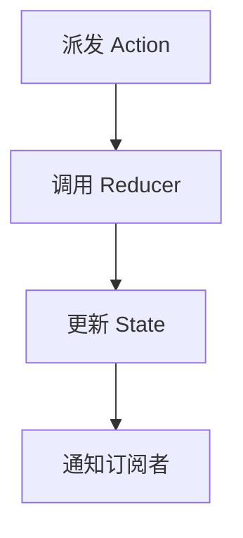

# Redux基础概念

Redux 是一个用于 JavaScript 应用的状态管理库，特别适合与 React 一起使用。它通过集中管理应用的状态，使得状态的变化更加可预测和易于调试。对于初学者来说，理解 Redux 的核心概念是掌握其用法的关键。

## 什么是 Redux？

Redux 是一个状态容器，它帮助你在 JavaScript 应用中管理全局状态。Redux 的核心思想是将应用的状态存储在一个单一的、不可变的 store 中，并通过纯函数（reducers）来更新状态。这种设计使得状态的变化更加可预测，并且易于调试。

### Redux 的核心概念

Redux 的核心概念包括以下几个部分：

1. **State（状态）**：应用的状态存储在一个单一的 JavaScript 对象中。
2. **Action（动作）**：描述状态变化的普通 JavaScript 对象。
3. **Reducer（归约器）**：纯函数，根据当前的 state 和 action 来计算新的 state。
4. **Store（存储）**：包含整个应用的状态，并提供了一些方法来访问状态、派发 action 和监听状态变化。

## Redux 的工作流程

Redux 的工作流程可以概括为以下几个步骤：

1. **派发 Action**：用户或应用中的某个事件触发一个 action。
2. **调用 Reducer**：Redux 调用 reducer 函数，传入当前的 state 和 action。
3. **更新 State**：Reducer 根据 action 的类型和 payload 来更新 state。
4. **通知订阅者**：Store 通知所有订阅了 state 变化的组件，组件根据新的 state 重新渲染。



## 实际案例：计数器应用

让我们通过一个简单的计数器应用来理解 Redux 的基本用法。

### 1. 定义 Action

首先，我们需要定义一些 action 来描述状态的变化。在这个例子中，我们有两个 action：`INCREMENT` 和 `DECREMENT`。

```javascript
const increment = () => ({
  type: 'INCREMENT'
});

const decrement = () => ({
  type: 'DECREMENT'
});
```

### 2. 定义 Reducer

接下来，我们定义一个 reducer 来处理这些 action，并更新 state。

```javascript
const initialState = {
  count: 0
};

const counterReducer = (state = initialState, action) => {
  switch (action.type) {
    case 'INCREMENT':
      return {
        ...state,
        count: state.count + 1
      };
    case 'DECREMENT':
      return {
        ...state,
        count: state.count - 1
      };
    default:
      return state;
  }
};
```

### 3. 创建 Store

然后，我们使用 `createStore` 函数来创建一个 store，并将 reducer 传递给它。

```javascript
import { createStore } from 'redux';

const store = createStore(counterReducer);
```

### 4. 派发 Action

现在，我们可以通过调用 `store.dispatch` 来派发 action，从而更新 state。

```javascript
store.dispatch(increment());
store.dispatch(increment());
store.dispatch(decrement());
```

### 5. 获取 State

我们可以通过 `store.getState` 来获取当前的 state。

```javascript
console.log(store.getState()); // { count: 1 }
```

### 6. 订阅 State 变化

最后，我们可以通过 `store.subscribe` 来订阅 state 的变化，并在每次 state 更新时执行一些操作。

```javascript
store.subscribe(() => {
  console.log('State updated:', store.getState());
});
```

## 总结

Redux 是一个强大的状态管理工具，它通过集中管理应用的状态，使得状态的变化更加可预测和易于调试。通过理解 Redux 的核心概念（state、action、reducer 和 store），你可以更好地掌握如何在 React 应用中使用 Redux。

:::tip
如果你刚开始学习 Redux，建议从简单的应用开始，逐步增加复杂性。通过实践，你会更好地理解 Redux 的工作原理。
:::

## 附加资源

- [Redux 官方文档](https://redux.js.org/)
- [Redux 入门教程](https://redux.js.org/tutorials/essentials/part-1-overview-concepts)
- [Redux 与 React 集成](https://react-redux.js.org/)

## 练习

1. 尝试扩展计数器应用，增加一个 `RESET` action，将计数器重置为 0。
2. 创建一个新的 Redux store，管理一个待办事项列表（todo list），并实现添加、删除和切换完成状态的功能。
