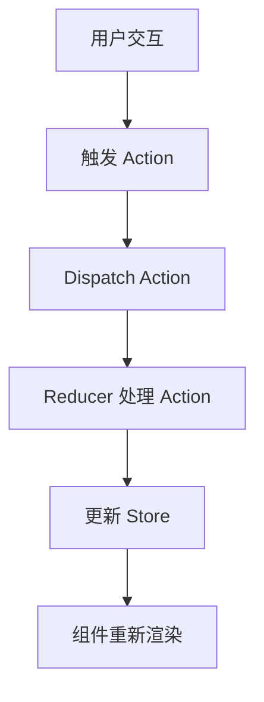

## 介绍

Redux 是一个用于 JavaScript 应用的状态管理库，特别适用于 React 应用。它通过集中管理应用的状态，使得状态的变化更加可预测和易于调试。Redux 的核心思想是将应用的状态存储在一个单一的全局对象中，并通过一系列严格的规则来管理状态的更新。

在本文中，我们将深入探讨 Redux 的工作流程，帮助你理解如何在 React 应用中使用 Redux 来管理状态。

## Redux 的核心概念

在深入 Redux 的工作流程之前，我们需要了解几个核心概念：

1. **Store**: 存储应用状态的全局对象。
2. **Action**: 描述状态变化的普通 JavaScript 对象。
3. **Reducer**: 纯函数，接收当前状态和 Action，返回新的状态。
4. **Dispatch**: 触发 Action 的方法，用于更新状态。

## Redux 工作流程

Redux 的工作流程可以概括为以下几个步骤：

1. **触发 Action**: 用户交互或应用逻辑触发一个 Action。
2. **Dispatch Action**: 使用 `dispatch` 方法将 Action 发送到 Store。
3. **Reducer 处理 Action**: Reducer 接收当前状态和 Action，返回新的状态。
4. **更新 Store**: Store 更新为 Reducer 返回的新状态。
5. **组件重新渲染**: 订阅 Store 的 React 组件接收到状态更新，重新渲染。

让我们通过一个简单的例子来理解这个过程。

### 示例：计数器应用

假设我们有一个简单的计数器应用，用户可以点击按钮来增加或减少计数。

#### 1. 定义 Action

首先，我们需要定义两个 Action 类型：`INCREMENT` 和 `DECREMENT`。

```javascript
const increment = () => ({
  type: 'INCREMENT'
});

const decrement = () => ({
  type: 'DECREMENT'
});
```

#### 2. 创建 Reducer

接下来，我们创建一个 Reducer 来处理这些 Action。

```javascript
const counterReducer = (state = 0, action) => {
  switch (action.type) {
    case 'INCREMENT':
      return state + 1;
    case 'DECREMENT':
      return state - 1;
    default:
      return state;
  }
};
```

#### 3. 创建 Store

然后，我们使用 Redux 的 `createStore` 方法创建一个 Store，并将 Reducer 传递给它。

```javascript
import { createStore } from 'redux';

const store = createStore(counterReducer);
```

#### 4. 订阅 Store

在 React 组件中，我们可以订阅 Store 的状态变化，并在状态更新时重新渲染组件。

```javascript
import React from 'react';
import { useSelector, useDispatch } from 'react-redux';

const Counter = () => {
  const count = useSelector(state => state);
  const dispatch = useDispatch();

  return (
    <div>
      <p>{count}</p>
      <button onClick={() => dispatch(increment())}>+</button>
      <button onClick={() => dispatch(decrement())}>-</button>
    </div>
  );
};
```

#### 5. 触发 Action

当用户点击按钮时，`dispatch` 方法会触发相应的 Action，Redux 会更新 Store 的状态，并重新渲染组件。

### Redux 工作流程图示

为了更好地理解 Redux 的工作流程，我们可以使用 Mermaid 图表来展示整个过程。



## 实际应用场景

Redux 在大型应用中非常有用，尤其是当多个组件需要共享和同步状态时。以下是一些常见的应用场景：

1. **用户认证**: 管理用户的登录状态和权限。
2. **购物车**: 管理用户的购物车内容。
3. **主题切换**: 管理应用的主题（如深色模式/浅色模式）。

## 总结

Redux 提供了一种可预测的状态管理机制，使得复杂应用的状态管理变得更加简单和可控。通过理解 Redux 的工作流程，你可以更好地在 React 应用中使用 Redux 来管理全局状态。

## 附加资源与练习

- **官方文档**: [Redux 官方文档](https://redux.js.org/)
- **练习**: 尝试创建一个简单的待办事项应用，使用 Redux 来管理任务列表的状态。

:::tip
如果你对 Redux 的工作流程还有疑问，建议多动手实践，通过实际项目来加深理解。
:::