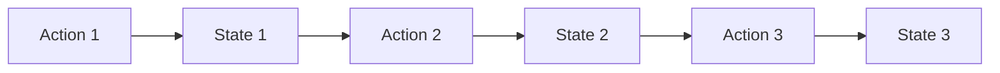

# Redux开发工具

Redux是一个强大的状态管理库，广泛应用于React应用中。然而，随着应用规模的增大，状态管理可能会变得复杂。为了帮助开发者更好地调试和优化Redux应用，Redux开发工具（Redux DevTools）应运而生。本文将详细介绍Redux开发工具的功能和使用方法，帮助你更高效地管理应用状态。

## 什么是Redux开发工具？

Redux开发工具是一个浏览器扩展，允许开发者实时监控和调试Redux应用的状态变化。它提供了时间旅行调试、状态快照、动作日志等功能，极大地简化了调试过程。

## 安装Redux开发工具

首先，你需要在浏览器中安装Redux开发工具扩展。你可以从Chrome Web Store或Firefox Add-ons中搜索并安装“Redux DevTools”。

安装完成后，你需要在你的Redux应用中集成Redux开发工具。通常，你可以使用`redux-devtools-extension`库来简化集成过程。

```bash
npm install redux-devtools-extension
```

## 集成Redux开发工具

在你的Redux store配置文件中，导入`composeWithDevTools`函数，并将其应用于`createStore`函数。

```javascript
import { createStore, applyMiddleware } from 'redux';
import { composeWithDevTools } from 'redux-devtools-extension';
import rootReducer from './reducers';
import thunk from 'redux-thunk';

const store = createStore(
  rootReducer,
  composeWithDevTools(applyMiddleware(thunk))
);

export default store;
```

## 使用Redux开发工具

### 1. 时间旅行调试

时间旅行调试是Redux开发工具的核心功能之一。它允许你回溯到应用状态的任意历史点，查看当时的状态和动作。



通过时间旅行调试，你可以轻松地回退到`State 1`，查看应用在`Action 1`执行后的状态。

### 2. 状态快照

Redux开发工具允许你保存和加载状态快照。这对于调试特定状态下的问题非常有用。

```javascript
// 保存状态快照
const snapshot = store.getState();

// 加载状态快照
store.dispatch({ type: 'LOAD_SNAPSHOT', payload: snapshot });
```

### 3. 动作日志

Redux开发工具会记录所有触发的动作，并显示它们的类型和负载。你可以通过动作日志快速定位问题。

```javascript
{
  type: 'ADD_TODO',
  payload: { text: 'Learn Redux DevTools' }
}
```

## 实际案例

假设你正在开发一个待办事项应用，用户可以通过点击按钮添加新的待办事项。使用Redux开发工具，你可以实时监控`ADD_TODO`动作的触发和状态变化。

```javascript
// actions.js
export const addTodo = (text) => ({
  type: 'ADD_TODO',
  payload: { text }
});

// reducers.js
const initialState = [];
const todosReducer = (state = initialState, action) => {
  switch (action.type) {
    case 'ADD_TODO':
      return [...state, action.payload];
    default:
      return state;
  }
};

export default todosReducer;
```

在Redux开发工具中，你可以看到每次`ADD_TODO`动作触发后，`todos`数组的变化。

## 总结

Redux开发工具是调试和优化Redux应用的强大工具。通过时间旅行调试、状态快照和动作日志等功能，你可以更高效地管理和调试应用状态。希望本文能帮助你更好地理解和使用Redux开发工具。

## 附加资源

- [Redux DevTools 官方文档](https://redux.js.org/usage/debugging)
- [Redux DevTools 扩展](https://github.com/reduxjs/redux-devtools)

## 练习

1. 在你的React应用中集成Redux开发工具，并尝试使用时间旅行调试功能。
2. 保存一个状态快照，并在应用的不同阶段加载它，观察状态的变化。
3. 记录并分析一个复杂动作的日志，找出潜在的性能问题。
