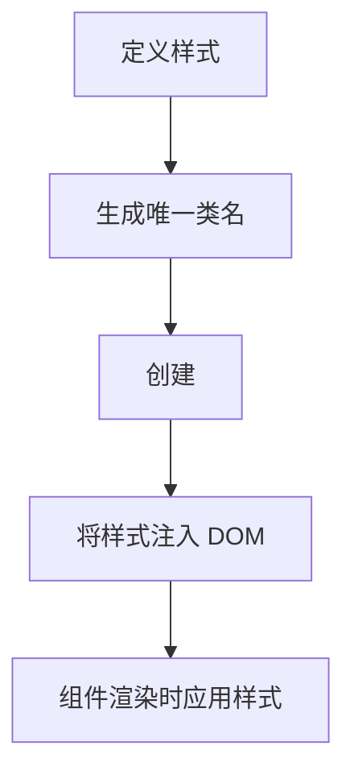

# CSS-in-JS 方案

在现代前端开发中，样式管理是一个重要的课题。传统的 CSS 文件虽然功能强大，但在大型项目中可能会遇到命名冲突、全局污染等问题。为了解决这些问题，**CSS-in-JS** 方案应运而生。本文将详细介绍 CSS-in-JS 的概念、工作原理及其在 React 中的应用。

## 什么是 CSS-in-JS？

CSS-in-JS 是一种将 CSS 样式直接写入 JavaScript 代码中的技术。它允许开发者在组件级别定义样式，从而避免全局样式污染和命名冲突。通过这种方式，样式与组件逻辑紧密结合，提高了代码的可维护性和可复用性。

:::note
CSS-in-JS 并不是一个具体的库，而是一种技术思想。目前有许多流行的 CSS-in-JS 库，例如 [styled-components](https://styled-components.com/)、[Emotion](https://emotion.sh/) 和 [JSS](https://cssinjs.org/)。
:::

## 为什么使用 CSS-in-JS？

1. **组件化样式**：样式与组件逻辑紧密结合，便于维护和复用。
2. **避免全局污染**：样式作用域仅限于组件内部，不会影响其他组件。
3. **动态样式**：可以根据组件的状态或属性动态生成样式。
4. **自动前缀**：许多 CSS-in-JS 库会自动为样式添加浏览器前缀，减少兼容性问题。

## 如何使用 CSS-in-JS？

以下是一个使用 `styled-components` 的简单示例：

```javascript
import React from 'react';
import styled from 'styled-components';

// 创建一个带样式的按钮组件
const Button = styled.button`
  background-color: ${props => (props.primary ? 'blue' : 'gray')};
  color: white;
  padding: 10px 20px;
  border: none;
  border-radius: 5px;
  cursor: pointer;

  &:hover {
    opacity: 0.8;
  }
`;

function App() {
  return (
    <div>
      <Button primary>Primary Button</Button>
      <Button>Secondary Button</Button>
    </div>
  );
}

export default App;
```

### 代码解析
- `styled.button` 是一个模板字符串函数，用于创建一个带有样式的按钮组件。
- 样式通过模板字符串定义，支持嵌套规则和伪类。
- `props` 可以用于动态调整样式，例如根据 `primary` 属性设置不同的背景颜色。

### 输出效果
- 第一个按钮为蓝色背景（`primary` 为 `true`）。
- 第二个按钮为灰色背景（默认样式）。

## CSS-in-JS 的工作原理

CSS-in-JS 库通常会在运行时动态生成 `<style>` 标签，并将样式注入到 DOM 中。以下是一个简化的流程：



:::tip
由于样式是动态生成的，CSS-in-JS 可能会对性能产生一定影响。但在大多数情况下，这种影响可以忽略不计。
:::

## 实际应用场景

### 1. 主题切换
CSS-in-JS 非常适合实现主题切换功能。以下是一个使用 `styled-components` 实现主题切换的示例：

```javascript
import React, { useState } from 'react';
import styled, { ThemeProvider } from 'styled-components';

// 定义主题
const lightTheme = {
  background: '#fff',
  text: '#000',
};

const darkTheme = {
  background: '#333',
  text: '#fff',
};

// 创建带样式的组件
const Container = styled.div`
  background-color: ${props => props.theme.background};
  color: ${props => props.theme.text};
  padding: 20px;
`;

function App() {
  const [isDarkMode, setIsDarkMode] = useState(false);

  return (
    <ThemeProvider theme={isDarkMode ? darkTheme : lightTheme}>
      <Container>
        <button onClick={() => setIsDarkMode(!isDarkMode)}>
          Toggle Theme
        </button>
        <p>当前主题：{isDarkMode ? '暗色' : '亮色'}</p>
      </Container>
    </ThemeProvider>
  );
}

export default App;
```

### 2. 动态样式
CSS-in-JS 可以根据组件的状态或属性动态调整样式。例如，根据按钮的加载状态显示不同的样式：

```javascript
const Button = styled.button`
  background-color: ${props => (props.isLoading ? 'gray' : 'blue')};
  color: white;
  padding: 10px 20px;
  border: none;
  border-radius: 5px;
  cursor: ${props => (props.isLoading ? 'not-allowed' : 'pointer')};
`;
```

## 总结

CSS-in-JS 是一种强大的样式管理方案，特别适合在 React 等现代前端框架中使用。它通过将样式与组件逻辑紧密结合，解决了传统 CSS 的许多问题，如全局污染和命名冲突。同时，CSS-in-JS 还支持动态样式和主题切换等高级功能。

:::caution
尽管 CSS-in-JS 有许多优点，但在某些场景下（如性能敏感的应用），可能需要权衡其使用。
:::

## 附加资源与练习

- **官方文档**：
  - [styled-components](https://styled-components.com/docs)
  - [Emotion](https://emotion.sh/docs/introduction)
- **练习**：
  1. 使用 `styled-components` 创建一个带有悬停效果的卡片组件。
  2. 实现一个支持亮色和暗色主题切换的 React 应用。

希望本文能帮助你更好地理解 CSS-in-JS 的概念和应用！如果你有任何问题，欢迎在评论区留言。