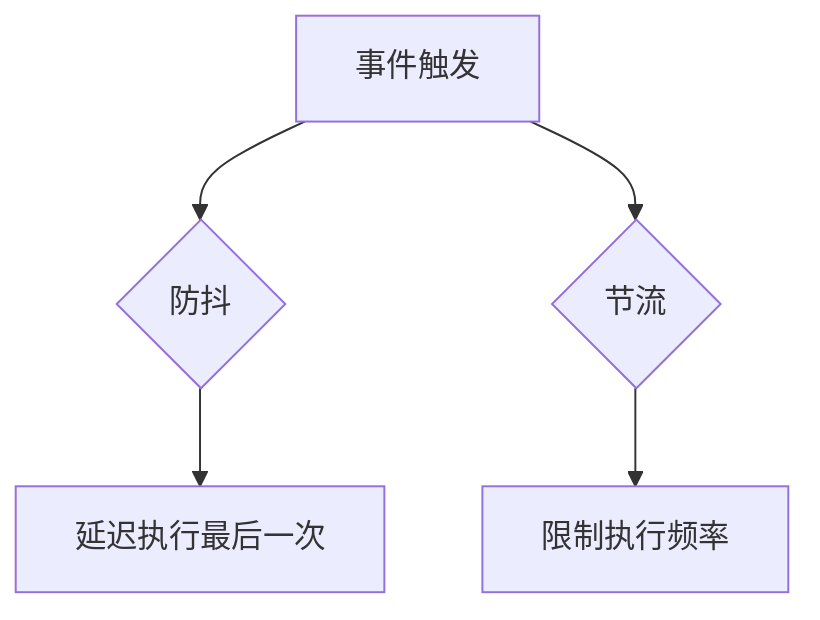

## 介绍

在前端开发中，性能优化是一个重要的课题。特别是在处理用户输入、滚动事件或窗口调整大小等高频触发的事件时，如果不加以控制，可能会导致页面卡顿或性能下降。防抖（Debounce）和节流（Throttle）是两种常用的优化技术，能够有效减少不必要的函数调用，从而提升应用的性能。

### 什么是防抖（Debounce）？

防抖的核心思想是：**在一定时间内，如果事件被多次触发，只执行最后一次**。换句话说，防抖会延迟函数的执行，直到事件停止触发一段时间后才会真正执行。

### 什么是节流（Throttle）？

节流的核心思想是：**在一定时间内，无论事件触发多少次，函数只会执行一次**。节流会限制函数的执行频率，确保函数不会在短时间内被多次调用。

## 防抖的实现与应用

### 防抖的基本实现

以下是一个简单的防抖函数实现：

```javascript
function debounce(func, delay) {
  let timeoutId;
  return function (...args) {
    clearTimeout(timeoutId);
    timeoutId = setTimeout(() => {
      func.apply(this, args);
    }, delay);
  };
}
```

### 防抖的实际应用

假设我们有一个搜索框，用户在输入时会触发搜索请求。如果不使用防抖，每次输入都会触发请求，这可能会导致性能问题。使用防抖后，只有在用户停止输入一段时间后才会触发搜索请求。

```javascript
const searchInput = document.getElementById('search-input');
const search = debounce(() => {
  console.log('Searching...');
}, 300);

searchInput.addEventListener('input', search);
```

:::tip
在这个例子中，`debounce` 函数会在用户停止输入 300 毫秒后执行搜索操作，从而减少不必要的请求。
:::

## 节流的实现与应用

### 节流的基本实现

以下是一个简单的节流函数实现：

```javascript
function throttle(func, limit) {
  let inThrottle;
  return function (...args) {
    if (!inThrottle) {
      func.apply(this, args);
      inThrottle = true;
      setTimeout(() => (inThrottle = false), limit);
    }
  };
}
```

### 节流的实际应用

假设我们有一个滚动事件监听器，每次滚动时都会触发一个函数。如果不使用节流，滚动时可能会触发大量函数调用，导致性能问题。使用节流后，函数会在一定时间内只执行一次。

```javascript
window.addEventListener('scroll', throttle(() => {
  console.log('Scrolling...');
}, 100));
```

:::tip
在这个例子中，`throttle` 函数会限制滚动事件的触发频率，确保每 100 毫秒内只执行一次滚动处理函数。
:::

## 防抖与节流的对比

为了更好地理解防抖和节流的区别，我们可以通过以下图表来展示它们的行为：



:::note
防抖和节流的主要区别在于：防抖关注的是**延迟执行**，而节流关注的是**限制执行频率**。
:::

## 实际案例

### 案例 1：搜索框的防抖优化

在一个电商网站中，用户在搜索框中输入关键词时，系统会自动显示搜索结果。如果不使用防抖，每次输入都会触发搜索请求，导致服务器压力过大。使用防抖后，只有在用户停止输入一段时间后才会触发搜索请求，从而减少不必要的请求。

### 案例 2：滚动加载的节流优化

在一个新闻网站中，用户滚动页面时会触发加载更多内容的操作。如果不使用节流，滚动时可能会触发大量加载请求，导致页面卡顿。使用节流后，加载操作会在一定时间内只执行一次，从而提升页面性能。

## 总结

防抖和节流是前端开发中常用的性能优化技术。防抖适用于需要延迟执行的场景，而节流适用于需要限制执行频率的场景。通过合理使用这两种技术，可以有效减少不必要的函数调用，提升应用的性能。

## 附加资源与练习

- **练习 1**：尝试在 React 项目中实现一个防抖的搜索框组件。
- **练习 2**：在滚动事件中使用节流技术，优化页面性能。
- **资源**：[Lodash](https://lodash.com/) 库中提供了现成的防抖和节流函数，可以直接使用。

:::caution
在使用防抖和节流时，需要注意选择合适的延迟时间和限制频率，以确保既能优化性能，又不会影响用户体验。
:::