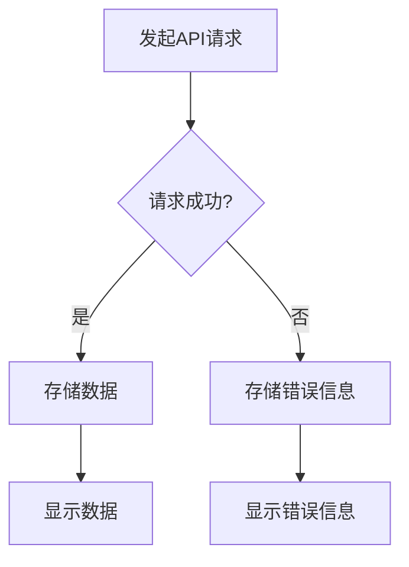

# API请求状态管理

在现代Web开发中，与API进行交互是不可避免的。无论是获取数据、提交表单还是更新资源，API请求都是前端开发的核心部分。然而，API请求通常是异步的，这意味着我们需要管理请求的不同状态，例如加载、成功和错误。本文将详细介绍如何在React中管理API请求的状态。

## 什么是API请求状态管理？

API请求状态管理是指在应用程序中跟踪API请求的不同状态。通常，API请求会经历以下几个状态：

1. **加载中（Loading）**：请求已发出，但尚未收到响应。
2. **成功（Success）**：请求成功完成，并返回了所需的数据。
3. **错误（Error）**：请求失败，可能是由于网络问题、服务器错误或其他原因。

通过管理这些状态，我们可以为用户提供更好的体验，例如在加载时显示加载指示器，在成功时显示数据，在错误时显示错误信息。

## 如何在React中管理API请求状态？

在React中，我们可以使用`useState`和`useEffect`钩子来管理API请求的状态。以下是一个简单的示例，展示了如何获取数据并管理其状态。

### 示例：获取用户数据

```jsx
import React, { useState, useEffect } from 'react';

function UserData() {
  const [data, setData] = useState(null);
  const [loading, setLoading] = useState(true);
  const [error, setError] = useState(null);

  useEffect(() => {
    fetch('https://api.example.com/users')
      .then(response => {
        if (!response.ok) {
          throw new Error('Network response was not ok');
        }
        return response.json();
      })
      .then(data => {
        setData(data);
        setLoading(false);
      })
      .catch(error => {
        setError(error);
        setLoading(false);
      });
  }, []);

  if (loading) {
    return <div>Loading...</div>;
  }

  if (error) {
    return <div>Error: {error.message}</div>;
  }

  return (
    <div>
      <h1>User Data</h1>
      <pre>{JSON.stringify(data, null, 2)}</pre>
    </div>
  );
}

export default UserData;
```

### 代码解释

1. **状态定义**：我们使用`useState`定义了三个状态变量：`data`用于存储API返回的数据，`loading`用于跟踪请求是否正在进行，`error`用于存储请求失败时的错误信息。
2. **请求发起**：在`useEffect`中，我们使用`fetch`发起API请求。如果请求成功，我们将数据存储在`data`中，并将`loading`设置为`false`。如果请求失败，我们将错误信息存储在`error`中，并将`loading`设置为`false`。
3. **条件渲染**：根据`loading`和`error`的状态，我们决定渲染加载指示器、错误信息或数据。

### 实际应用场景

假设你正在开发一个博客应用，需要从API获取文章列表。你可以使用上述方法来管理API请求的状态，并在加载时显示加载指示器，在成功时显示文章列表，在错误时显示错误信息。

```jsx
import React, { useState, useEffect } from 'react';

function BlogPosts() {
  const [posts, setPosts] = useState([]);
  const [loading, setLoading] = useState(true);
  const [error, setError] = useState(null);

  useEffect(() => {
    fetch('https://api.example.com/posts')
      .then(response => {
        if (!response.ok) {
          throw new Error('Network response was not ok');
        }
        return response.json();
      })
      .then(data => {
        setPosts(data);
        setLoading(false);
      })
      .catch(error => {
        setError(error);
        setLoading(false);
      });
  }, []);

  if (loading) {
    return <div>Loading posts...</div>;
  }

  if (error) {
    return <div>Error: {error.message}</div>;
  }

  return (
    <div>
      <h1>Blog Posts</h1>
      <ul>
        {posts.map(post => (
          <li key={post.id}>{post.title}</li>
        ))}
      </ul>
    </div>
  );
}

export default BlogPosts;
```

### 状态管理流程图

为了更好地理解API请求状态管理的过程，我们可以使用Mermaid绘制一个简单的流程图。



## 总结

在React中管理API请求的状态是构建现代Web应用的关键技能。通过使用`useState`和`useEffect`，我们可以轻松地跟踪请求的加载、成功和错误状态，并根据这些状态为用户提供适当的反馈。

### 附加资源

- [React官方文档](https://reactjs.org/docs/hooks-effect.html)
- [MDN Fetch API文档](https://developer.mozilla.org/en-US/docs/Web/API/Fetch_API)

### 练习

1. 修改上述示例，使其在加载时显示一个旋转的加载图标。
2. 尝试使用`async/await`语法重写`useEffect`中的API请求逻辑。
3. 扩展博客应用示例，使其支持分页加载文章。

通过完成这些练习，你将更深入地理解API请求状态管理的概念，并能够在实际项目中应用这些知识。