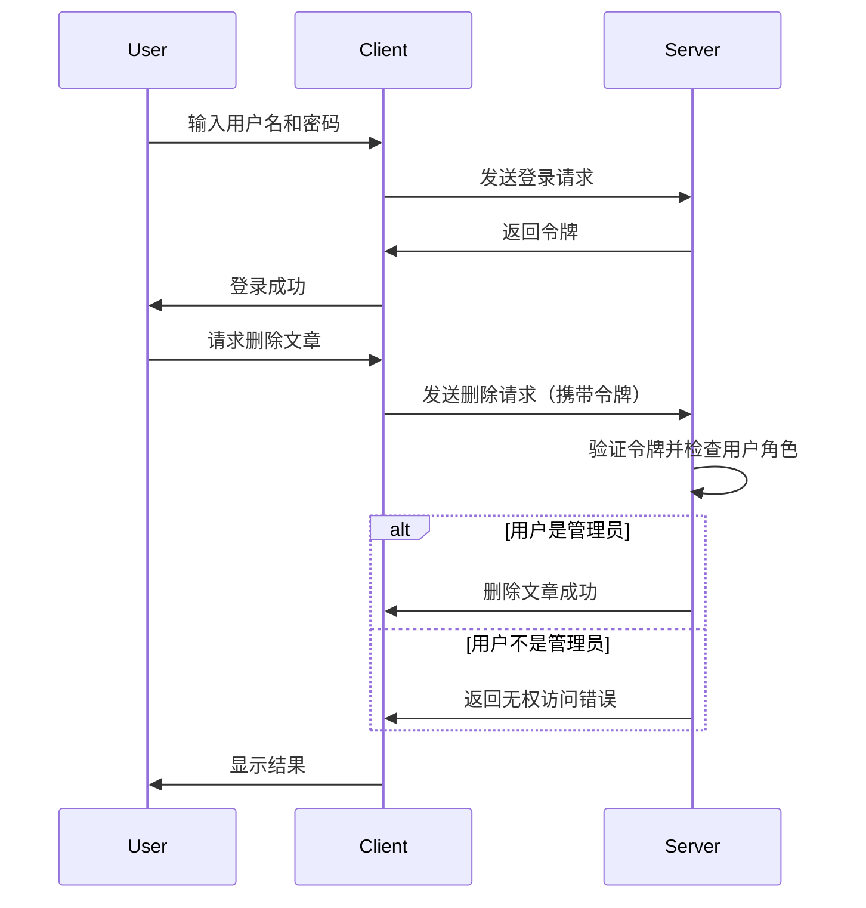

## 介绍

在现代 Web 应用中，认证（Authentication）和授权（Authorization）是确保系统安全性的两个核心概念。认证是验证用户身份的过程，而授权则是确定用户是否有权限访问特定资源或执行特定操作。本文将逐步讲解如何在 React 应用中实现认证与授权，并通过实际案例展示其应用场景。

## 认证（Authentication）

认证是验证用户身份的过程。通常，用户通过提供用户名和密码来证明自己的身份。一旦认证成功，服务器会返回一个令牌（Token），客户端可以在后续请求中使用该令牌来证明自己的身份。

### 基本流程

1. 用户输入用户名和密码。
2. 客户端将用户名和密码发送到服务器。
3. 服务器验证用户名和密码。
4. 如果验证成功，服务器返回一个令牌（Token）。
5. 客户端将令牌存储在本地（如 localStorage 或 sessionStorage）。
6. 客户端在后续请求中携带该令牌以证明身份。

### 代码示例

以下是一个简单的 React 组件，展示了如何实现用户登录并存储令牌：

```jsx
import React, { useState } from 'react';

const Login = () => {
  const [username, setUsername] = useState('');
  const [password, setPassword] = useState('');

  const handleLogin = async () => {
    const response = await fetch('/api/login', {
      method: 'POST',
      headers: {
        'Content-Type': 'application/json',
      },
      body: JSON.stringify({ username, password }),
    });

    if (response.ok) {
      const data = await response.json();
      localStorage.setItem('token', data.token);
      alert('登录成功！');
    } else {
      alert('登录失败，请检查用户名和密码。');
    }
  };

  return (
    <div>
      <input
        type="text"
        placeholder="用户名"
        value={username}
        onChange={(e) => setUsername(e.target.value)}
      />
      <input
        type="password"
        placeholder="密码"
        value={password}
        onChange={(e) => setPassword(e.target.value)}
      />
      <button onClick={handleLogin}>登录</button>
    </div>
  );
};

export default Login;
```

:::note
在实际应用中，建议使用 HTTPS 来加密传输的数据，以防止敏感信息被窃取。
:::

## 授权（Authorization）

授权是确定用户是否有权限访问特定资源或执行特定操作的过程。通常，服务器会根据用户的角色或权限来决定是否允许访问。

### 基本流程

1. 客户端在请求中携带令牌。
2. 服务器验证令牌的有效性。
3. 服务器检查用户的角色或权限。
4. 如果用户有权限，服务器返回请求的资源或执行操作。
5. 如果用户没有权限，服务器返回错误响应。

### 代码示例

以下是一个简单的 React 组件，展示了如何在请求中携带令牌并检查用户权限：

```jsx
import React, { useEffect, useState } from 'react';

const Dashboard = () => {
  const [data, setData] = useState(null);

  useEffect(() => {
    const fetchData = async () => {
      const token = localStorage.getItem('token');
      const response = await fetch('/api/dashboard', {
        headers: {
          'Authorization': `Bearer ${token}`,
        },
      });

      if (response.ok) {
        const data = await response.json();
        setData(data);
      } else {
        alert('无权访问该资源。');
      }
    };

    fetchData();
  }, []);

  return (
    <div>
      {data ? (
        <div>
          <h1>仪表盘</h1>
          <p>{data.message}</p>
        </div>
      ) : (
        <p>加载中...</p>
      )}
    </div>
  );
};

export default Dashboard;
```

:::tip
在实际应用中，建议使用更复杂的权限管理策略，如基于角色的访问控制（RBAC）或基于属性的访问控制（ABAC）。
:::

## 实际案例

假设我们正在开发一个博客平台，用户可以发布文章，但只有管理员可以删除文章。我们可以通过以下步骤实现这一功能：

1. 用户在登录时获取令牌。
2. 用户在发布文章时携带令牌。
3. 服务器验证令牌并检查用户角色。
4. 如果用户是管理员，允许删除文章；否则，返回错误响应。



## 总结

认证与授权是确保 Web 应用安全性的关键步骤。通过认证，我们可以验证用户的身份；通过授权，我们可以控制用户对资源的访问权限。在 React 应用中，我们可以通过令牌来实现认证与授权，并结合服务器端的权限管理策略来确保系统的安全性。

## 附加资源与练习

- **练习 1**：尝试在现有的 React 项目中实现用户登录功能，并使用令牌进行认证。
- **练习 2**：扩展你的项目，实现基于角色的访问控制，确保只有管理员可以删除文章。
- **资源**：[JWT 官方文档](https://jwt.io/) - 了解 JSON Web Token（JWT）的更多细节，这是一种常用的令牌格式。

通过本文的学习，你应该能够在 React 应用中实现基本的认证与授权功能，并理解其在实际应用中的重要性。继续探索更多高级的安全策略，以构建更加安全的 Web 应用。