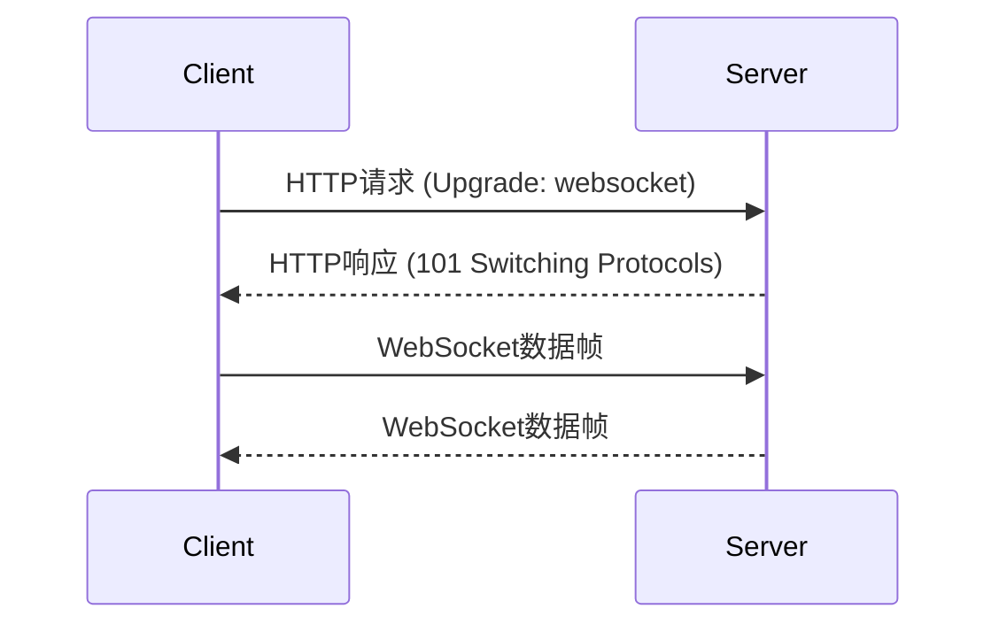

# WebSocket实时通信

在现代Web应用中，实时通信变得越来越重要。无论是聊天应用、实时通知，还是多人协作工具，都需要一种高效的方式来在客户端和服务器之间传递数据。WebSocket协议正是为此而设计的，它允许在单个TCP连接上进行全双工通信，从而实现真正的实时数据传输。

## 什么是WebSocket？

WebSocket是一种网络通信协议，它允许在客户端和服务器之间建立一个持久的连接。与传统的HTTP请求不同，WebSocket连接一旦建立，双方可以随时发送数据，而不需要反复建立和关闭连接。这使得WebSocket非常适合需要实时通信的应用场景。

:::note
WebSocket协议在2011年被标准化为RFC 6455，目前已被所有现代浏览器支持。
:::

## WebSocket的工作原理

WebSocket通信的建立过程分为两个阶段：

1. **握手阶段**：客户端通过HTTP请求发起WebSocket连接，服务器响应并确认连接。
2. **数据传输阶段**：一旦连接建立，客户端和服务器可以通过WebSocket协议发送和接收数据。



## 在React中使用WebSocket

在React应用中使用WebSocket非常简单。我们可以使用浏览器的原生`WebSocket` API来创建和管理WebSocket连接。

### 示例：创建一个简单的WebSocket连接

以下是一个简单的React组件示例，展示了如何与WebSocket服务器进行通信。

```jsx
import React, { useState, useEffect } from 'react';

function WebSocketComponent() {
  const [messages, setMessages] = useState([]);
  const [inputValue, setInputValue] = useState('');

  useEffect(() => {
    // 创建WebSocket连接
    const socket = new WebSocket('ws://your-websocket-server-url');

    // 监听消息事件
    socket.addEventListener('message', (event) => {
      setMessages((prevMessages) => [...prevMessages, event.data]);
    });

    // 清理函数，组件卸载时关闭连接
    return () => {
      socket.close();
    };
  }, []);

  const sendMessage = () => {
    const socket = new WebSocket('ws://your-websocket-server-url');
    socket.send(inputValue);
    setInputValue('');
  };

  return (
    <div>
      <h2>WebSocket消息</h2>
      <ul>
        {messages.map((message, index) => (
          <li key={index}>{message}</li>
        ))}
      </ul>
      <input
        type="text"
        value={inputValue}
        onChange={(e) => setInputValue(e.target.value)}
      />
      <button onClick={sendMessage}>发送</button>
    </div>
  );
}

export default WebSocketComponent;
```

:::tip
在实际应用中，建议将WebSocket连接的管理逻辑封装到一个自定义Hook中，以便在多个组件中复用。
:::

### 输入与输出

- **输入**：用户在输入框中输入消息并点击“发送”按钮。
- **输出**：消息通过WebSocket发送到服务器，并显示在消息列表中。

## 实际应用场景

WebSocket在许多实时应用中都有广泛的应用，以下是一些常见的场景：

1. **聊天应用**：用户可以在聊天室中实时发送和接收消息。
2. **实时通知**：用户可以在不刷新页面的情况下接收新的通知。
3. **多人协作工具**：多个用户可以同时编辑同一个文档，并实时看到彼此的更改。
4. **在线游戏**：玩家可以在游戏中实时交互，例如多人对战游戏。

## 总结

WebSocket为现代Web应用提供了一种高效的实时通信方式。通过建立持久的连接，客户端和服务器可以随时发送和接收数据，从而实现真正的实时交互。在React应用中使用WebSocket非常简单，只需使用浏览器的原生API即可。

## 附加资源与练习

- **MDN WebSocket文档**：[WebSocket API](https://developer.mozilla.org/en-US/docs/Web/API/WebSocket)
- **练习**：尝试创建一个简单的聊天应用，使用WebSocket实现用户之间的实时消息传递。

:::caution
在实际开发中，请确保处理WebSocket连接的错误和重连逻辑，以提高应用的健壮性。
:::