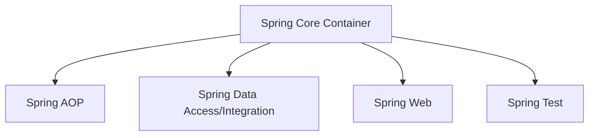

## 介绍

Spring框架是一个开源的Java平台，广泛用于构建企业级应用程序。它提供了一个全面的编程和配置模型，支持现代Java应用程序的快速开发。Spring的核心思想是**依赖注入（Dependency Injection, DI）**和**面向切面编程（Aspect-Oriented Programming, AOP）**，这些特性使得Spring在开发中具有高度的灵活性和可扩展性。

本文将逐步介绍Spring的架构设计，帮助你理解其核心模块及其在实际开发中的应用。

---

## Spring 架构的核心模块

Spring框架由多个模块组成，每个模块都有其特定的功能。以下是Spring的核心模块：

1. **Spring Core Container**  
   这是Spring框架的基础，提供了依赖注入（DI）和IoC（控制反转）功能。核心容器包括：
   - `BeanFactory`：负责管理Bean的生命周期。
   - `ApplicationContext`：扩展了`BeanFactory`，提供了更多企业级功能，如国际化支持和事件传播。

2. **Spring AOP**  
   面向切面编程模块，允许开发者通过切面（Aspect）将横切关注点（如日志记录、事务管理）与业务逻辑分离。

3. **Spring Data Access/Integration**  
   提供了对数据库访问的支持，包括JDBC、ORM（如Hibernate）、事务管理等。

4. **Spring Web**  
   支持Web应用程序开发，包括Spring MVC和WebFlux。

5. **Spring Test**  
   提供了对单元测试和集成测试的支持。

---

## Spring 架构图

以下是一个简化的Spring架构图，展示了各个模块之间的关系：



---

## 依赖注入（DI）与IoC容器

依赖注入是Spring的核心特性之一。它通过将对象的依赖关系从代码中解耦，使得代码更易于测试和维护。以下是一个简单的依赖注入示例：

```java
// 定义一个接口
public interface MessageService {
    String getMessage();
}

// 实现接口
public class EmailService implements MessageService {
    @Override
    public String getMessage() {
        return "Hello, this is an email!";
    }
}

// 使用依赖注入
public class NotificationService {
    private final MessageService messageService;

    // 通过构造函数注入
    public NotificationService(MessageService messageService) {
        this.messageService = messageService;
    }

    public void sendNotification() {
        System.out.println(messageService.getMessage());
    }
}
```

在Spring中，我们可以通过配置文件或注解来管理Bean的依赖关系。例如，使用`@Autowired`注解：

```java
@Service
public class NotificationService {
    @Autowired
    private MessageService messageService;

    public void sendNotification() {
        System.out.println(messageService.getMessage());
    }
}
```

---

## 实际应用场景

假设我们正在开发一个电商网站，需要实现用户注册功能。我们可以使用Spring的依赖注入来管理服务层和数据访问层的依赖关系：

```java
// 数据访问层
@Repository
public class UserRepository {
    public void saveUser(User user) {
        // 保存用户到数据库
    }
}

// 服务层
@Service
public class UserService {
    @Autowired
    private UserRepository userRepository;

    public void registerUser(User user) {
        userRepository.saveUser(user);
    }
}

// 控制器层
@RestController
public class UserController {
    @Autowired
    private UserService userService;

    @PostMapping("/register")
    public String register(@RequestBody User user) {
        userService.registerUser(user);
        return "User registered successfully!";
    }
}
```

在这个例子中，Spring的依赖注入机制自动将`UserRepository`注入到`UserService`中，并将`UserService`注入到`UserController`中，从而实现了各层之间的解耦。

---

## 总结

Spring框架通过其模块化的设计和强大的依赖注入机制，为Java开发者提供了一个灵活且高效的开发平台。无论是小型项目还是大型企业级应用，Spring都能提供良好的支持。

通过本文的学习，你应该对Spring的架构有了初步的了解。接下来，你可以尝试使用Spring构建一个简单的应用程序，以加深对框架的理解。

---

## 附加资源与练习

1. **官方文档**  
   阅读[Spring官方文档](https://spring.io/projects/spring-framework)以获取更多详细信息。

2. **练习**  
   尝试使用Spring Boot（基于Spring的快速开发框架）构建一个简单的RESTful API。

3. **推荐书籍**  
   - 《Spring实战》（Spring in Action）
   - 《Spring源码深度解析》

:::tip
在学习过程中，建议多动手实践，通过编写代码来巩固所学知识。
:::