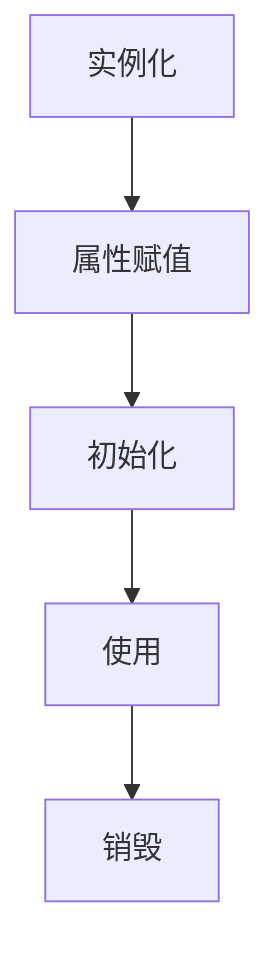

## 介绍

在 Spring 框架中，Bean 是 Spring IoC 容器管理的对象。Spring Bean 的生命周期指的是 Bean 从创建到销毁的整个过程。理解 Bean 的生命周期对于掌握 Spring 的核心机制至关重要。本文将详细介绍 Spring Bean 的生命周期，并通过代码示例和实际案例帮助你更好地理解这一概念。

## Spring Bean 生命周期的阶段

Spring Bean 的生命周期可以分为以下几个阶段：

1. **实例化（Instantiation）**：Spring 容器根据配置或注解创建 Bean 的实例。
2. **属性赋值（Populate Properties）**：Spring 容器将配置的属性值注入到 Bean 中。
3. **初始化（Initialization）**：Bean 完成属性注入后，执行初始化逻辑。
4. **使用（In Use）**：Bean 可以被应用程序使用。
5. **销毁（Destruction）**：当容器关闭时，Bean 会被销毁。

### 1. 实例化

在实例化阶段，Spring 容器会根据配置或注解创建 Bean 的实例。这通常是通过调用 Bean 的构造函数来完成的。

```java
public class MyBean {
    public MyBean() {
        System.out.println("MyBean 实例化");
    }
}
```

### 2. 属性赋值

在属性赋值阶段，Spring 容器会将配置的属性值注入到 Bean 中。这可以通过 XML 配置、注解或 Java 配置来实现。

```java
public class MyBean {
    private String name;

    public void setName(String name) {
        this.name = name;
        System.out.println("MyBean 属性赋值: " + name);
    }
}
```

### 3. 初始化

在初始化阶段，Spring 容器会调用 Bean 的初始化方法。你可以通过实现 `InitializingBean` 接口或使用 `@PostConstruct` 注解来定义初始化逻辑。

```java
import javax.annotation.PostConstruct;

public class MyBean {
    @PostConstruct
    public void init() {
        System.out.println("MyBean 初始化");
    }
}
```

### 4. 使用

在初始化完成后，Bean 就可以被应用程序使用了。你可以通过 `ApplicationContext` 或 `BeanFactory` 获取 Bean 实例，并调用其方法。

```java
import org.springframework.context.ApplicationContext;
import org.springframework.context.support.ClassPathXmlApplicationContext;

public class Main {
    public static void main(String[] args) {
        ApplicationContext context = new ClassPathXmlApplicationContext("applicationContext.xml");
        MyBean myBean = context.getBean(MyBean.class);
        System.out.println("MyBean 使用中");
    }
}
```

### 5. 销毁

当 Spring 容器关闭时，Bean 会被销毁。你可以通过实现 `DisposableBean` 接口或使用 `@PreDestroy` 注解来定义销毁逻辑。

```java
import javax.annotation.PreDestroy;

public class MyBean {
    @PreDestroy
    public void destroy() {
        System.out.println("MyBean 销毁");
    }
}
```

## Bean 生命周期的完整流程

为了更好地理解 Bean 的生命周期，我们可以使用 Mermaid 图表来展示整个过程：



## 实际案例

假设我们有一个简单的应用程序，需要管理用户的登录状态。我们可以创建一个 `UserService` Bean 来管理用户信息，并在 Bean 的生命周期中执行一些操作。

```java
import javax.annotation.PostConstruct;
import javax.annotation.PreDestroy;

public class UserService {
    private String username;

    public void setUsername(String username) {
        this.username = username;
        System.out.println("UserService 属性赋值: " + username);
    }

    @PostConstruct
    public void init() {
        System.out.println("UserService 初始化");
    }

    public void login() {
        System.out.println("用户 " + username + " 登录成功");
    }

    @PreDestroy
    public void destroy() {
        System.out.println("UserService 销毁");
    }
}
```

在 `applicationContext.xml` 中配置 `UserService` Bean：

```xml
<bean id="userService" class="com.example.UserService">
    <property name="username" value="Alice" />
</bean>
```

在应用程序中使用 `UserService` Bean：

```java
import org.springframework.context.ApplicationContext;
import org.springframework.context.support.ClassPathXmlApplicationContext;

public class Main {
    public static void main(String[] args) {
        ApplicationContext context = new ClassPathXmlApplicationContext("applicationContext.xml");
        UserService userService = context.getBean(UserService.class);
        userService.login();
        ((ClassPathXmlApplicationContext) context).close();
    }
}
```

运行上述代码，你将看到以下输出：

```
UserService 实例化
UserService 属性赋值: Alice
UserService 初始化
用户 Alice 登录成功
UserService 销毁
```

## 总结

Spring Bean 的生命周期是 Spring 框架中的一个核心概念。通过理解 Bean 的生命周期，你可以更好地掌握 Spring 的工作机制，并在实际开发中灵活运用。本文详细介绍了 Bean 生命周期的各个阶段，并通过实际案例展示了如何在实际应用中使用这些知识。

## 附加资源

- [Spring 官方文档](https://docs.spring.io/spring-framework/docs/current/reference/html/core.html#beans-factory-lifecycle)
- [Spring Bean 生命周期详解](https://www.baeldung.com/spring-bean-lifecycle)
- [Spring IoC 容器与 Bean 管理](https://www.tutorialspoint.com/spring/spring_bean_life_cycle.htm)

## 练习

1. 创建一个新的 Spring Bean，并在其生命周期中添加自定义的初始化和销毁逻辑。
2. 修改上述 `UserService` 示例，使其在初始化时从数据库中加载用户信息。
3. 尝试使用 `@Bean` 注解在 Java 配置类中定义 Bean，并观察其生命周期。

通过完成这些练习，你将更深入地理解 Spring Bean 的生命周期，并能够在实际项目中灵活应用。