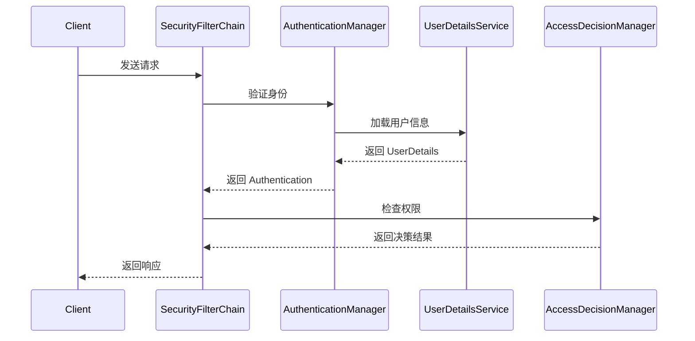

## 介绍

Spring Security 是一个功能强大且高度可定制的安全框架，用于保护基于 Spring 的应用程序。它提供了身份验证（Authentication）、授权（Authorization）、防止常见攻击（如 CSRF、XSS）等功能。理解 Spring Security 的架构是掌握其工作原理的关键。

在本教程中，我们将深入探讨 Spring Security 的核心架构，包括其关键组件、工作流程以及如何在实际项目中应用这些概念。

---

## Spring Security 的核心架构

Spring Security 的架构主要由以下几个核心组件组成：

1. **SecurityContextHolder**  
2. **Authentication**  
3. **SecurityFilterChain**  
4. **UserDetailsService**  
5. **AuthenticationManager**  
6. **AccessDecisionManager**  

让我们逐一了解这些组件的作用。

---

### 1. SecurityContextHolder

`SecurityContextHolder` 是 Spring Security 的核心，用于存储当前用户的安全上下文信息。它通过 `ThreadLocal` 实现，确保每个线程都有自己的安全上下文。

```java
SecurityContext context = SecurityContextHolder.getContext();
Authentication authentication = context.getAuthentication();
```

:::tip
`SecurityContextHolder` 默认使用 `ThreadLocal` 存储安全上下文，但可以通过配置更改为其他模式，如 `MODE_GLOBAL` 或 `MODE_INHERITABLETHREADLOCAL`。
:::

---

### 2. Authentication

`Authentication` 接口表示当前用户的身份验证信息。它包含以下关键属性：

- `principal`：当前用户的身份（通常是用户名或 `UserDetails` 对象）。
- `credentials`：用户的凭证（通常是密码）。
- `authorities`：用户的权限集合（如角色）。

```java
Authentication authentication = new UsernamePasswordAuthenticationToken(
    "user", "password", AuthorityUtils.createAuthorityList("ROLE_USER")
);
```

---

### 3. SecurityFilterChain

`SecurityFilterChain` 是 Spring Security 的核心过滤器链，负责处理 HTTP 请求的安全逻辑。每个请求都会经过一系列的过滤器，例如：

- `UsernamePasswordAuthenticationFilter`：处理表单登录。
- `BasicAuthenticationFilter`：处理 HTTP Basic 认证。
- `CsrfFilter`：防止 CSRF 攻击。

```java
@Bean
public SecurityFilterChain securityFilterChain(HttpSecurity http) throws Exception {
    http
        .authorizeHttpRequests(auth -> auth
            .requestMatchers("/public/**").permitAll()
            .anyRequest().authenticated()
        )
        .formLogin(form -> form
            .loginPage("/login")
            .permitAll()
        );
    return http.build();
}
```

---

### 4. UserDetailsService

`UserDetailsService` 是一个接口，用于加载用户信息。它通常从数据库或其他存储中加载用户数据，并返回一个 `UserDetails` 对象。

```java
@Service
public class CustomUserDetailsService implements UserDetailsService {
    @Override
    public UserDetails loadUserByUsername(String username) throws UsernameNotFoundException {
        // 从数据库加载用户信息
        User user = userRepository.findByUsername(username);
        if (user == null) {
            throw new UsernameNotFoundException("User not found");
        }
        return new org.springframework.security.core.userdetails.User(
            user.getUsername(), user.getPassword(), user.getAuthorities()
        );
    }
}
```

---

### 5. AuthenticationManager

`AuthenticationManager` 是身份验证的核心接口，负责验证用户的凭证。它通常委托给 `ProviderManager`，后者会调用多个 `AuthenticationProvider` 进行验证。

```java
@Bean
public AuthenticationManager authenticationManager(AuthenticationConfiguration config) throws Exception {
    return config.getAuthenticationManager();
}
```

---

### 6. AccessDecisionManager

`AccessDecisionManager` 负责决定用户是否有权限访问特定资源。它通常与 `@PreAuthorize` 或 `@PostAuthorize` 注解一起使用。

```java
@PreAuthorize("hasRole('ADMIN')")
public void deleteUser(Long userId) {
    // 删除用户逻辑
}
```

---

## Spring Security 的工作流程

以下是 Spring Security 处理请求的典型工作流程：



---

## 实际案例：保护 REST API

假设我们有一个简单的 REST API，需要保护 `/admin` 路径，只允许管理员访问。

```java
@Configuration
@EnableWebSecurity
public class SecurityConfig {

    @Bean
    public SecurityFilterChain securityFilterChain(HttpSecurity http) throws Exception {
        http
            .authorizeHttpRequests(auth -> auth
                .requestMatchers("/admin/**").hasRole("ADMIN")
                .anyRequest().authenticated()
            )
            .httpBasic(Customizer.withDefaults());
        return http.build();
    }

    @Bean
    public UserDetailsService userDetailsService() {
        UserDetails admin = User.withUsername("admin")
            .password("{noop}admin123")
            .roles("ADMIN")
            .build();
        return new InMemoryUserDetailsManager(admin);
    }
}
```

---

## 总结

Spring Security 的架构由多个核心组件组成，包括 `SecurityContextHolder`、`Authentication`、`SecurityFilterChain`、`UserDetailsService`、`AuthenticationManager` 和 `AccessDecisionManager`。理解这些组件及其交互方式是掌握 Spring Security 的关键。

通过本教程，您已经了解了 Spring Security 的基本架构及其在实际项目中的应用。接下来，您可以尝试实现更复杂的安全功能，如 OAuth2 或 JWT 认证。

---

## 附加资源

- [Spring Security 官方文档](https://docs.spring.io/spring-security/reference/)
- [Spring Security 实战教程](https://www.baeldung.com/security-spring)
- [Spring Security GitHub 仓库](https://github.com/spring-projects/spring-security)

---

## 练习

1. 实现一个自定义的 `UserDetailsService`，从数据库中加载用户信息。
2. 配置 Spring Security，使其支持基于 JWT 的认证。
3. 使用 `@PreAuthorize` 注解保护一个方法，只允许特定角色的用户访问。

Happy Coding! 🚀