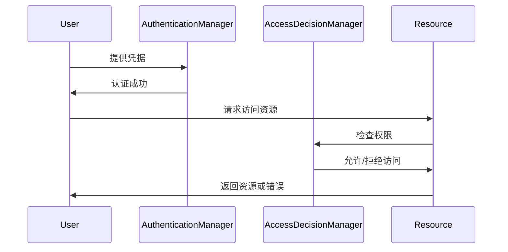

# Spring 授权流程

在Spring Security中，授权（Authorization）是确保用户只能访问其被允许的资源的过程。授权流程是Spring Security的核心功能之一，它与认证（Authentication）流程紧密相关。本文将详细介绍Spring Security的授权流程，并通过代码示例和实际案例帮助你理解其工作原理。

## 什么是授权？

授权是指在用户通过认证后，系统根据用户的角色或权限决定其是否有权访问特定资源的过程。Spring Security通过一系列的过滤器链和决策机制来实现这一功能。

## Spring Security授权流程概述

Spring Security的授权流程可以分为以下几个步骤：

1. **用户认证**：用户首先通过认证流程，系统确认其身份。
2. **获取权限**：认证成功后，系统从用户信息中提取其角色或权限。
3. **访问控制**：当用户尝试访问某个资源时，系统会根据其权限决定是否允许访问。
4. **决策机制**：Spring Security使用`AccessDecisionManager`来做出最终的访问决策。

### 授权流程的详细步骤



1. **用户认证**：用户提供凭据（如用户名和密码），`AuthenticationManager`负责验证这些凭据。
2. **获取权限**：认证成功后，系统从`Authentication`对象中提取用户的权限信息。
3. **访问控制**：当用户尝试访问某个资源时，Spring Security会调用`AccessDecisionManager`来检查用户是否有权访问该资源。
4. **决策机制**：`AccessDecisionManager`会根据配置的投票机制（如`AffirmativeBased`、`ConsensusBased`等）做出最终决策。

## 代码示例

以下是一个简单的Spring Security配置示例，展示了如何配置基于角色的访问控制。

```java
@Configuration
@EnableWebSecurity
public class SecurityConfig extends WebSecurityConfigurerAdapter {

    @Override
    protected void configure(HttpSecurity http) throws Exception {
        http
            .authorizeRequests()
                .antMatchers("/admin/**").hasRole("ADMIN")
                .antMatchers("/user/**").hasAnyRole("USER", "ADMIN")
                .anyRequest().authenticated()
            .and()
            .formLogin();
    }

    @Override
    protected void configure(AuthenticationManagerBuilder auth) throws Exception {
        auth
            .inMemoryAuthentication()
                .withUser("user").password("{noop}password").roles("USER")
                .and()
                .withUser("admin").password("{noop}admin").roles("ADMIN");
    }
}
```

### 解释

- `.antMatchers("/admin/**").hasRole("ADMIN")`：只有具有`ADMIN`角色的用户才能访问`/admin/**`路径下的资源。
- `.antMatchers("/user/**").hasAnyRole("USER", "ADMIN")`：具有`USER`或`ADMIN`角色的用户可以访问`/user/**`路径下的资源。
- `.anyRequest().authenticated()`：所有其他请求都需要用户认证。

## 实际案例

假设我们有一个简单的博客系统，其中包含以下角色和权限：

- **ADMIN**：可以管理所有博客文章和用户。
- **USER**：可以创建和编辑自己的博客文章。

通过Spring Security的授权配置，我们可以确保只有`ADMIN`用户可以访问管理页面，而`USER`用户只能访问自己的博客文章。

```java
@Configuration
@EnableWebSecurity
public class BlogSecurityConfig extends WebSecurityConfigurerAdapter {

    @Override
    protected void configure(HttpSecurity http) throws Exception {
        http
            .authorizeRequests()
                .antMatchers("/admin/**").hasRole("ADMIN")
                .antMatchers("/posts/**").hasAnyRole("USER", "ADMIN")
                .anyRequest().authenticated()
            .and()
            .formLogin();
    }

    @Override
    protected void configure(AuthenticationManagerBuilder auth) throws Exception {
        auth
            .inMemoryAuthentication()
                .withUser("user").password("{noop}password").roles("USER")
                .and()
                .withUser("admin").password("{noop}admin").roles("ADMIN");
    }
}
```

## 总结

Spring Security的授权流程是一个强大且灵活的工具，可以帮助你轻松实现复杂的访问控制逻辑。通过本文的介绍和示例代码，你应该已经掌握了如何配置和使用Spring Security的授权功能。

:::tip
在实际项目中，建议将用户角色和权限存储在数据库中，并使用`UserDetailsService`来动态加载用户信息。
:::

## 附加资源

- [Spring Security官方文档](https://docs.spring.io/spring-security/reference/)
- [Spring Security实战](https://www.baeldung.com/security-spring)

## 练习

1. 尝试扩展上述博客系统的授权配置，添加一个新的角色`EDITOR`，并赋予其编辑所有博客文章的权限。
2. 使用数据库存储用户信息，并实现动态加载用户角色和权限的功能。
