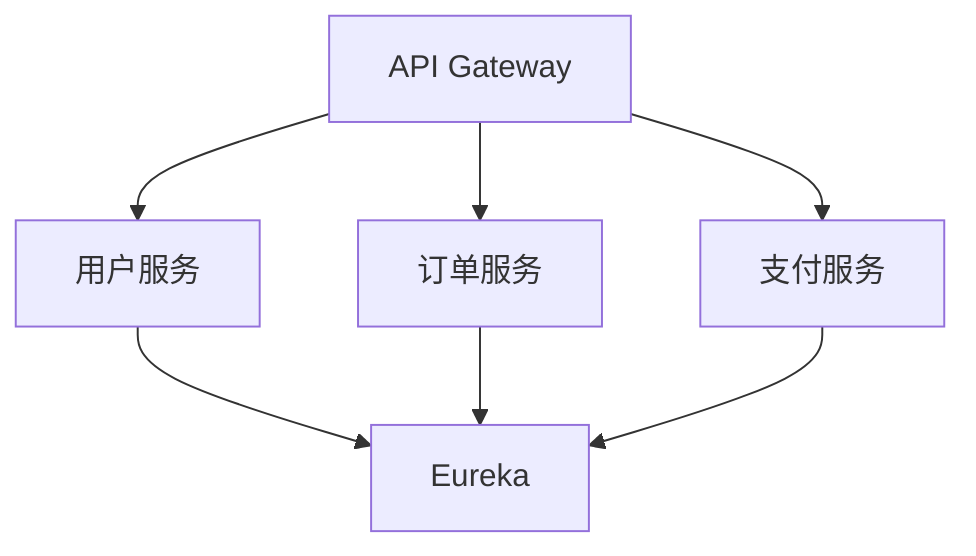

# Spring Cloud概述

## 什么是Spring Cloud？

Spring Cloud 是一个基于 Spring Boot 的微服务框架，旨在简化分布式系统的开发。它提供了一系列工具和库，帮助开发者快速构建和部署微服务应用。Spring Cloud 的核心目标是解决微服务架构中的常见问题，例如服务发现、配置管理、负载均衡、熔断器等。

:::note
Spring Cloud 并不是一个单一的工具，而是一个由多个独立项目组成的生态系统。每个项目都专注于解决微服务架构中的特定问题。
:::

## Spring Cloud 的核心组件

Spring Cloud 包含多个核心组件，以下是其中一些最重要的组件：

### 1. **服务发现与注册（Eureka）**
服务发现是微服务架构中的关键组件之一。Spring Cloud 使用 **Eureka** 作为服务注册中心，允许服务实例在启动时向注册中心注册自己，并能够动态发现其他服务。

```java
// 示例：在Spring Boot应用中启用Eureka客户端
@SpringBootApplication
@EnableEurekaClient
public class MyServiceApplication {
    public static void main(String[] args) {
        SpringApplication.run(MyServiceApplication.class, args);
    }
}
```

### 2. **配置管理（Spring Cloud Config）**
Spring Cloud Config 提供了一个集中化的外部配置管理解决方案。它允许你将配置文件存储在远程仓库（如 Git）中，并在运行时动态加载这些配置。

```yaml
# application.yml
spring:
  cloud:
    config:
      uri: http://localhost:8888
```

### 3. **负载均衡（Ribbon）**
Ribbon 是一个客户端负载均衡器，它可以在服务调用时自动选择可用的服务实例。Spring Cloud 默认集成了 Ribbon，使得负载均衡变得非常简单。

```java
// 示例：使用Ribbon进行负载均衡
@RestController
public class MyController {
    @Autowired
    private RestTemplate restTemplate;

    @GetMapping("/call-service")
    public String callService() {
        return restTemplate.getForObject("http://my-service/endpoint", String.class);
    }
}
```

### 4. **熔断器（Hystrix）**
Hystrix 是一个容错库，用于处理分布式系统中的延迟和故障。它通过熔断机制防止服务雪崩，并提供降级处理。

```java
// 示例：使用Hystrix进行熔断
@HystrixCommand(fallbackMethod = "fallbackMethod")
public String callService() {
    return restTemplate.getForObject("http://my-service/endpoint", String.class);
}

public String fallbackMethod() {
    return "Service is unavailable";
}
```

### 5. **API 网关（Zuul 或 Spring Cloud Gateway）**
API 网关是微服务架构中的入口点，负责路由请求、负载均衡、安全认证等。Spring Cloud 提供了 **Zuul** 和 **Spring Cloud Gateway** 两种网关解决方案。

```yaml
# application.yml
spring:
  cloud:
    gateway:
      routes:
        - id: my_route
          uri: http://localhost:8081
          predicates:
            - Path=/my-service/**
```

## 实际应用场景

假设你正在开发一个电商平台，该平台由多个微服务组成，例如用户服务、订单服务、支付服务等。使用 Spring Cloud，你可以轻松实现以下功能：

1. **服务发现**：所有服务在启动时自动注册到 Eureka，并能够相互发现。
2. **配置管理**：所有服务的配置集中存储在 Git 仓库中，并通过 Spring Cloud Config 动态加载。
3. **负载均衡**：当用户服务调用订单服务时，Ribbon 会自动选择一个可用的订单服务实例。
4. **熔断机制**：如果订单服务不可用，Hystrix 会触发熔断，并返回一个友好的错误信息。
5. **API 网关**：所有外部请求都通过 Spring Cloud Gateway 路由到相应的服务。



## 总结

Spring Cloud 是一个强大的微服务框架，它提供了一系列工具和库，帮助开发者轻松构建和部署分布式系统。通过使用 Spring Cloud，你可以专注于业务逻辑的开发，而不必担心分布式系统中的复杂问题。

:::tip
如果你刚刚开始学习 Spring Cloud，建议从 Spring Boot 开始，因为 Spring Cloud 是基于 Spring Boot 构建的。
:::

## 附加资源与练习

- **官方文档**：[Spring Cloud 官方文档](https://spring.io/projects/spring-cloud)
- **练习**：尝试创建一个简单的微服务应用，并使用 Spring Cloud 实现服务发现、配置管理和负载均衡。
- **推荐书籍**：《Spring Microservices in Action》 和 《Spring Cloud 微服务实战》

通过本文的学习，你应该对 Spring Cloud 有了一个初步的了解。接下来，你可以深入探索每个组件的具体用法，并在实际项目中应用这些知识。