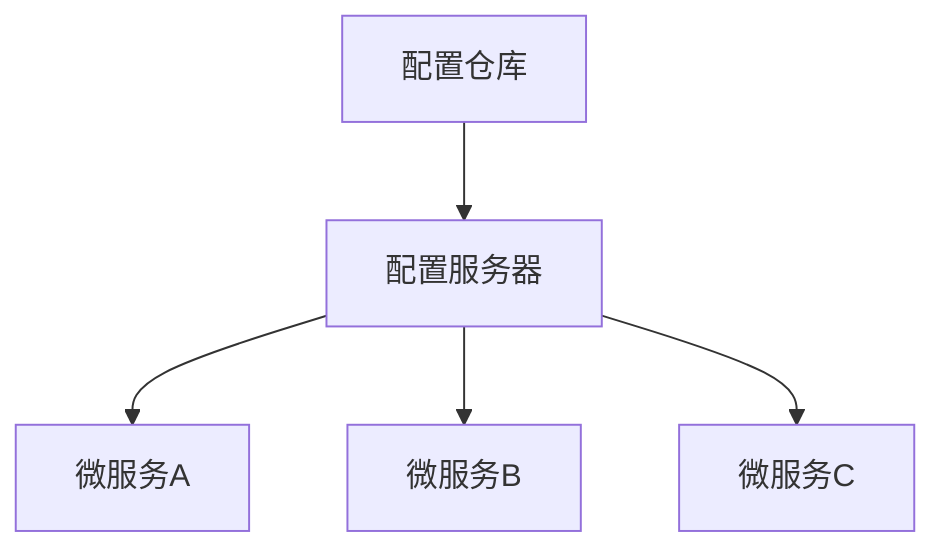

# Spring Cloud 配置中心

在现代分布式系统中，配置管理是一个至关重要的环节。随着微服务架构的普及，服务的数量不断增加，手动管理每个服务的配置文件变得非常繁琐且容易出错。Spring Cloud 配置中心（Spring Cloud Config）应运而生，它提供了一个集中化的配置管理解决方案，帮助开发者轻松管理分布式系统中的配置。

## 什么是 Spring Cloud 配置中心？

Spring Cloud 配置中心是一个集中化的配置管理工具，它允许你将所有微服务的配置文件集中存储在一个地方（如 Git 仓库、文件系统等），并通过 REST API 或消息总线将这些配置分发给各个微服务。这样，你可以在不重启服务的情况下动态更新配置，极大地提高了系统的灵活性和可维护性。

### 核心概念

- **配置服务器（Config Server）**：负责从配置仓库（如 Git）中读取配置文件，并将其提供给客户端。
- **配置客户端（Config Client）**：微服务应用，通过 REST API 从配置服务器获取配置。
- **配置仓库（Config Repository）**：存储配置文件的仓库，通常是一个 Git 仓库。

## 如何工作？

Spring Cloud 配置中心的工作原理非常简单：

1. **配置服务器启动**：配置服务器从配置仓库中加载配置文件。
2. **客户端请求配置**：微服务启动时，会向配置服务器请求其所需的配置。
3. **配置服务器响应**：配置服务器根据客户端的请求，返回相应的配置。
4. **客户端应用配置**：微服务应用从配置服务器获取的配置，并应用到自己的上下文中。



## 实际应用场景

假设你有一个电商系统，其中包含多个微服务，如用户服务、订单服务、支付服务等。每个服务都有自己的配置文件，如数据库连接信息、缓存配置、第三方 API 密钥等。使用 Spring Cloud 配置中心，你可以将这些配置文件集中管理，并在需要时动态更新。

### 示例：配置服务器与客户端

#### 1. 创建配置服务器

首先，创建一个 Spring Boot 项目，并添加 `spring-cloud-config-server` 依赖。

```xml
<dependency>
    <groupId>org.springframework.cloud</groupId>
    <artifactId>spring-cloud-config-server</artifactId>
</dependency>
```

然后，在 `application.yml` 中配置 Git 仓库作为配置仓库：

```yaml
server:
  port: 8888

spring:
  cloud:
    config:
      server:
        git:
          uri: https://github.com/your-repo/config-repo.git
```

最后，在启动类上添加 `@EnableConfigServer` 注解：

```java
@SpringBootApplication
@EnableConfigServer
public class ConfigServerApplication {
    public static void main(String[] args) {
        SpringApplication.run(ConfigServerApplication.class, args);
    }
}
```

#### 2. 创建配置客户端

在微服务项目中，添加 `spring-cloud-starter-config` 依赖：

```xml
<dependency>
    <groupId>org.springframework.cloud</groupId>
    <artifactId>spring-cloud-starter-config</artifactId>
</dependency>
```

然后，在 `bootstrap.yml` 中配置配置服务器的地址：

```yaml
spring:
  application:
    name: user-service
  cloud:
    config:
      uri: http://localhost:8888
```

#### 3. 使用配置

在微服务中，你可以通过 `@Value` 注解或 `@ConfigurationProperties` 来注入配置。

```java
@RestController
public class UserController {

    @Value("${user.service.message}")
    private String message;

    @GetMapping("/message")
    public String getMessage() {
        return message;
    }
}
```

## 动态刷新配置

Spring Cloud 配置中心支持动态刷新配置。你可以在配置客户端中添加 `spring-boot-starter-actuator` 依赖，并通过 `/actuator/refresh` 端点来刷新配置。

```xml
<dependency>
    <groupId>org.springframework.boot</groupId>
    <artifactId>spring-boot-starter-actuator</artifactId>
</dependency>
```

然后，在需要刷新的类上添加 `@RefreshScope` 注解：

```java
@RestController
@RefreshScope
public class UserController {

    @Value("${user.service.message}")
    private String message;

    @GetMapping("/message")
    public String getMessage() {
        return message;
    }
}
```

## 总结

Spring Cloud 配置中心为分布式系统提供了一个集中化的配置管理解决方案，极大地简化了配置的管理和更新。通过配置服务器和客户端的配合，你可以轻松实现配置的动态刷新，提高系统的灵活性和可维护性。

:::tip
在实际项目中，建议将配置仓库设置为私有仓库，并确保配置服务器的安全性，以防止敏感信息泄露。
:::

## 附加资源

- [Spring Cloud Config 官方文档](https://spring.io/projects/spring-cloud-config)
- [Spring Cloud Config 示例项目](https://github.com/spring-cloud-samples/config-server)

## 练习

1. 创建一个简单的 Spring Cloud 配置服务器，并将其连接到 Git 仓库。
2. 创建一个微服务项目，作为配置客户端，从配置服务器获取配置。
3. 尝试动态刷新配置，观察配置的变化。
