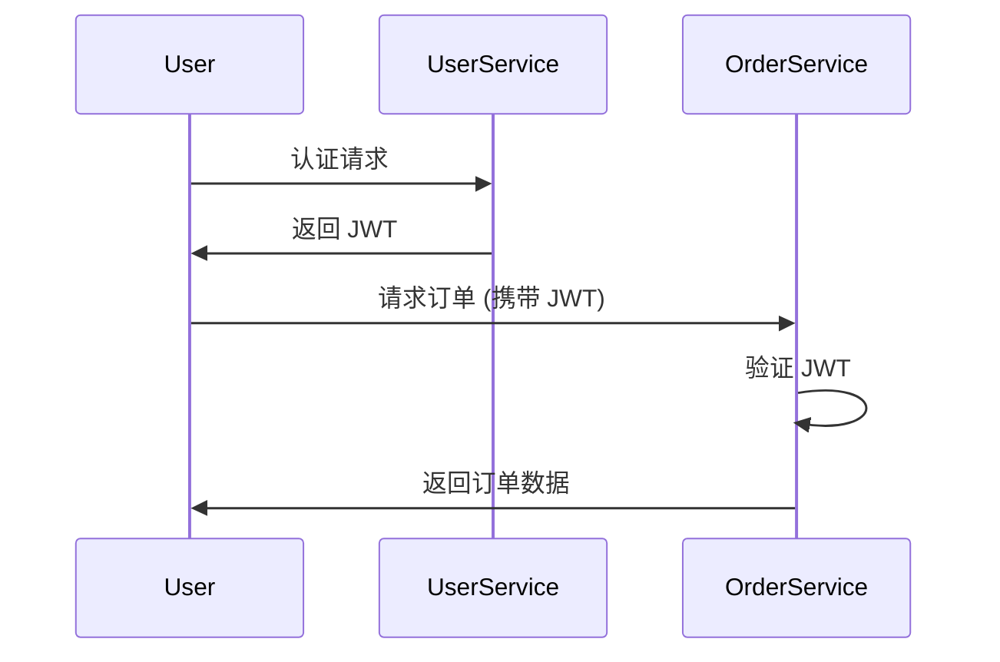

## 介绍

在现代微服务架构中，安全性是一个至关重要的方面。Spring Cloud 提供了一系列工具和库，帮助开发者轻松实现微服务的安全性。本文将介绍如何在 Spring Cloud 中实现认证、授权、OAuth2 和 JWT 等关键安全功能。

## 认证与授权

认证（Authentication）是验证用户身份的过程，而授权（Authorization）是确定用户是否有权限访问特定资源的过程。Spring Cloud 提供了多种方式来实现认证和授权。

### 使用 Spring Security 实现认证

Spring Security 是 Spring 生态系统中的一个强大框架，用于处理认证和授权。以下是一个简单的示例，展示如何在 Spring Boot 应用中配置基本的认证：

```java
@Configuration
@EnableWebSecurity
public class SecurityConfig extends WebSecurityConfigurerAdapter {

    @Override
    protected void configure(HttpSecurity http) throws Exception {
        http
            .authorizeRequests()
                .antMatchers("/public/**").permitAll()
                .anyRequest().authenticated()
                .and()
            .formLogin()
                .loginPage("/login")
                .permitAll()
                .and()
            .logout()
                .permitAll();
    }

    @Override
    protected void configure(AuthenticationManagerBuilder auth) throws Exception {
        auth
            .inMemoryAuthentication()
                .withUser("user").password("{noop}password").roles("USER");
    }
}
```

在这个示例中，我们配置了一个简单的内存认证，用户名为 `user`，密码为 `password`。所有请求都需要认证，除了 `/public/**` 路径下的请求。

### 使用 OAuth2 实现授权

OAuth2 是一种广泛使用的授权框架，允许第三方应用访问用户资源而不暴露用户凭据。Spring Cloud Security 提供了对 OAuth2 的支持。

以下是一个简单的 OAuth2 配置示例：

```java
@Configuration
@EnableAuthorizationServer
public class AuthorizationServerConfig extends AuthorizationServerConfigurerAdapter {

    @Autowired
    private AuthenticationManager authenticationManager;

    @Override
    public void configure(ClientDetailsServiceConfigurer clients) throws Exception {
        clients.inMemory()
            .withClient("client-id")
            .secret("{noop}client-secret")
            .authorizedGrantTypes("authorization_code", "refresh_token", "password")
            .scopes("read", "write")
            .accessTokenValiditySeconds(3600);
    }

    @Override
    public void configure(AuthorizationServerEndpointsConfigurer endpoints) throws Exception {
        endpoints.authenticationManager(authenticationManager);
    }
}
```

在这个示例中，我们配置了一个简单的 OAuth2 授权服务器，客户端 ID 为 `client-id`，客户端密钥为 `client-secret`。

### 使用 JWT 实现无状态认证

JSON Web Token (JWT) 是一种紧凑的、自包含的方式，用于在各方之间安全地传输信息。Spring Cloud Security 支持使用 JWT 进行无状态认证。

以下是一个简单的 JWT 配置示例：

```java
@Configuration
public class JwtConfig {

    @Bean
    public JwtAccessTokenConverter accessTokenConverter() {
        JwtAccessTokenConverter converter = new JwtAccessTokenConverter();
        converter.setSigningKey("secret-key");
        return converter;
    }

    @Bean
    public TokenStore tokenStore() {
        return new JwtTokenStore(accessTokenConverter());
    }
}
```

在这个示例中，我们配置了一个 JWT 转换器，并使用 `secret-key` 进行签名。

## 实际案例

假设我们有一个微服务架构，包含一个用户服务和一个订单服务。用户服务负责用户认证，订单服务负责处理订单。我们可以使用 OAuth2 和 JWT 来实现这两个服务之间的安全通信。

1. 用户通过用户服务进行认证，获取 JWT。
2. 用户在请求订单服务时，携带 JWT。
3. 订单服务验证 JWT，并根据 JWT 中的信息进行授权。



## 总结

Spring Cloud 提供了强大的工具和库，帮助开发者轻松实现微服务的安全性。通过 Spring Security、OAuth2 和 JWT，我们可以实现认证、授权和无状态认证等功能。在实际应用中，这些技术可以有效地保护微服务架构的安全性。

## 附加资源

- [Spring Security 官方文档](https://docs.spring.io/spring-security/reference/)
- [OAuth2 官方文档](https://oauth.net/2/)
- [JWT 官方文档](https://jwt.io/)

## 练习

1. 尝试在本地环境中配置一个简单的 Spring Boot 应用，使用 Spring Security 实现基本的认证。
2. 使用 OAuth2 和 JWT 实现一个简单的微服务架构，包含用户服务和订单服务。
3. 探索 Spring Cloud Security 的其他功能，如单点登录（SSO）和角色管理。
