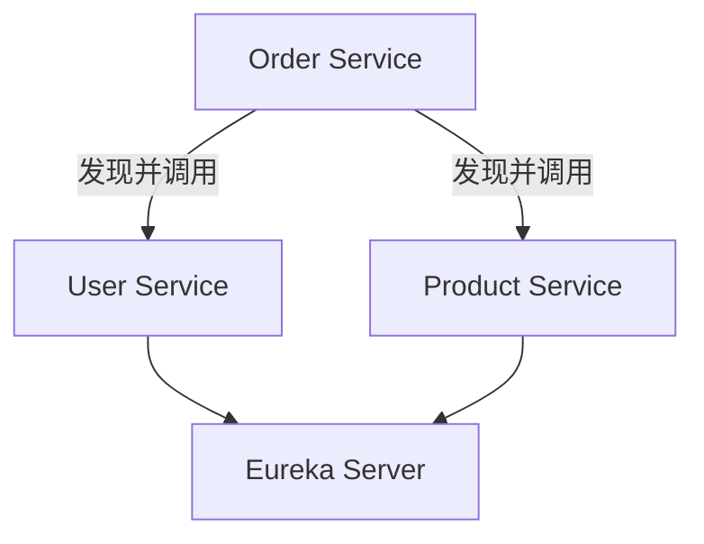

# Spring Cloud 服务发现

在现代微服务架构中，服务发现是一个至关重要的组件。它允许微服务动态地找到彼此并进行通信，而无需硬编码服务地址。Spring Cloud 提供了强大的工具来实现服务发现，其中最常用的组件是 **Eureka** 和 **Consul**。本文将详细介绍 Spring Cloud 中的服务发现机制，并通过实际案例帮助你理解其工作原理。

## 什么是服务发现？

在微服务架构中，服务通常分布在多个服务器上，并且可能会动态扩展或缩减。服务发现是一种机制，允许服务在运行时动态地找到其他服务的位置（IP 地址和端口）。这样，服务之间可以相互通信，而无需手动配置或硬编码服务地址。

服务发现的核心组件包括：
- **服务注册**：服务启动时，将自己的信息（如 IP 地址、端口、服务名称等）注册到服务注册中心。
- **服务发现**：服务在需要调用其他服务时，从服务注册中心获取目标服务的地址信息。

## Spring Cloud 中的服务发现

Spring Cloud 提供了多种服务发现实现，其中最常用的是 **Eureka** 和 **Consul**。以下我们将以 Eureka 为例，逐步讲解如何在 Spring Cloud 中实现服务发现。

### 1. 创建 Eureka 服务注册中心

首先，我们需要创建一个 Eureka 服务注册中心。这个中心将负责管理所有注册的服务。

```java
@SpringBootApplication
@EnableEurekaServer
public class EurekaServerApplication {
    public static void main(String[] args) {
        SpringApplication.run(EurekaServerApplication.class, args);
    }
}
```

在 `application.yml` 中配置 Eureka 服务器：

```yaml
server:
  port: 8761

eureka:
  instance:
    hostname: localhost
  client:
    registerWithEureka: false
    fetchRegistry: false
    serviceUrl:
      defaultZone: http://${eureka.instance.hostname}:${server.port}/eureka/
```

启动该应用后，Eureka 服务注册中心将在 `http://localhost:8761` 上运行。

### 2. 注册服务到 Eureka

接下来，我们需要将微服务注册到 Eureka 服务器。假设我们有一个名为 `user-service` 的服务。

```java
@SpringBootApplication
@EnableDiscoveryClient
public class UserServiceApplication {
    public static void main(String[] args) {
        SpringApplication.run(UserServiceApplication.class, args);
    }
}
```

在 `application.yml` 中配置 `user-service`：

```yaml
spring:
  application:
    name: user-service

server:
  port: 8081

eureka:
  client:
    serviceUrl:
      defaultZone: http://localhost:8761/eureka/
```

启动 `user-service` 后，它将自动注册到 Eureka 服务器。

### 3. 服务发现与调用

现在，假设我们有另一个服务 `order-service`，它需要调用 `user-service`。我们可以通过 Eureka 来发现 `user-service` 的地址。

```java
@RestController
public class OrderController {

    @Autowired
    private RestTemplate restTemplate;

    @GetMapping("/order/{userId}")
    public String getUserOrder(@PathVariable Long userId) {
        String userServiceUrl = "http://user-service/user/" + userId;
        return restTemplate.getForObject(userServiceUrl, String.class);
    }
}
```

在 `application.yml` 中配置 `order-service`：

```yaml
spring:
  application:
    name: order-service

server:
  port: 8082

eureka:
  client:
    serviceUrl:
      defaultZone: http://localhost:8761/eureka/
```

:::tip
确保在 `order-service` 中配置了 `RestTemplate` 并启用了负载均衡：

```java
@Bean
@LoadBalanced
public RestTemplate restTemplate() {
    return new RestTemplate();
}
```

:::

### 4. 实际案例

假设我们有一个电商系统，其中包含以下微服务：
- `user-service`：管理用户信息。
- `order-service`：管理订单信息。
- `product-service`：管理商品信息。

当用户下单时，`order-service` 需要调用 `user-service` 来验证用户信息，并调用 `product-service` 来检查商品库存。通过 Eureka，`order-service` 可以动态发现 `user-service` 和 `product-service` 的地址，从而实现服务间的通信。



### 5. 总结

Spring Cloud 的服务发现机制使得微服务之间的通信变得更加灵活和高效。通过 Eureka 或 Consul，服务可以动态注册和发现，而无需硬编码服务地址。这为微服务架构的扩展和维护提供了极大的便利。

:::note
**附加资源**：
- [Spring Cloud Eureka 官方文档](https://spring.io/projects/spring-cloud-netflix)
- [Consul 服务发现](https://www.consul.io/)

**练习**：
1. 尝试使用 Consul 替代 Eureka 实现服务发现。
2. 在 `order-service` 中添加对 `product-service` 的调用，并测试整个流程。
:::

通过本文的学习，你应该已经掌握了 Spring Cloud 中的服务发现机制，并能够在实际项目中应用它。继续探索 Spring Cloud 的其他功能，以构建更强大的微服务系统！