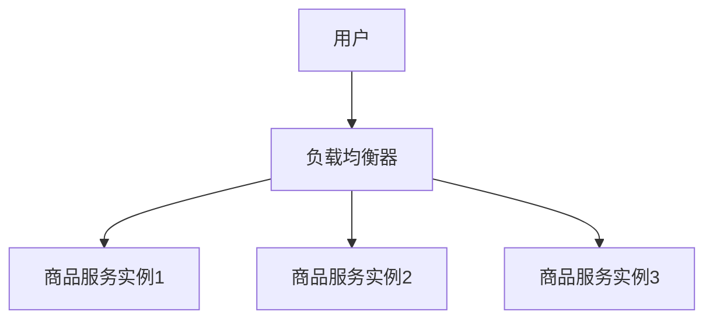

# Spring Cloud负载均衡

在现代分布式系统中，负载均衡是一个至关重要的概念。它确保请求能够均匀地分发到多个服务实例上，从而提高系统的可用性和性能。Spring Cloud提供了多种负载均衡的实现方式，其中最常用的是Ribbon和Spring Cloud LoadBalancer。本文将详细介绍这些技术，并通过实际案例帮助你理解它们的应用。

## 什么是负载均衡？

负载均衡是一种将网络流量或请求分发到多个服务器上的技术。它的主要目的是优化资源使用、最大化吞吐量、最小化响应时间，并避免任何单一服务器过载。在微服务架构中，负载均衡尤为重要，因为服务通常会被部署在多个实例上。

## Spring Cloud中的负载均衡

Spring Cloud提供了两种主要的负载均衡实现：

1. **Ribbon**：Ribbon是一个客户端负载均衡器，它可以在客户端决定将请求发送到哪个服务实例。Ribbon已经集成在Spring Cloud Netflix中，但由于Netflix OSS的维护状态，Spring Cloud推荐使用Spring Cloud LoadBalancer作为替代。

2. **Spring Cloud LoadBalancer**：这是Spring Cloud官方推荐的负载均衡器，提供了更现代化的API和更好的扩展性。

### 使用Ribbon实现负载均衡

Ribbon是Spring Cloud Netflix的一部分，它通过客户端负载均衡来分发请求。以下是一个简单的示例，展示如何在Spring Boot应用中使用Ribbon。

```java
@RestController
public class MyController {

    @Autowired
    private RestTemplate restTemplate;

    @GetMapping("/call-service")
    public String callService() {
        return restTemplate.getForObject("http://my-service/endpoint", String.class);
    }
}
```

在上面的代码中，`RestTemplate`会自动使用Ribbon进行负载均衡。你只需要在配置文件中指定服务实例的地址即可。

```yaml
my-service:
  ribbon:
    listOfServers: http://localhost:8081,http://localhost:8082
```

### 使用Spring Cloud LoadBalancer

Spring Cloud LoadBalancer是Ribbon的替代品，提供了更现代化的API。以下是一个使用Spring Cloud LoadBalancer的示例。

```java
@Bean
public RestTemplate restTemplate() {
    return new RestTemplate();
}

@Bean
public LoadBalancerClient loadBalancerClient() {
    return new LoadBalancerClient();
}

@RestController
public class MyController {

    @Autowired
    private RestTemplate restTemplate;

    @Autowired
    private LoadBalancerClient loadBalancerClient;

    @GetMapping("/call-service")
    public String callService() {
        ServiceInstance instance = loadBalancerClient.choose("my-service");
        URI uri = instance.getUri();
        return restTemplate.getForObject(uri + "/endpoint", String.class);
    }
}
```

在这个示例中，`LoadBalancerClient`用于选择服务实例，然后使用`RestTemplate`发送请求。

## 实际应用场景

假设你有一个电商系统，其中包含多个商品服务实例。当用户浏览商品时，请求需要被分发到不同的商品服务实例上。通过使用Spring Cloud的负载均衡机制，你可以确保每个实例都能均匀地处理请求，从而提高系统的整体性能和可用性。



## 总结

负载均衡是分布式系统中不可或缺的一部分，Spring Cloud提供了多种实现方式，包括Ribbon和Spring Cloud LoadBalancer。通过本文的介绍和示例，你应该能够理解如何在Spring Cloud中实现负载均衡，并将其应用到实际项目中。

## 附加资源

- [Spring Cloud官方文档](https://spring.io/projects/spring-cloud)
- [Spring Cloud LoadBalancer文档](https://docs.spring.io/spring-cloud-commons/docs/current/reference/html/#spring-cloud-loadbalancer)
- [Ribbon GitHub仓库](https://github.com/Netflix/ribbon)

## 练习

1. 尝试在一个Spring Boot项目中配置Ribbon，并观察请求是如何被分发到不同服务实例的。
2. 使用Spring Cloud LoadBalancer替换Ribbon，并比较两者的使用体验。
3. 设计一个简单的微服务架构，并在其中实现负载均衡。

通过完成这些练习，你将更深入地理解Spring Cloud中的负载均衡机制。