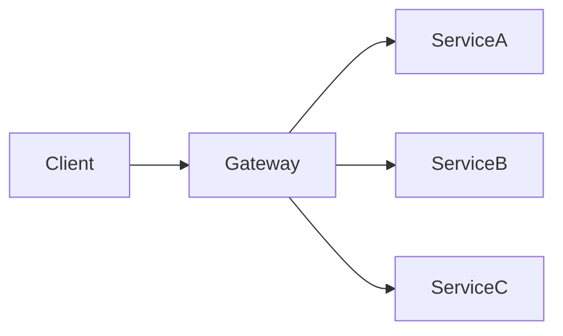

## 什么是Spring Cloud网关？

Spring Cloud网关是Spring Cloud生态系统中的一个重要组件，用于为微服务架构提供统一的API入口。它充当了客户端和后端服务之间的中间层，负责路由、负载均衡、安全认证、限流等功能。通过Spring Cloud网关，开发者可以集中管理微服务的访问策略，简化客户端与后端服务的交互。

:::note
Spring Cloud网关基于Spring WebFlux构建，支持非阻塞的异步编程模型，适合高并发场景。
:::

---

## Spring Cloud网关的核心功能

Spring Cloud网关提供了以下核心功能：

1. **路由（Routing）**：将客户端请求转发到对应的后端服务。
2. **负载均衡（Load Balancing）**：通过集成Ribbon或Spring Cloud LoadBalancer实现负载均衡。
3. **安全认证（Security）**：支持OAuth2、JWT等认证机制。
4. **限流（Rate Limiting）**：通过集成Resilience4j或Sentinel实现请求限流。
5. **熔断（Circuit Breaking）**：通过集成Hystrix或Resilience4j实现熔断机制。
6. **日志与监控（Logging & Monitoring）**：支持集成Micrometer和Prometheus进行监控。

---

## 如何配置Spring Cloud网关？

以下是一个简单的Spring Cloud网关配置示例：

```yaml
spring:
  cloud:
    gateway:
      routes:
        - id: user-service
          uri: http://localhost:8081
          predicates:
            - Path=/user/**
          filters:
            - AddRequestHeader=X-Request-User, Gateway
```

### 代码说明：
- `id`：路由的唯一标识。
- `uri`：目标服务的地址。
- `predicates`：定义路由匹配规则，例如`Path=/user/**`表示匹配以`/user`开头的请求。
- `filters`：定义请求或响应的过滤器，例如`AddRequestHeader`用于添加请求头。

---

## Spring Cloud网关的实际应用场景

### 场景1：统一API入口
在微服务架构中，客户端需要访问多个服务。通过Spring Cloud网关，可以将所有服务的API统一到一个入口，简化客户端的调用逻辑。



### 场景2：动态路由
Spring Cloud网关支持动态路由配置，可以根据请求的路径、参数或头信息动态转发到不同的服务。

```yaml
spring:
  cloud:
    gateway:
      routes:
        - id: dynamic-route
          uri: ${DYNAMIC_SERVICE_URI}
          predicates:
            - Path=/dynamic/**
```

### 场景3：限流与熔断
在高并发场景下，Spring Cloud网关可以通过限流和熔断机制保护后端服务，避免服务雪崩。

```yaml
spring:
  cloud:
    gateway:
      routes:
        - id: rate-limited-route
          uri: http://localhost:8082
          predicates:
            - Path=/limited/**
          filters:
            - name: RequestRateLimiter
              args:
                redis-rate-limiter.replenishRate: 10
                redis-rate-limiter.burstCapacity: 20
```

---

## 总结

Spring Cloud网关是微服务架构中不可或缺的组件，它通过路由、负载均衡、安全认证、限流等功能，为微服务提供了统一的访问入口和管理能力。通过本文的学习，你应该已经掌握了Spring Cloud网关的基本概念、配置方法以及实际应用场景。

---

## 附加资源与练习

### 资源
- [Spring Cloud Gateway官方文档](https://spring.io/projects/spring-cloud-gateway)
- [Spring WebFlux官方文档](https://docs.spring.io/spring-framework/docs/current/reference/html/web-reactive.html)

### 练习
1. 尝试配置一个Spring Cloud网关，将请求路由到两个不同的后端服务。
2. 为网关添加一个限流过滤器，限制每秒最多处理10个请求。
3. 使用Spring Cloud Gateway实现一个动态路由功能，根据请求头中的`X-Service-Name`字段动态选择目标服务。

:::tip
如果你在练习中遇到问题，可以参考官方文档或在社区中寻求帮助。
:::