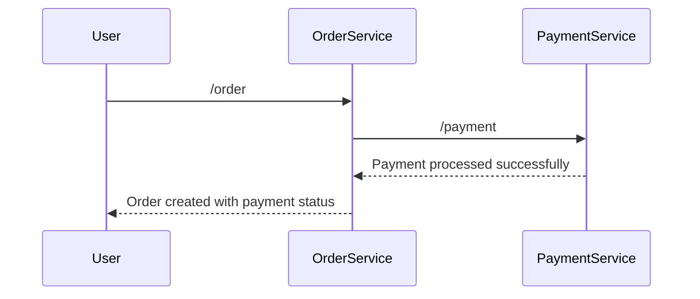

# Spring Cloud链路追踪

在现代微服务架构中，一个请求可能会经过多个服务，每个服务都可能调用其他服务。为了监控和调试这些复杂的请求流程，链路追踪（Distributed Tracing）成为了一个重要的工具。Spring Cloud提供了对链路追踪的支持，帮助开发者更好地理解请求在微服务中的流转情况。

## 什么是链路追踪？

链路追踪是一种用于监控和调试分布式系统的技术。它通过记录请求在系统中的流转路径，帮助开发者了解请求在各个服务之间的调用关系、耗时以及潜在的性能瓶颈。链路追踪的核心思想是为每个请求分配一个唯一的追踪ID（Trace ID），并在请求经过的每个服务中记录相关的信息（如服务名称、调用时间等）。

## Spring Cloud中的链路追踪

Spring Cloud通过集成[Sleuth](https://spring.io/projects/spring-cloud-sleuth)和[Zipkin](https://zipkin.io/)来实现链路追踪。Sleuth负责生成和传播追踪信息，而Zipkin则用于存储和展示这些追踪数据。

### 1. 集成Sleuth

首先，我们需要在Spring Boot项目中引入Sleuth依赖。在`pom.xml`中添加以下依赖：

```xml
<dependency>
    <groupId>org.springframework.cloud</groupId>
    <artifactId>spring-cloud-starter-sleuth</artifactId>
</dependency>
```

Sleuth会自动为每个请求生成一个唯一的Trace ID和Span ID，并将这些信息传播到下游服务。你可以在日志中看到这些信息，例如：

```
2023-10-01 12:00:00.000 INFO [service-name,trace-id,span-id] - Request received
```

### 2. 集成Zipkin

为了将追踪数据可视化，我们可以集成Zipkin。首先，在`pom.xml`中添加Zipkin依赖：

```xml
<dependency>
    <groupId>org.springframework.cloud</groupId>
    <artifactId>spring-cloud-starter-zipkin</artifactId>
</dependency>
```

然后，在`application.yml`中配置Zipkin服务器的地址：

```yaml
spring:
  zipkin:
    base-url: http://localhost:9411
  sleuth:
    sampler:
      probability: 1.0 # 采样率，1.0表示采样所有请求
```

启动Zipkin服务器后，你可以访问`http://localhost:9411`来查看追踪数据。

### 3. 实际案例

假设我们有两个微服务：`order-service`和`payment-service`。当用户下单时，`order-service`会调用`payment-service`来处理支付。我们可以通过链路追踪来监控这个流程。

在`order-service`中，我们定义一个简单的REST控制器：

```java
@RestController
public class OrderController {

    @Autowired
    private RestTemplate restTemplate;

    @GetMapping("/order")
    public String createOrder() {
        String paymentResponse = restTemplate.getForObject("http://payment-service/payment", String.class);
        return "Order created with payment status: " + paymentResponse;
    }
}
```

在`payment-service`中，我们定义另一个REST控制器：

```java
@RestController
public class PaymentController {

    @GetMapping("/payment")
    public String processPayment() {
        return "Payment processed successfully";
    }
}
```

当用户访问`/order`端点时，Sleuth会自动生成Trace ID和Span ID，并将这些信息传播到`payment-service`。你可以在Zipkin中看到整个请求的流转情况。

### 4. 链路追踪的可视化

通过Zipkin，我们可以直观地看到请求在各个服务之间的调用关系。以下是一个简单的Mermaid图表，展示了请求的流转路径：



## 总结

链路追踪是微服务架构中不可或缺的工具，它帮助开发者监控和调试复杂的请求流程。通过Spring Cloud Sleuth和Zipkin，我们可以轻松实现链路追踪，并可视化请求的流转路径。

## 附加资源

- [Spring Cloud Sleuth官方文档](https://spring.io/projects/spring-cloud-sleuth)
- [Zipkin官方文档](https://zipkin.io/)
- [微服务架构中的链路追踪实践](https://microservices.io/patterns/observability/distributed-tracing.html)

## 练习

1. 在你的Spring Boot项目中集成Sleuth和Zipkin，并尝试追踪一个简单的请求流程。
2. 修改采样率，观察Zipkin中的追踪数据变化。
3. 尝试在多个微服务之间传播自定义的追踪信息。

通过以上步骤，你将能够更好地理解和应用Spring Cloud中的链路追踪技术。