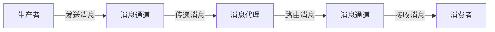
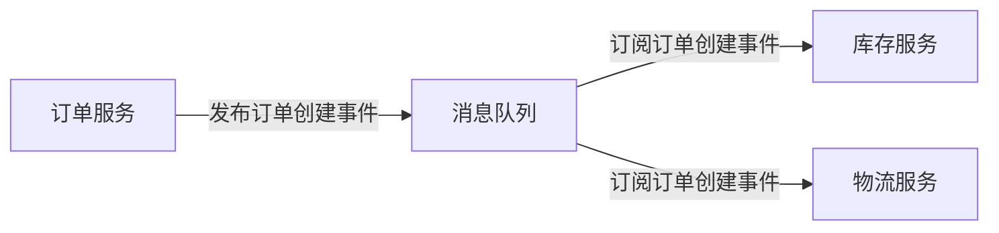

# Spring 消息概述

在现代应用程序开发中，消息传递是一种常见的通信方式，尤其是在分布式系统中。Spring框架提供了强大的消息支持，帮助开发者轻松实现异步通信、解耦系统组件以及构建高效的消息驱动架构。本文将带你了解Spring消息的核心概念、工作原理以及实际应用。

## 什么是Spring消息？

Spring消息是Spring框架中的一个模块，用于支持消息驱动的应用程序开发。它基于**Java消息服务（JMS）**和**Spring Integration**等标准，提供了统一的API来处理消息的发送和接收。通过Spring消息，开发者可以轻松实现异步通信、事件驱动架构以及系统解耦。

### 核心概念

在深入Spring消息之前，我们需要了解一些核心概念：

1. **消息（Message）**：消息是应用程序之间传递的数据单元。它通常包含一个**消息头**（用于存储元数据）和一个**消息体**（用于存储实际数据）。
2. **消息通道（Message Channel）**：消息通道是消息传递的媒介。它可以是点对点（Point-to-Point）或发布/订阅（Publish/Subscribe）模式。
3. **消息端点（Message Endpoint）**：消息端点是消息的生产者或消费者。生产者负责发送消息，消费者负责接收和处理消息。
4. **消息代理（Message Broker）**：消息代理是消息传递的中介，负责管理消息的存储、路由和传递。

## Spring 消息的工作原理

Spring消息的核心是**Spring Messaging**模块，它提供了一套统一的API来处理消息。以下是Spring消息的基本工作流程：

1. **消息发送**：生产者通过消息通道发送消息。
2. **消息传递**：消息代理负责将消息从生产者传递到消费者。
3. **消息接收**：消费者从消息通道接收消息并处理。



### 代码示例

以下是一个简单的Spring消息示例，展示了如何发送和接收消息：

```java
import org.springframework.messaging.Message;
import org.springframework.messaging.MessageChannel;
import org.springframework.messaging.support.MessageBuilder;
import org.springframework.messaging.PollableChannel;

public class SpringMessagingExample {

    private MessageChannel inputChannel;
    private PollableChannel outputChannel;

    public void sendMessage(String payload) {
        Message<String> message = MessageBuilder.withPayload(payload).build();
        inputChannel.send(message);
    }

    public String receiveMessage() {
        Message<?> message = outputChannel.receive();
        return message != null ? message.getPayload().toString() : null;
    }
}
```

在这个示例中，`inputChannel` 是消息发送的通道，`outputChannel` 是消息接收的通道。`sendMessage` 方法用于发送消息，`receiveMessage` 方法用于接收消息。

:::note
**注意**：在实际应用中，消息通道和消息代理通常由Spring配置管理，开发者只需关注业务逻辑。
:::

## 实际应用场景

Spring消息广泛应用于以下场景：

1. **异步通信**：通过消息队列实现异步处理，提高系统响应速度。
2. **事件驱动架构**：通过消息传递实现系统组件之间的解耦。
3. **分布式系统**：在分布式系统中，消息传递是实现跨服务通信的重要手段。

### 案例：订单处理系统

假设我们有一个订单处理系统，订单创建后需要通知库存系统和物流系统。使用Spring消息，我们可以将订单创建事件发布到消息队列中，库存系统和物流系统分别订阅该队列并处理相关事件。



通过这种方式，订单服务、库存服务和物流服务之间实现了完全解耦，系统扩展性和可维护性得到了极大提升。

## 总结

Spring消息是Spring框架中用于实现消息驱动架构的重要模块。它提供了统一的API来处理消息的发送和接收，支持异步通信、事件驱动架构以及分布式系统开发。通过本文的学习，你应该对Spring消息的核心概念、工作原理以及实际应用有了初步了解。

:::tip
**提示**：如果你想深入学习Spring消息，可以尝试以下练习：
1. 实现一个简单的消息生产者-消费者模型。
2. 使用Spring Integration构建一个事件驱动的应用程序。
3. 探索Spring Boot中如何集成消息队列（如RabbitMQ或Kafka）。
:::

希望本文能帮助你快速入门Spring消息，并为你的编程学习之旅打下坚实的基础！