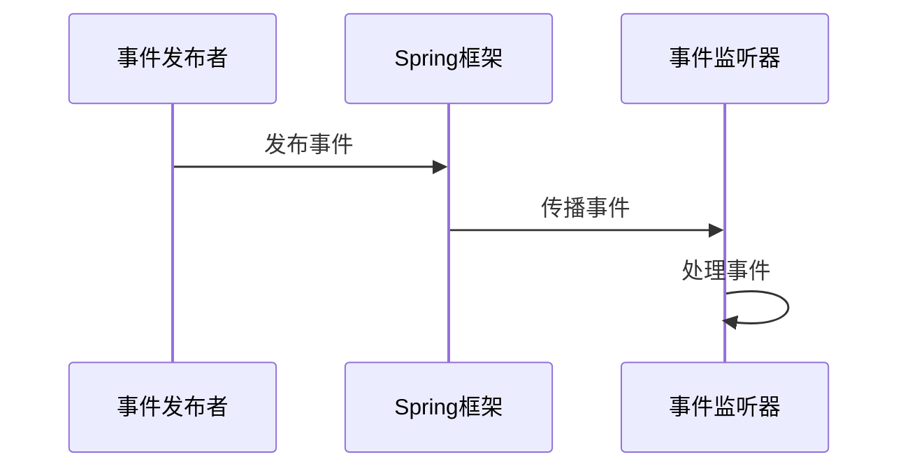

## 介绍

Spring事件机制是Spring框架提供的一种基于观察者模式的事件驱动编程模型。它允许应用程序中的不同组件通过发布和监听事件的方式进行通信，从而实现松耦合的设计。通过事件机制，开发者可以将业务逻辑分散到多个独立的组件中，而不是将所有逻辑集中在一个地方。

在Spring中，事件机制的核心是`ApplicationEvent`和`ApplicationListener`。`ApplicationEvent`是一个事件对象，而`ApplicationListener`是一个监听器接口，用于处理特定类型的事件。

## Spring 事件机制的核心组件

### 1. ApplicationEvent

`ApplicationEvent`是Spring中所有事件的基类。开发者可以继承这个类来创建自定义事件。例如：

```java
public class CustomEvent extends ApplicationEvent {
    private String message;

    public CustomEvent(Object source, String message) {
        super(source);
        this.message = message;
    }

    public String getMessage() {
        return message;
    }
}
```

### 2. ApplicationListener

`ApplicationListener`是一个接口，用于监听特定类型的事件。开发者需要实现这个接口，并在`onApplicationEvent`方法中定义事件处理逻辑。例如：

```java
@Component
public class CustomEventListener implements ApplicationListener<CustomEvent> {
    @Override
    public void onApplicationEvent(CustomEvent event) {
        System.out.println("Received event: " + event.getMessage());
    }
}
```

### 3. ApplicationEventPublisher

`ApplicationEventPublisher`是Spring提供的一个接口，用于发布事件。开发者可以通过注入`ApplicationEventPublisher`来发布自定义事件。例如：

```java
@Service
public class CustomEventPublisher {
    @Autowired
    private ApplicationEventPublisher publisher;

    public void publishEvent(String message) {
        CustomEvent event = new CustomEvent(this, message);
        publisher.publishEvent(event);
    }
}
```

## 事件机制的工作流程

Spring事件机制的工作流程可以分为以下几个步骤：

1. **事件发布**：通过`ApplicationEventPublisher`发布一个事件。
2. **事件传播**：Spring框架将事件传播给所有注册的监听器。
3. **事件处理**：监听器接收到事件后，执行相应的处理逻辑。



## 实际案例

假设我们有一个电商系统，当用户下单时，我们需要发送邮件通知用户，并记录订单日志。我们可以使用Spring事件机制来实现这个功能。

### 1. 定义事件

```java
public class OrderPlacedEvent extends ApplicationEvent {
    private String orderId;

    public OrderPlacedEvent(Object source, String orderId) {
        super(source);
        this.orderId = orderId;
    }

    public String getOrderId() {
        return orderId;
    }
}
```

### 2. 定义监听器

```java
@Component
public class EmailNotificationListener implements ApplicationListener<OrderPlacedEvent> {
    @Override
    public void onApplicationEvent(OrderPlacedEvent event) {
        System.out.println("Sending email notification for order: " + event.getOrderId());
    }
}

@Component
public class OrderLoggingListener implements ApplicationListener<OrderPlacedEvent> {
    @Override
    public void onApplicationEvent(OrderPlacedEvent event) {
        System.out.println("Logging order: " + event.getOrderId());
    }
}
```

### 3. 发布事件

```java
@Service
public class OrderService {
    @Autowired
    private ApplicationEventPublisher publisher;

    public void placeOrder(String orderId) {
        // 处理订单逻辑
        System.out.println("Order placed: " + orderId);

        // 发布订单事件
        publisher.publishEvent(new OrderPlacedEvent(this, orderId));
    }
}
```

### 4. 测试代码

```java
@SpringBootApplication
public class Application implements CommandLineRunner {
    @Autowired
    private OrderService orderService;

    public static void main(String[] args) {
        SpringApplication.run(Application.class, args);
    }

    @Override
    public void run(String... args) throws Exception {
        orderService.placeOrder("12345");
    }
}
```

运行上述代码后，控制台将输出：

```
Order placed: 12345
Sending email notification for order: 12345
Logging order: 12345
```

## 总结

Spring事件机制提供了一种灵活的方式来解耦应用程序的各个组件。通过事件驱动的方式，开发者可以将业务逻辑分散到多个独立的组件中，从而提高代码的可维护性和可扩展性。

在实际开发中，Spring事件机制可以用于处理各种异步任务、通知、日志记录等场景。通过合理地使用事件机制，开发者可以构建出更加模块化和可扩展的应用程序。

## 附加资源

- [Spring官方文档 - 事件机制](https://docs.spring.io/spring-framework/docs/current/reference/html/core.html#context-functionality-events)
- [Spring事件机制实战](https://www.baeldung.com/spring-events)

## 练习

1. 尝试创建一个自定义事件，并在监听器中处理该事件。
2. 修改上述电商系统的案例，添加一个新的监听器，用于在订单完成后发送短信通知。
3. 研究Spring中的异步事件处理，并尝试在事件监听器中使用`@Async`注解实现异步处理。
