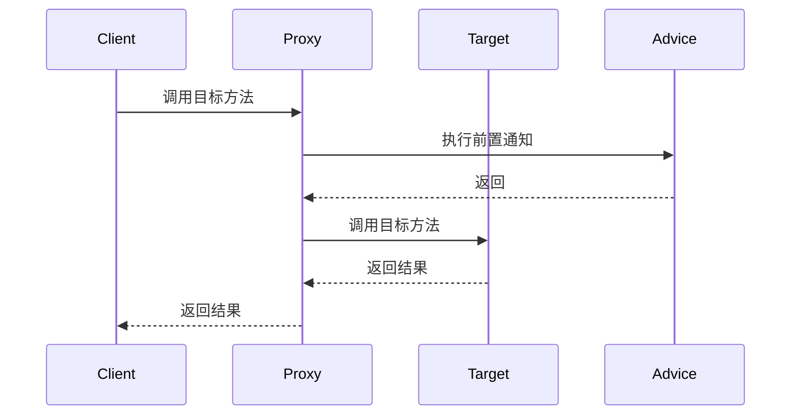

## 介绍

在 Spring AOP（面向切面编程）中，**前置通知（Before Advice）** 是一种通知类型，它允许我们在目标方法执行之前插入自定义逻辑。前置通知通常用于执行一些预处理操作，例如日志记录、权限检查或参数验证。

前置通知的核心思想是“在方法执行之前做一些事情”。它不会影响目标方法的执行流程，但可以在方法执行前执行一些额外的逻辑。

## 前置通知的工作原理

前置通知是 Spring AOP 中最简单的通知类型之一。它通过拦截目标方法的调用，在方法执行之前执行通知逻辑。以下是前置通知的工作流程：



如上图所示，当客户端调用目标方法时，Spring AOP 的代理会首先执行前置通知，然后再调用目标方法。

## 实现前置通知

在 Spring 中，前置通知可以通过注解或 XML 配置来实现。以下是使用注解的示例。

### 使用注解实现前置通知

首先，我们需要定义一个切面类，并在其中使用 `@Before` 注解来标记前置通知方法。

```java
import org.aspectj.lang.annotation.Aspect;
import org.aspectj.lang.annotation.Before;
import org.springframework.stereotype.Component;

@Aspect
@Component
public class LoggingAspect {

    @Before("execution(* com.example.service.*.*(..))")
    public void beforeAdvice() {
        System.out.println("前置通知：在目标方法执行前记录日志");
    }
}
```

在上面的代码中，`@Before` 注解指定了切点表达式 `execution(* com.example.service.*.*(..))`，表示在 `com.example.service` 包下的所有方法执行前都会触发 `beforeAdvice` 方法。

### 示例代码

假设我们有一个简单的服务类 `UserService`：

```java
package com.example.service;

import org.springframework.stereotype.Service;

@Service
public class UserService {

    public void addUser(String username) {
        System.out.println("添加用户: " + username);
    }
}
```

当我们调用 `addUser` 方法时，前置通知会先执行：

```java
import org.springframework.context.ApplicationContext;
import org.springframework.context.annotation.AnnotationConfigApplicationContext;

public class MainApp {
    public static void main(String[] args) {
        ApplicationContext context = new AnnotationConfigApplicationContext(AppConfig.class);
        UserService userService = context.getBean(UserService.class);
        userService.addUser("Alice");
    }
}
```

**输出：**

```
前置通知：在目标方法执行前记录日志
添加用户: Alice
```

## 实际应用场景

前置通知在实际开发中有许多应用场景，以下是一些常见的例子：

1. **日志记录**：在方法执行前记录方法调用的详细信息，例如方法名、参数等。
2. **权限检查**：在方法执行前检查用户是否有权限执行该操作。
3. **参数验证**：在方法执行前验证输入参数是否合法。

### 示例：权限检查

假设我们有一个需要权限检查的服务方法：

```java
package com.example.service;

import org.springframework.stereotype.Service;

@Service
public class AdminService {

    public void deleteUser(String username) {
        System.out.println("删除用户: " + username);
    }
}
```

我们可以使用前置通知来实现权限检查：

```java
import org.aspectj.lang.annotation.Aspect;
import org.aspectj.lang.annotation.Before;
import org.springframework.stereotype.Component;

@Aspect
@Component
public class SecurityAspect {

    @Before("execution(* com.example.service.AdminService.deleteUser(..)) && args(username)")
    public void checkPermission(String username) {
        if (!"admin".equals(username)) {
            throw new SecurityException("权限不足，无法删除用户");
        }
        System.out.println("权限检查通过，允许删除用户");
    }
}
```

在这个例子中，前置通知会检查传入的用户名是否为 `admin`，如果不是，则抛出 `SecurityException`。

## 总结

前置通知是 Spring AOP 中一种强大的工具，它允许我们在目标方法执行前插入自定义逻辑。通过前置通知，我们可以实现日志记录、权限检查、参数验证等功能，从而提高代码的可维护性和安全性。

在实际开发中，前置通知的应用非常广泛，特别是在需要预处理操作的场景中。通过合理使用前置通知，我们可以将横切关注点（如日志、安全等）与业务逻辑分离，使代码更加清晰和模块化。

## 附加资源与练习

- **练习**：尝试在你的 Spring 项目中实现一个前置通知，用于记录方法的执行时间。
- **进一步阅读**：
  - [Spring AOP 官方文档](https://docs.spring.io/spring-framework/docs/current/reference/html/core.html#aop)
  - 《Spring 实战》第 4 章：面向切面的 Spring

通过不断实践和深入学习，你将能够更好地掌握 Spring AOP 的各种通知类型，并在实际项目中灵活运用它们。