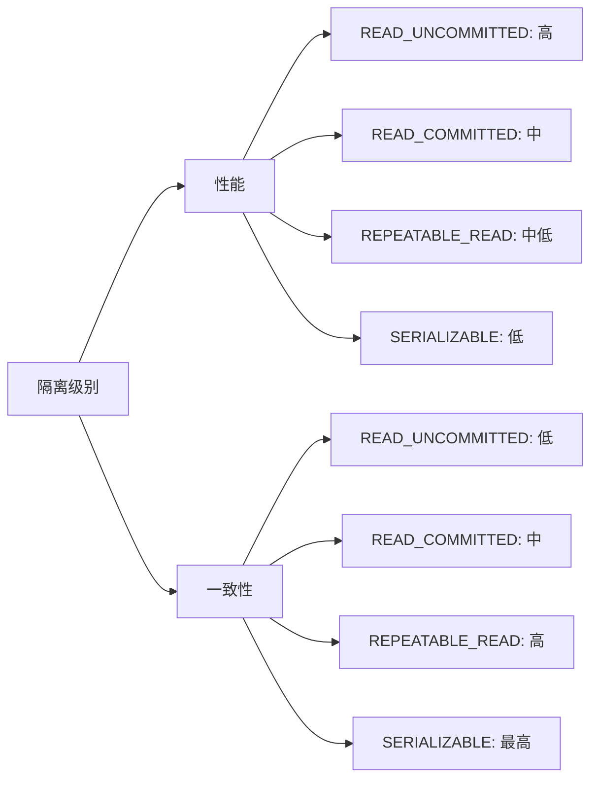

# Spring 事务隔离级别

在数据库操作中，事务（Transaction）是确保数据一致性和完整性的重要机制。Spring框架提供了强大的事务管理功能，其中**事务隔离级别**是控制并发事务行为的关键概念之一。本文将详细介绍Spring事务隔离级别的基本概念、类型及其在实际开发中的应用。

## 什么是事务隔离级别？

事务隔离级别定义了多个并发事务之间的可见性和影响范围。它决定了在一个事务中，其他事务对数据的修改是否可见，以及如何避免脏读、不可重复读和幻读等问题。

Spring支持以下四种标准的事务隔离级别：

1. **READ_UNCOMMITTED**：最低的隔离级别，允许一个事务读取另一个未提交事务的数据（脏读）。
2. **READ_COMMITTED**：确保一个事务只能读取已提交的数据，避免脏读。
3. **REPEATABLE_READ**：确保在一个事务中多次读取同一数据时，结果一致，避免脏读和不可重复读。
4. **SERIALIZABLE**：最高的隔离级别，确保事务串行执行，避免脏读、不可重复读和幻读。

## 事务隔离级别的作用

事务隔离级别的主要作用是解决并发事务中的以下问题：

- **脏读（Dirty Read）**：一个事务读取了另一个未提交事务的数据。
- **不可重复读（Non-Repeatable Read）**：一个事务中多次读取同一数据，结果不一致。
- **幻读（Phantom Read）**：一个事务中多次查询同一范围的数据，结果集不一致。

通过设置合适的事务隔离级别，可以有效避免这些问题，确保数据的一致性和完整性。

---

## Spring 中的事务隔离级别配置

在Spring中，可以通过`@Transactional`注解或XML配置来设置事务隔离级别。以下是使用`@Transactional`注解的示例：

```java
@Service
public class UserService {

    @Transactional(isolation = Isolation.READ_COMMITTED)
    public void updateUserBalance(Long userId, BigDecimal amount) {
        // 业务逻辑
    }
}
```

在上面的代码中，`isolation = Isolation.READ_COMMITTED`指定了事务的隔离级别为`READ_COMMITTED`。

---

## 事务隔离级别的实际案例

假设我们有一个银行转账的场景，用户A向用户B转账。为了防止脏读和不可重复读，我们可以将事务隔离级别设置为`REPEATABLE_READ`。

```java
@Service
public class TransferService {

    @Autowired
    private AccountRepository accountRepository;

    @Transactional(isolation = Isolation.REPEATABLE_READ)
    public void transfer(Long fromAccountId, Long toAccountId, BigDecimal amount) {
        Account fromAccount = accountRepository.findById(fromAccountId).orElseThrow();
        Account toAccount = accountRepository.findById(toAccountId).orElseThrow();

        if (fromAccount.getBalance().compareTo(amount) < 0) {
            throw new InsufficientBalanceException("余额不足");
        }

        fromAccount.setBalance(fromAccount.getBalance().subtract(amount));
        toAccount.setBalance(toAccount.getBalance().add(amount));

        accountRepository.save(fromAccount);
        accountRepository.save(toAccount);
    }
}
```

在这个案例中，`REPEATABLE_READ`隔离级别确保了在转账过程中，账户余额不会被其他事务修改，从而避免了不可重复读的问题。

---

## 事务隔离级别的选择

选择合适的事务隔离级别需要根据具体的业务场景和性能需求来决定：

- **READ_UNCOMMITTED**：适用于对数据一致性要求不高的场景，性能最好。
- **READ_COMMITTED**：适用于大多数场景，平衡了性能和一致性。
- **REPEATABLE_READ**：适用于需要避免不可重复读的场景。
- **SERIALIZABLE**：适用于对数据一致性要求极高的场景，但性能最差。

:::tip
在实际开发中，建议从`READ_COMMITTED`开始，根据具体需求逐步调整隔离级别。
:::

---

## 事务隔离级别与并发性能

事务隔离级别越高，数据库需要维护的锁和一致性检查越多，这可能会影响并发性能。以下是一个简单的性能对比：



---

## 总结

事务隔离级别是Spring事务管理中的重要概念，它决定了并发事务之间的可见性和影响范围。通过合理设置隔离级别，可以有效避免脏读、不可重复读和幻读等问题，确保数据的一致性和完整性。

在实际开发中，建议根据业务需求选择合适的隔离级别，并在性能和一致性之间找到平衡点。

---

## 附加资源与练习

1. **练习**：尝试在一个Spring项目中配置不同的事务隔离级别，观察其对并发操作的影响。
2. **阅读**：深入学习Spring事务管理的其他特性，如事务传播行为。
3. **参考**：[Spring官方文档 - 事务管理](https://docs.spring.io/spring-framework/docs/current/reference/html/data-access.html#transaction)

希望本文能帮助你更好地理解Spring事务隔离级别！如果有任何问题，欢迎在评论区留言讨论。