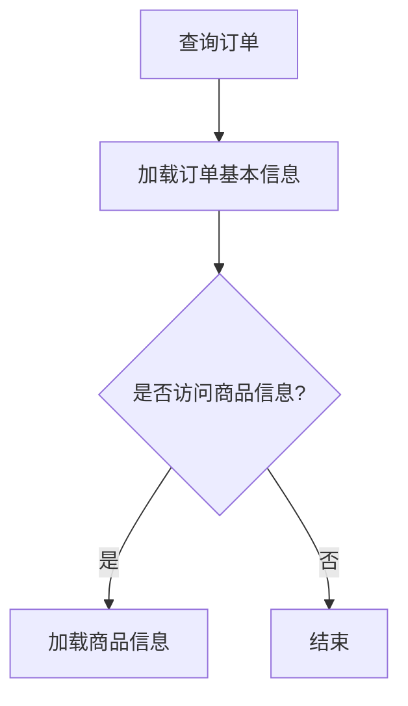

# Spring 延迟加载

在Spring ORM中，**延迟加载（Lazy Loading）** 是一种优化数据访问性能的技术。它允许应用程序在需要时才从数据库中加载关联数据，而不是在初始查询时立即加载所有数据。这种方式可以显著减少不必要的数据库查询，从而提高应用程序的性能。

## 什么是延迟加载？

延迟加载的核心思想是**按需加载**。当我们从数据库中查询一个实体时，与其关联的其他实体（例如一对多或多对多关系中的子实体）并不会立即加载，而是等到真正访问这些关联数据时才会触发查询。

### 延迟加载的优势
- **减少初始查询的负载**：延迟加载避免了在初始查询时加载大量不必要的数据。
- **节省内存**：只有在需要时才会加载数据，减少了内存占用。
- **提高性能**：避免了不必要的数据库查询，从而提高了应用程序的响应速度。

### 延迟加载的适用场景
- 当关联数据量较大时，延迟加载可以显著减少初始查询的开销。
- 在分页或部分数据展示的场景中，延迟加载可以避免加载不必要的数据。

---

## 延迟加载的实现

在Spring ORM中，延迟加载通常与Hibernate等ORM框架结合使用。Hibernate通过代理模式实现延迟加载。

### 1. 配置延迟加载

在实体类中，可以通过`@OneToMany`、`@ManyToOne`等注解的`fetch`属性来配置延迟加载。默认情况下，`@OneToMany`和`@ManyToMany`关系是延迟加载的，而`@ManyToOne`和`@OneToOne`关系是立即加载的。

```java
@Entity
public class Order {
    @Id
    @GeneratedValue(strategy = GenerationType.IDENTITY)
    private Long id;

    @OneToMany(mappedBy = "order", fetch = FetchType.LAZY)
    private List<OrderItem> items;

    // 其他字段和方法
}
```

在上面的代码中，`Order`实体与`OrderItem`实体之间是一对多的关系，并且配置为延迟加载。

### 2. 延迟加载的触发

延迟加载的触发通常发生在访问关联数据时。例如：

```java
Order order = entityManager.find(Order.class, 1L);
// 此时不会加载items
List<OrderItem> items = order.getItems(); // 触发延迟加载
```

:::caution 注意
如果在事务外访问延迟加载的数据，可能会抛出`LazyInitializationException`异常。确保在事务范围内访问延迟加载的数据。
:::

---

## 实际案例

假设我们有一个电商系统，其中`Order`实体包含多个`OrderItem`。在展示订单列表时，我们只需要显示订单的基本信息，而不需要立即加载每个订单的详细商品信息。这时，延迟加载可以显著提高性能。

### 场景描述
- 查询订单列表时，只加载订单的基本信息。
- 当用户点击某个订单查看详情时，再加载该订单的商品信息。

### 代码示例

```java
@Service
public class OrderService {

    @Autowired
    private EntityManager entityManager;

    @Transactional
    public Order getOrderDetails(Long orderId) {
        Order order = entityManager.find(Order.class, orderId);
        // 触发延迟加载
        List<OrderItem> items = order.getItems();
        return order;
    }
}
```

在这个例子中，`Order`的`items`字段只有在调用`getItems()`方法时才会被加载。

---

## 延迟加载与立即加载的对比

为了更好地理解延迟加载的优势，我们可以通过以下对比来展示延迟加载与立即加载的区别。



- **立即加载**：在查询订单时，同时加载所有商品信息。
- **延迟加载**：只有在访问商品信息时，才会触发加载。

---

## 总结

延迟加载是Spring ORM中一种重要的性能优化技术。通过按需加载关联数据，它可以减少不必要的数据库查询，从而提高应用程序的性能。然而，在使用延迟加载时，需要注意事务范围，以避免`LazyInitializationException`异常。

### 附加资源
- [Hibernate官方文档 - 延迟加载](https://docs.jboss.org/hibernate/orm/current/userguide/html_single/Hibernate_User_Guide.html#fetching-lazy)
- [Spring Data JPA官方文档](https://docs.spring.io/spring-data/jpa/docs/current/reference/html/)

### 练习
1. 修改一个现有的Spring项目，将`@OneToMany`关系配置为延迟加载，并观察性能变化。
2. 尝试在事务外访问延迟加载的数据，捕获并处理`LazyInitializationException`异常。

希望本文能帮助你更好地理解Spring中的延迟加载机制！如果有任何问题，欢迎在评论区留言讨论。