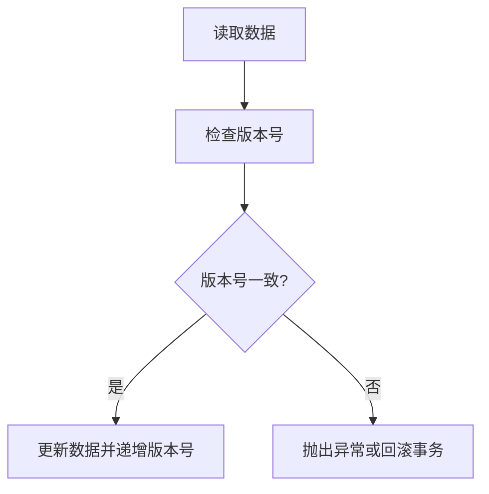

# Spring 乐观锁

乐观锁（Optimistic Locking）是一种并发控制机制，用于在多个用户或线程同时访问和修改同一数据时，避免数据冲突。与悲观锁不同，乐观锁假设大多数情况下不会发生冲突，因此不会在读取数据时加锁，而是在更新数据时检查是否有冲突。如果检测到冲突，乐观锁会抛出异常或采取其他措施来处理冲突。

在 Spring 中，乐观锁通常与 ORM（对象关系映射）框架（如 Hibernate）结合使用，通过版本控制来实现。本文将详细介绍 Spring 中的乐观锁机制，并通过代码示例和实际案例帮助你理解其工作原理和应用场景。

## 乐观锁的工作原理

乐观锁的核心思想是通过版本号（Version）来检测数据是否被其他事务修改。每次更新数据时，系统会检查当前版本号是否与读取时的版本号一致。如果一致，则更新数据并递增版本号；如果不一致，则说明数据已被其他事务修改，系统会抛出异常或回滚事务。



## 在 Spring 中实现乐观锁

在 Spring 中，乐观锁通常通过 JPA 或 Hibernate 的 `@Version` 注解来实现。以下是一个简单的示例，展示如何在实体类中使用乐观锁。

### 1. 定义实体类

首先，我们需要在实体类中添加一个版本字段，并使用 `@Version` 注解标记该字段。

```java
import javax.persistence.*;

@Entity
public class Product {
    @Id
    @GeneratedValue(strategy = GenerationType.IDENTITY)
    private Long id;

    private String name;
    private double price;

    @Version
    private int version;

    // Getters and Setters
}
```

在上面的代码中，`version` 字段用于存储版本号。每次更新 `Product` 实体时，Hibernate 会自动递增该字段的值。

### 2. 更新数据

接下来，我们通过一个简单的服务类来演示如何更新数据。

```java
import org.springframework.beans.factory.annotation.Autowired;
import org.springframework.stereotype.Service;
import org.springframework.transaction.annotation.Transactional;

@Service
public class ProductService {

    @Autowired
    private ProductRepository productRepository;

    @Transactional
    public void updateProductPrice(Long productId, double newPrice) {
        Product product = productRepository.findById(productId)
                .orElseThrow(() -> new RuntimeException("Product not found"));

        product.setPrice(newPrice);
        productRepository.save(product);
    }
}
```

在这个示例中，`updateProductPrice` 方法会更新产品的价格。如果在更新过程中检测到版本号不一致，Hibernate 会抛出 `OptimisticLockException` 异常。

### 3. 处理乐观锁冲突

当乐观锁检测到冲突时，通常会抛出 `OptimisticLockException` 异常。我们可以通过捕获该异常来处理冲突。

```java
import org.springframework.orm.ObjectOptimisticLockingFailureException;

@Service
public class ProductService {

    @Autowired
    private ProductRepository productRepository;

    @Transactional
    public void updateProductPrice(Long productId, double newPrice) {
        try {
            Product product = productRepository.findById(productId)
                    .orElseThrow(() -> new RuntimeException("Product not found"));

            product.setPrice(newPrice);
            productRepository.save(product);
        } catch (ObjectOptimisticLockingFailureException e) {
            // 处理乐观锁冲突
            System.out.println("数据已被其他事务修改，请重试");
        }
    }
}
```

## 实际应用场景

乐观锁适用于读多写少的场景，尤其是在高并发环境下，可以减少锁竞争，提高系统性能。以下是一些常见的应用场景：

1. **电商库存管理**：在电商系统中，多个用户可能同时购买同一商品。使用乐观锁可以避免超卖问题。
2. **银行账户余额更新**：在银行系统中，多个事务可能同时更新同一账户的余额。乐观锁可以确保余额更新的正确性。
3. **社交网络点赞功能**：在社交网络中，多个用户可能同时点赞同一篇文章。乐观锁可以避免点赞计数错误。

## 总结

乐观锁是一种高效的并发控制机制，适用于读多写少的场景。在 Spring 中，我们可以通过 JPA 或 Hibernate 的 `@Version` 注解轻松实现乐观锁。通过版本号检测冲突，乐观锁可以在不阻塞其他事务的情况下，确保数据的一致性。

在实际开发中，乐观锁可以帮助我们避免数据冲突，提高系统的并发性能。然而，乐观锁并不适用于所有场景，特别是在写操作频繁的情况下，可能会导致大量的冲突和重试。因此，在选择并发控制机制时，需要根据具体的业务场景进行权衡。

## 附加资源与练习

- **练习**：尝试在一个简单的 Spring Boot 项目中实现乐观锁，并模拟多个线程同时更新同一数据，观察乐观锁的行为。
- **资源**：
  - [Spring Data JPA 官方文档](https://docs.spring.io/spring-data/jpa/docs/current/reference/html/)
  - [Hibernate 乐观锁文档](https://docs.jboss.org/hibernate/orm/current/userguide/html_single/Hibernate_User_Guide.html#locking)
