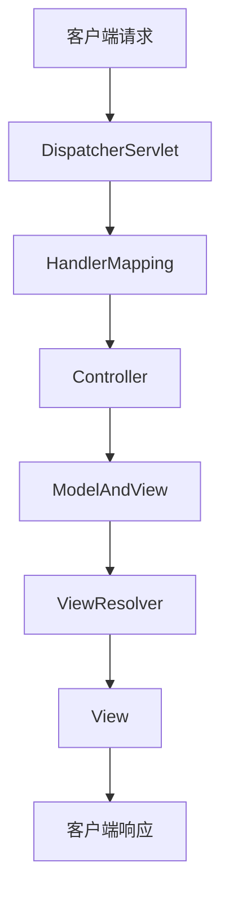

## 介绍

Spring MVC 是 Spring 框架中的一个模块，用于构建基于模型-视图-控制器（MVC）设计模式的 Web 应用程序。它提供了一种结构化的方式来开发 Web 应用，使得代码更易于维护和扩展。Spring MVC 的核心思想是将应用程序的不同职责分离，从而提高代码的可读性和可测试性。

在 Spring MVC 中，请求首先由 **DispatcherServlet** 处理，它是整个框架的核心调度器。DispatcherServlet 负责将请求分发给相应的控制器（Controller），控制器处理请求并返回模型（Model）和视图（View）名称。最后，视图解析器（View Resolver）根据视图名称找到对应的视图并渲染响应。

## Spring MVC 架构的核心组件

Spring MVC 的架构主要由以下几个核心组件组成：

1. **DispatcherServlet**：前端控制器，负责接收所有请求并将其分发给相应的处理器。
2. **HandlerMapping**：负责将请求映射到相应的处理器（Controller）。
3. **Controller**：处理请求并返回模型和视图。
4. **ModelAndView**：包含模型数据和视图名称的对象。
5. **ViewResolver**：根据视图名称解析出实际的视图对象。
6. **View**：负责渲染模型数据并生成最终的响应。



## 请求处理流程

1. **客户端发送请求**：客户端（通常是浏览器）发送一个 HTTP 请求到服务器。
2. **DispatcherServlet 接收请求**：DispatcherServlet 是 Spring MVC 的前端控制器，它接收所有的请求。
3. **HandlerMapping 查找处理器**：DispatcherServlet 使用 HandlerMapping 来查找处理该请求的 Controller。
4. **Controller 处理请求**：Controller 处理请求并返回一个 ModelAndView 对象，其中包含模型数据和视图名称。
5. **ViewResolver 解析视图**：ViewResolver 根据视图名称找到实际的视图对象。
6. **视图渲染**：视图对象使用模型数据渲染最终的响应。
7. **返回响应**：渲染后的响应返回给客户端。

## 代码示例

以下是一个简单的 Spring MVC 控制器示例：

```java
@Controller
public class HelloController {

    @RequestMapping("/hello")
    public ModelAndView sayHello() {
        ModelAndView modelAndView = new ModelAndView();
        modelAndView.addObject("message", "Hello, Spring MVC!");
        modelAndView.setViewName("hello");
        return modelAndView;
    }
}
```

在这个示例中，`HelloController` 类处理 `/hello` 路径的请求。它返回一个 `ModelAndView` 对象，其中包含一个名为 `message` 的模型属性和一个名为 `hello` 的视图名称。

:::note
`@Controller` 注解用于标记一个类为 Spring MVC 控制器。`@RequestMapping` 注解用于将请求路径映射到控制器方法。
:::

## 视图解析器配置

在 Spring MVC 中，视图解析器负责将逻辑视图名称解析为实际的视图对象。以下是一个典型的视图解析器配置：

```java
@Bean
public ViewResolver viewResolver() {
    InternalResourceViewResolver resolver = new InternalResourceViewResolver();
    resolver.setPrefix("/WEB-INF/views/");
    resolver.setSuffix(".jsp");
    return resolver;
}
```

在这个配置中，`InternalResourceViewResolver` 将逻辑视图名称解析为 JSP 文件。例如，视图名称 `hello` 将被解析为 `/WEB-INF/views/hello.jsp`。

## 实际应用场景

Spring MVC 广泛应用于各种 Web 应用程序中，尤其是那些需要高度模块化和可扩展性的项目。以下是一些常见的应用场景：

1. **企业级 Web 应用**：Spring MVC 提供了强大的功能和灵活性，适合构建复杂的企业级 Web 应用。
2. **RESTful Web 服务**：Spring MVC 支持构建 RESTful Web 服务，可以轻松处理 JSON 和 XML 数据。
3. **单页应用（SPA）后端**：Spring MVC 可以作为单页应用的后端，提供数据接口和业务逻辑处理。

## 总结

Spring MVC 是一个强大且灵活的框架，适用于构建各种类型的 Web 应用程序。通过将应用程序的不同职责分离，Spring MVC 使得代码更易于维护和扩展。本文介绍了 Spring MVC 的基本架构、核心组件以及请求处理流程，并通过代码示例展示了如何在实际项目中使用 Spring MVC。

## 附加资源与练习

- **官方文档**：阅读 [Spring MVC 官方文档](https://docs.spring.io/spring-framework/docs/current/reference/html/web.html) 以深入了解框架的更多细节。
- **练习**：尝试创建一个简单的 Spring MVC 项目，实现一个控制器来处理不同的请求路径，并返回不同的视图。

:::tip
在学习 Spring MVC 时，建议从简单的示例开始，逐步增加复杂性。通过实践，你将更好地理解框架的工作原理。
:::