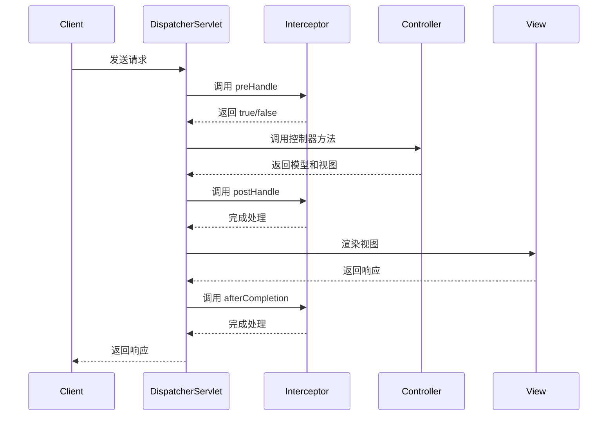

# Spring MVC 拦截器

## 介绍

在 Spring MVC 中，拦截器（Interceptor）是一种强大的工具，用于在请求到达控制器之前或之后执行某些操作。拦截器可以用于日志记录、权限验证、性能监控等场景。与过滤器（Filter）不同，拦截器是 Spring 框架的一部分，因此可以访问 Spring 的上下文和依赖注入。

拦截器的主要作用是在请求处理的不同阶段插入自定义逻辑。Spring MVC 提供了 `HandlerInterceptor` 接口，开发者可以通过实现该接口来创建自定义拦截器。

## 拦截器的工作原理

Spring MVC 拦截器的工作流程可以分为三个阶段：

1. **预处理（PreHandle）**：在请求到达控制器之前执行。可以用于权限验证、日志记录等。
2. **后处理（PostHandle）**：在控制器处理完请求之后，视图渲染之前执行。可以用于修改模型数据或视图。
3. **完成处理（AfterCompletion）**：在视图渲染完成之后执行。通常用于资源清理或日志记录。



## 实现自定义拦截器

要创建一个自定义拦截器，需要实现 `HandlerInterceptor` 接口，并重写其中的方法。以下是一个简单的示例：

```java
import org.springframework.web.servlet.HandlerInterceptor;
import javax.servlet.http.HttpServletRequest;
import javax.servlet.http.HttpServletResponse;

public class CustomInterceptor implements HandlerInterceptor {

    @Override
    public boolean preHandle(HttpServletRequest request, HttpServletResponse response, Object handler) throws Exception {
        System.out.println("PreHandle: 请求到达控制器之前");
        return true; // 返回 true 继续执行，返回 false 中断请求
    }

    @Override
    public void postHandle(HttpServletRequest request, HttpServletResponse response, Object handler, ModelAndView modelAndView) throws Exception {
        System.out.println("PostHandle: 控制器处理完请求之后");
    }

    @Override
    public void afterCompletion(HttpServletRequest request, HttpServletResponse response, Object handler, Exception ex) throws Exception {
        System.out.println("AfterCompletion: 视图渲染完成之后");
    }
}
```

## 配置拦截器

在 Spring MVC 中，可以通过配置类或 XML 配置文件来注册拦截器。以下是通过 Java 配置类注册拦截器的示例：

```java
import org.springframework.context.annotation.Configuration;
import org.springframework.web.servlet.config.annotation.InterceptorRegistry;
import org.springframework.web.servlet.config.annotation.WebMvcConfigurer;

@Configuration
public class WebConfig implements WebMvcConfigurer {

    @Override
    public void addInterceptors(InterceptorRegistry registry) {
        registry.addInterceptor(new CustomInterceptor())
                .addPathPatterns("/**") // 拦截所有路径
                .excludePathPatterns("/public/**"); // 排除特定路径
    }
}
```

## 实际应用场景

### 1. 日志记录

拦截器可以用于记录请求的详细信息，例如请求 URL、请求方法、客户端 IP 等。这对于调试和监控应用程序非常有用。

```java
@Override
public boolean preHandle(HttpServletRequest request, HttpServletResponse response, Object handler) throws Exception {
    String requestURI = request.getRequestURI();
    String method = request.getMethod();
    String clientIP = request.getRemoteAddr();
    System.out.println("Request URI: " + requestURI + ", Method: " + method + ", Client IP: " + clientIP);
    return true;
}
```

### 2. 权限验证

拦截器可以用于检查用户是否具有访问特定资源的权限。如果用户未通过验证，可以重定向到登录页面或返回错误响应。

```java
@Override
public boolean preHandle(HttpServletRequest request, HttpServletResponse response, Object handler) throws Exception {
    HttpSession session = request.getSession();
    if (session.getAttribute("user") == null) {
        response.sendRedirect("/login");
        return false;
    }
    return true;
}
```

### 3. 性能监控

拦截器可以用于记录请求的处理时间，以监控应用程序的性能。

```java
@Override
public boolean preHandle(HttpServletRequest request, HttpServletResponse response, Object handler) throws Exception {
    request.setAttribute("startTime", System.currentTimeMillis());
    return true;
}

@Override
public void afterCompletion(HttpServletRequest request, HttpServletResponse response, Object handler, Exception ex) throws Exception {
    long startTime = (Long) request.getAttribute("startTime");
    long endTime = System.currentTimeMillis();
    System.out.println("Request processing time: " + (endTime - startTime) + "ms");
}
```

## 总结

Spring MVC 拦截器是一个强大的工具，可以在请求处理的不同阶段插入自定义逻辑。通过实现 `HandlerInterceptor` 接口，开发者可以轻松地创建自定义拦截器，并将其应用于特定的请求路径。拦截器在日志记录、权限验证、性能监控等场景中非常有用。

## 附加资源

- [Spring 官方文档 - 拦截器](https://docs.spring.io/spring-framework/docs/current/reference/html/web.html#mvc-handlermapping-interceptor)
- [Spring MVC 拦截器示例](https://www.baeldung.com/spring-mvc-handlerinterceptor)

## 练习

1. 创建一个拦截器，记录每个请求的处理时间，并将其输出到控制台。
2. 实现一个拦截器，检查用户是否已登录，如果未登录则重定向到登录页面。
3. 修改拦截器配置，使其只拦截 `/admin` 路径下的请求。

通过完成这些练习，你将更深入地理解 Spring MVC 拦截器的工作原理和应用场景。