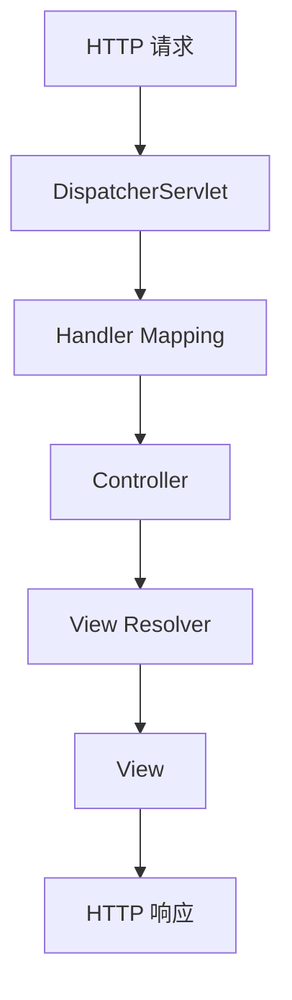

## 介绍

在 Spring Web 开发中，`DispatcherServlet` 是 Spring MVC 框架的核心组件。它充当了前端控制器（Front Controller）的角色，负责接收所有的 HTTP 请求，并将这些请求分发给相应的处理器（如控制器）。`DispatcherServlet` 是 Spring MVC 架构的入口点，它协调了请求处理的整个流程。

### DispatcherServlet 的作用

`DispatcherServlet` 的主要职责包括：
1. **请求接收**：接收客户端发送的 HTTP 请求。
2. **请求分发**：根据请求的 URL 和其他信息，将请求分发给相应的控制器。
3. **视图解析**：处理控制器返回的视图名称，并将其解析为实际的视图（如 JSP、Thymeleaf 模板等）。
4. **异常处理**：处理请求处理过程中可能出现的异常。

## DispatcherServlet 的工作原理

为了更好地理解 `DispatcherServlet` 的工作原理，我们可以将其工作流程分为以下几个步骤：

1. **请求到达**：客户端发送的 HTTP 请求首先到达 `DispatcherServlet`。
2. **请求映射**：`DispatcherServlet` 根据请求的 URL 查找对应的处理器（通常是控制器中的方法）。
3. **处理器执行**：找到对应的处理器后，`DispatcherServlet` 调用该处理器来处理请求。
4. **视图解析**：处理器返回一个视图名称，`DispatcherServlet` 通过视图解析器将其解析为实际的视图。
5. **响应返回**：最终，`DispatcherServlet` 将处理结果返回给客户端。



## 配置 DispatcherServlet

在 Spring 应用中，`DispatcherServlet` 通常是通过 Java 配置或 XML 配置来定义的。以下是一个简单的 Java 配置示例：

```java
import org.springframework.web.servlet.support.AbstractAnnotationConfigDispatcherServletInitializer;

public class MyWebAppInitializer extends AbstractAnnotationConfigDispatcherServletInitializer {

    @Override
    protected Class<?>[] getRootConfigClasses() {
        return new Class<?>[] { RootConfig.class };
    }

    @Override
    protected Class<?>[] getServletConfigClasses() {
        return new Class<?>[] { WebConfig.class };
    }

    @Override
    protected String[] getServletMappings() {
        return new String[] { "/" };
    }
}
```

在这个示例中，`MyWebAppInitializer` 类扩展了 `AbstractAnnotationConfigDispatcherServletInitializer`，并重写了三个方法：
- `getRootConfigClasses()`：返回根配置类，通常用于配置与 Web 无关的 Bean。
- `getServletConfigClasses()`：返回 Web 配置类，通常用于配置与 Web 相关的 Bean，如控制器、视图解析器等。
- `getServletMappings()`：指定 `DispatcherServlet` 处理的 URL 模式，这里设置为 `"/"`，表示处理所有请求。

## 实际案例

假设我们有一个简单的 Spring MVC 应用，用户可以通过访问 `/hello` 来获取一个简单的问候消息。以下是一个控制器的示例：

```java
import org.springframework.stereotype.Controller;
import org.springframework.web.bind.annotation.GetMapping;
import org.springframework.web.bind.annotation.ResponseBody;

@Controller
public class HelloController {

    @GetMapping("/hello")
    @ResponseBody
    public String sayHello() {
        return "Hello, World!";
    }
}
```

在这个示例中，`HelloController` 类被标记为 `@Controller`，表示它是一个 Spring MVC 控制器。`@GetMapping("/hello")` 注解表示当用户访问 `/hello` 时，`sayHello()` 方法将被调用。`@ResponseBody` 注解表示方法的返回值将直接作为 HTTP 响应的内容。

当用户访问 `/hello` 时，`DispatcherServlet` 会将请求分发给 `HelloController` 的 `sayHello()` 方法，并将返回的字符串 `"Hello, World!"` 作为响应返回给客户端。

## 总结

`DispatcherServlet` 是 Spring MVC 框架的核心组件，它负责接收所有的 HTTP 请求，并将这些请求分发给相应的处理器。通过理解 `DispatcherServlet` 的工作原理和配置方法，你可以更好地掌握 Spring Web 开发的基础知识。

### 附加资源

- [Spring 官方文档 - DispatcherServlet](https://docs.spring.io/spring-framework/docs/current/reference/html/web.html#mvc-servlet)
- [Spring MVC 教程](https://www.baeldung.com/spring-mvc-tutorial)

### 练习

1. 创建一个简单的 Spring MVC 应用，配置 `DispatcherServlet` 并实现一个控制器，返回自定义的问候消息。
2. 尝试修改 `DispatcherServlet` 的 URL 映射，使其只处理特定的 URL 模式（如 `/api/*`）。