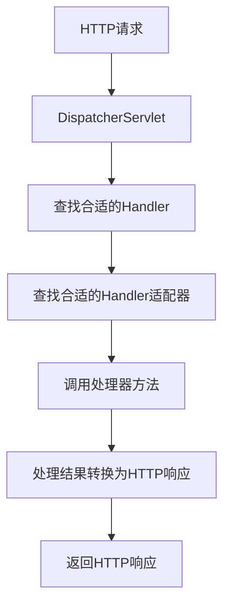

# Spring Handler适配器

在Spring Web开发中，**Handler适配器**是一个关键组件，它负责将HTTP请求映射到具体的处理器（Handler）方法，并处理请求和响应的转换。本文将详细介绍Handler适配器的概念、工作原理以及如何在实际开发中使用它。

## 什么是Handler适配器？

Handler适配器是Spring MVC框架中的一个核心组件，它的主要作用是将HTTP请求与具体的处理器方法进行适配。换句话说，Handler适配器负责调用正确的处理器方法，并将请求参数传递给该方法，最后将处理结果转换为HTTP响应。

在Spring MVC中，处理器（Handler）通常是控制器（Controller）中的方法。Handler适配器的作用就是找到这些方法并调用它们。

## Handler适配器的工作原理

Spring MVC框架中有多种Handler适配器，每种适配器都支持不同类型的处理器。最常见的Handler适配器是`RequestMappingHandlerAdapter`，它支持基于注解的控制器方法（如`@RequestMapping`注解的方法）。

以下是Handler适配器的工作流程：

1. **请求到达DispatcherServlet**：当HTTP请求到达Spring MVC的`DispatcherServlet`时，`DispatcherServlet`会查找合适的处理器（Handler）来处理该请求。
2. **查找Handler适配器**：`DispatcherServlet`会根据处理器的类型查找合适的Handler适配器。
3. **调用处理器方法**：Handler适配器调用处理器方法，并将请求参数传递给该方法。
4. **处理结果转换**：处理器方法返回的结果会被Handler适配器转换为HTTP响应。



## 代码示例

以下是一个简单的Spring MVC控制器示例，展示了如何使用`@RequestMapping`注解定义处理器方法：

```java
@Controller
public class MyController {

    @RequestMapping("/hello")
    public String sayHello(Model model) {
        model.addAttribute("message", "Hello, World!");
        return "hello";
    }
}
```

在这个示例中，`sayHello`方法是一个处理器方法，它处理路径为`/hello`的HTTP请求。`RequestMappingHandlerAdapter`会负责调用这个方法，并将`Model`对象传递给该方法。

## 实际应用场景

Handler适配器在实际开发中的应用非常广泛。以下是一些常见的应用场景：

1. **RESTful Web服务**：在开发RESTful Web服务时，Handler适配器负责将HTTP请求映射到控制器方法，并将方法返回的对象转换为JSON或XML格式的响应。
2. **表单处理**：在处理表单提交时，Handler适配器可以将表单数据绑定到Java对象，并将对象传递给控制器方法进行处理。
3. **文件上传**：Handler适配器还可以处理文件上传请求，并将上传的文件传递给控制器方法。

## 总结

Handler适配器是Spring MVC框架中的一个重要组件，它负责将HTTP请求与具体的处理器方法进行适配。通过理解Handler适配器的工作原理，开发者可以更好地掌握Spring MVC框架的请求处理机制。

在实际开发中，Handler适配器的应用场景非常广泛，包括RESTful Web服务、表单处理和文件上传等。掌握Handler适配器的使用，可以帮助开发者更高效地构建Web应用程序。

## 附加资源与练习

- **Spring官方文档**：阅读Spring官方文档中关于Handler适配器的部分，了解更多详细信息。
- **练习**：尝试编写一个Spring MVC控制器，并使用不同的Handler适配器处理不同类型的请求。

:::tip
提示：在实际开发中，Spring MVC框架已经为我们提供了默认的Handler适配器，因此在大多数情况下，我们不需要手动配置Handler适配器。但在某些特殊场景下，可能需要自定义Handler适配器。
:::